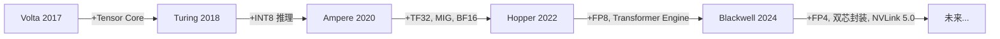

# 2.1 主流 GPU 横向对比与选型

> 来源：AIInfraGuide 模块一 GPU 模块 | 笔记类型：学习笔记（新人友好版）
> 目标：能读懂 GPU 规格表、能用决策树选卡、能估算模型显存需求 | 更新时间：2026-07-10
> 关联：前置 `2. NVIDIA-GPU架构演进史.md` / 性能指标 `../2. 硬件基础篇/2. 显存层次与性能指标.md`

---

## 一句话结论

选卡先看四大指标对齐需求（训练看显存+算力+互联，推理看带宽+低精度），再按预算在 V100/A100/H100/消费级之间权衡；纵向看 Tensor Core 与显存带宽演进，能预测下一代卡的趋势。

---

## 背景与定位

- **这篇讲什么**：主流 AI GPU 横向对比（数据中心卡 + 消费级卡）、核心技术纵向演进、选卡决策树和显存估算。
- **为什么重要**：硬件选型是 AI Infra 工程的高频决策——训练用 A100 还是 H100？推理用 T4 还是消费级卡？预算有限怎么选？
- **前置知识**：`2. NVIDIA-GPU架构演进史.md`（五代架构背景）、`2. 显存层次与性能指标.md`（四大指标）。
- **在笔记链路中的位置**：第 3 篇，演进史之后的实际应用。

---

## 核心概念（新人友好讲解）

### 1. 主流 AI GPU 横向对比

#### 1.1 数据中心卡

| 型号 | 架构 | SM 数 | 显存 | 带宽 | FP16 算力 | FP8 算力 | TDP | 典型用途 |
|------|------|-------|------|------|----------|---------|-----|---------|
| V100 | Volta | 80 | 32 GB HBM2 | 900 GB/s | 125 TFLOPS | — | 300W | 经典训练卡 |
| A100 SXM | Ampere | 108 | 80 GB HBM2e | 2,039 GB/s | 312 TFLOPS | — | 400W | 训练 + 推理 |
| H100 SXM | Hopper | 132 | 80 GB HBM3 | 3,350 GB/s | 989 TFLOPS | 1,979 TFLOPS | 700W | 大规模训练 |
| H200 | Hopper | 132 | 141 GB HBM3e | 4,800 GB/s | 989 TFLOPS | 1,979 TFLOPS | 700W | 长序列推理 |
| B200 | Blackwell | 160 | 192 GB HBM3e | 8,000 GB/s | 2,250 TFLOPS | 4,500 TFLOPS | 1000W | 下一代旗舰 |
| L40S | Ada | 142 | 48 GB GDDR6 | 864 GB/s | 366 TFLOPS | — | 350W | 推理 / 多媒体 |

> 🔧 **新人参数解释**：
> - **SM 数**：Streaming Multiprocessor 数量，越多并行度越高
> - **TDP**（Thermal Design Power）：热设计功耗，决定散热和供电需求
> - **HBM2e/HBM3/HBM3e**：HBM 显存的代次，e=enhanced，每代带宽和容量提升

> ⚠️ **SXM vs PCIe**：同一架构可能有 SXM 和 PCIe 两种封装。SXM 版本功耗更高、频率更高、支持 NVLink 全互联；PCIe 版本功耗低、仅支持 2 卡桥接。选型务必确认封装类型。

#### 1.2 消费级卡

| 型号 | 架构 | 显存 | 带宽 | FP16 算力 | TDP | 典型用途 |
|------|------|------|------|----------|-----|---------|
| RTX 3090 | Ampere | 24 GB GDDR6X | 936 GB/s | 71 TFLOPS | 350W | 单卡训练/推理 |
| RTX 4090 | Ada | 24 GB GDDR6X | 1,008 GB/s | 165 TFLOPS | 450W | 高性价比推理 |
| RTX 4060 | Ada | 8 GB GDDR6 | 272 GB/s | 15 TFLOPS | 115W | 入门学习 |

**数据中心卡 vs 消费级卡关键差异**：

| 维度 | 数据中心卡（A100/H100） | 消费级卡（RTX 4090） |
|------|----------------------|---------------------|
| NVLink 互联 | ✅ 全互联（900 GB/s） | ❌ 不支持（仅 PCIe） |
| 显存容量 | 80~192 GB | 8~24 GB |
| MIG 隔离 | ✅ 支持 | ❌ 不支持 |
| FP8/FP4 | ✅ H100+ 支持 | ❌ 不支持 |
| 显存类型 | HBM（高带宽） | GDDR（性价比） |
| 价格 | $10K~40K | $500~2000 |
| 适合 | 大模型训练/推理 | 学习/小模型/单卡推理 |

---

### 2. 核心技术纵向对比

#### 2.1 特性引入时间线



#### 2.2 显存与带宽演进趋势

| 指标 | V100 | A100 | H100 | B200 | 趋势 |
|------|------|------|------|------|------|
| 显存容量 | 32 GB | 80 GB | 80 GB | 192 GB | 每 2 代翻倍 |
| 显存带宽 | 0.9 TB/s | 2.0 TB/s | 3.35 TB/s | 8 TB/s | 每 2 代翻倍 |
| NVLink 带宽 | 300 GB/s | 600 GB/s | 900 GB/s | 1,800 GB/s | 每代 +50%~100% |

> 📌 **关键趋势**：显存带宽增长慢于算力增长。这意味着每代平衡点（算力/带宽）都在上升，越来越多的算子变成 Memory-bound。大模型推理尤其受影响——decode 阶段完全靠带宽。

---

### 3. 如何选择合适的 GPU

#### 3.1 选卡决策树

```
你的任务是什么？
│
├─ 大模型训练（>10B）
│   ├─ 预算充足 → H100 SXM（FP8 + NVLink 4.0）
│   ├─ 预算有限 → A100 80GB（性价比高，生态成熟）
│   └─ 超大模型（>100B）→ B200/GB200（192GB + NVLink 5.0）
│
├─ 大模型推理
│   ├─ 低成本在线推理 → T4（70W 低功耗，INT8 够用）
│   ├─ 中等规模 LLM → A100 / L40S（显存够大）
│   ├─ 大规模 LLM → H100 / H200（FP8 + 高带宽）
│   └─ 极致推理 → B200（FP4 + 192GB）
│
├─ 学习/入门
│   ├─ 预算充足 → RTX 4090（24GB，能跑 7B 模型）
│   ├─ 预算有限 → RTX 3090（24GB 二手性价比高）
│   └─ 极限预算 → RTX 4060（8GB，跑小模型）
│
└─ 单卡训练（<7B）
    ├─ 消费级首选 → RTX 4090（24GB + 高算力）
    └─ 数据中心 → A100 80GB（如果有的话）	
```

#### 3.2 显存容量估算

模型显存占用取决于参数量和精度：

```
模型参数显存 = 参数量 × 每参数字节数

精度     每参数字节
FP32       4 B
FP16/BF16  2 B
INT8       1 B
INT4       0.5 B
```

**训练显存估算**（Adam 优化器 + 混合精度）：

```
训练显存 ≈ 参数量 × 18 字节（含参数/梯度/优化器状态/激活值）

例：7B 模型训练
  7 × 10^9 × 18 = 126 GB → 单卡装不下（需 A100 80GB × 2 或 ZeRO 分片）
```

**推理显存估算**：

```
推理显存 ≈ 参数量 × 每参数字节 + KV Cache

例：7B 模型 BF16 推理
  7 × 10^9 × 2 = 14 GB（仅权重）→ RTX 4090 24GB 够用
  + KV Cache（取决于序列长度和 batch size）
```

#### 3.3 选卡示例

| 场景 | 推荐 | 理由 |
|------|------|------|
| 训练 7B 模型 | A100 80GB × 2 或 RTX 4090 × 4 | 7B 训练需 ~126GB，单卡不够 |
| 推理 7B 模型 | RTX 4090（24GB）或 A100（80GB） | 7B BF16 推理需 ~14GB，4090 够 |
| 训练 70B 模型 | H100 SXM × 8 | 70B 训练需 ~1260GB，需多卡 |
| 推理 70B 模型 | H100/H200 或 A100 × 2 | 70B BF16 推理需 ~140GB |
| LLM 推理服务 | H100（FP8）或 T4（INT8，低成本） | 看吞吐需求 |

---

## 动手实践：查看当前 GPU 规格

```bash
# ✅ 无需 sudo —— 查询当前 GPU 规格，对照选卡
nvidia-smi --query-gpu=name,memory.total,compute_cap,clocks.max.sm --format=csv
```

**预期输出**（取决于你的 GPU，以下是几种常见输出）：

```
# RTX 4090 示例
name, memory.total [MiB], compute_cap, clocks.max.sm [MHz]
NVIDIA GeForce RTX 4090, 24564, 8.9, 2520

# A100 示例
name, memory.total [MiB], compute_cap, clocks.max.sm [MHz]
NVIDIA A100-SXM4-80GB, 81920, 8.0, 1410
```

> 💡 拿到输出后，对照上面的横向对比表，就能知道你手上的卡能跑多大的模型、适合训练还是推理。

---

## 面试回答（可直接口述的版本）

**问：训练 70B 模型需要什么卡？多少显存？**

答：70B 模型用 Adam + BF16 混合精度训练，每参数约 18 字节（参数 2B + FP32 master 4B + 梯度 4B + Adam m/v 各 4B），固定显存约 1260 GB。加上激活值（取决于 batch size 和序列长度），通常需要 8×H100 SXM（共 640GB）配合 ZeRO Stage 3 + 梯度检查点 + CPU Offload。如果用 FP8 训练可以进一步压缩约 30%~50%。

**问：A100 和 H100 的关键提升在哪？**

答：三个维度：①算力——FP16 从 312 到 989 TFLOPS（3.2×），新增 FP8 达 1979 TFLOPS；②带宽——显存从 2.0 到 3.35 TB/s（1.7×），NVLink 从 600 到 900 GB/s（1.5×）；③新特性——Transformer Engine 自动 FP8 调度、Thread Block Cluster、TMA 异步拷贝。H100 是为大模型而生的，FP8+NVLink 4.0 大幅提升千卡训练效率。

**问：消费级卡能不能训大模型？瓶颈在哪？**

答：能训小模型（7B 以下），但训大模型有三个瓶颈：①显存小——RTX 4090 只有 24GB，7B 训练需要 ~126GB；②无 NVLink——多卡只能走 PCIe（~64 GB/s），通信成为严重瓶颈；③无 FP8/FP4——消费级卡不支持低精度 Tensor Core，算力受限。所以大模型训练还是得用数据中心卡。

---

## 深入追问（可能被追问的点）

- **Q1: 云租用 vs 自购 GPU 怎么选？**
  A: 短期/弹性需求选云租用（按小时付费，灵活扩缩容），长期稳定需求选自购（2-3 年回本）。训练任务推荐云租用（用完即还），推理服务长期运行推荐自购。

- **Q2: 为什么 H200 比 H100 适合推理？**
  A: H200 和 H100 算力相同（同架构），但 H200 显存 141GB（vs 80GB）+ 带宽 4.8 TB/s（vs 3.35 TB/s）。推理是 Memory-bound，带宽越高 token/s 越高，大显存能装更大模型或更长上下文。

- **Q3: SXM 和 PCIe 在多卡训练中差距多大？**
  A: SXM 版通过 NVSwitch 实现 8 卡全互联，任意两卡 900 GB/s（H100）。PCIe 版仅支持 2 卡桥接，且 PCIe 5.0 带宽仅 128 GB/s，相差约 7 倍。多卡训练中 All-Reduce 通信量很大，PCIe 会成为严重瓶颈。

---

## 易混淆点对比

| 易混概念 | 区别 | 记忆技巧 |
|---------|------|----------|
| SXM vs PCIe | SXM=高功耗+全互联，PCIe=低功耗+有限互联 | 数据中心选 SXM，桌面用 PCIe |
| 训练卡 vs 推理卡 | 训练=算力+互联+高精度，推理=带宽+低精度+低功耗 | 训练看 NVLink，推理看 INT8/FP8 |
| 显存容量 vs 显存带宽 | 容量=能装多少模型，带宽=跑多快 | 容量决定"能不能跑"，带宽决定"跑多快" |
| 云租用 vs 自购 | 弹性 vs 长期成本 | 短期云，长期买 |
| H100 vs H200 | 同算力，H200 显存/带宽更大 | H200 是推理特化版 |


---

## 自测清单（含答案）

- [x] 能说出四大性能指标及其选卡意义
  > **答**：①算力（TFLOPS）——Compute-bound 任务上限；②显存带宽（GB/s）——Memory-bound 任务上限；③显存容量（GB）——能跑多大模型；④互联带宽（GB/s）——多卡扩展效率。训练看显存+算力+互联，推理看带宽+低精度。→ 详见 `../2. 硬件基础篇/2. 显存层次与性能指标.md` §4.1

- [x] 能区分数据中心卡和消费级卡的关键差异
  > **答**：
  > | 维度 | 数据中心卡（A100/H100） | 消费级卡（RTX 4090） |
  > |------|----------------------|---------------------|
  > | NVLink 互联 | ✅ 全互联（900 GB/s） | ❌ 不支持（仅 PCIe） |
  > | 显存容量 | 80~192 GB | 8~24 GB |
  > | MIG 隔离 | ✅ 支持 | ❌ 不支持 |
  > | FP8/FP4 | ✅ H100+ 支持 | ❌ 不支持 |
  > | 显存类型 | HBM（高带宽） | GDDR（性价比） |
  > | 价格 | $10K~40K | $500~2000 |
  > → 详见 §1.2 对比表

- [x] 能解释 SXM 和 PCIe 封装的区别
  > **答**：SXM 版功耗更高、频率更高、通过 NVSwitch 支持 8 卡全互联（任意两卡 900 GB/s）；PCIe 版功耗低、仅支持 2 卡桥接、PCIe 5.0 带宽仅 128 GB/s，相差约 7 倍。选型原则：数据中心多卡训练选 SXM，桌面单卡用 PCIe。→ 详见 §1.1 ⚠️ + 深入追问 Q3

- [x] 能估算 7B 模型训练和推理的显存需求
  > **答**：
  > - **训练**（Adam + BF16 混合精度）：每参数 18 字节，7B × 18 = **126 GB**（含参数/梯度/优化器状态/激活值）。单卡 80GB 装不下，需 ZeRO 分片或多卡。
  > - **推理**（BF16）：仅权重 7B × 2 = **14 GB**，加 KV Cache（取决于序列长度）。RTX 4090 24GB 够用。
  > → 详见 §3.2 显存估算 + `../4. 系统进阶篇/1. 显存管理与多卡互联.md` §1.1

- [x] 能用决策树为不同场景选择合适的 GPU
  > **答**：
  > - 大模型训练（>10B）→ H100 SXM（预算充足）/ A100 80GB（预算有限）/ B200（超大模型）
  > - 大模型推理 → T4（低成本）/ A100 / L40S（中等）/ H100 / H200 / B200（大规模）
  > - 学习入门 → RTX 4090（预算充足）/ RTX 3090（二手性价比）/ RTX 4060（极限预算）
  > → 详见 §3.1 选卡决策树

- [x] 能解释为什么消费级卡不适合大模型训练
  > **答**：三个瓶颈：①显存小——RTX 4090 仅 24GB，7B 训练需 126GB；②无 NVLink——多卡只能走 PCIe（~64 GB/s），All-Reduce 通信成为严重瓶颈；③无 FP8/FP4——消费级卡不支持低精度 Tensor Core，算力受限。→ 详见 面试回答 Q3

- [x] 能读懂 GPU 规格表（SM 数/显存/带宽/TDP）
  > **答**：SM 数越多并行度越高；显存看容量+类型（HBM vs GDDR）+带宽；TDP（热设计功耗）决定散热和供电需求；算力看各精度的 TFLOPS（注意区分 Dense 和稀疏）。对照 §1.1 数据中心卡规格表即可读懂。→ 详见 §1.1 规格表

- [x] 能用 `nvidia-smi --query-gpu` 查看当前卡规格
  > **答**：`nvidia-smi --query-gpu=name,memory.total,compute_cap,clocks.max.sm --format=csv`，输出 GPU 名称、显存总量、算力版本、最大 SM 时钟频率。拿到后对照 §1.1 规格表即可知道你的卡能跑多大模型。→ 详见 §动手实践 命令与输出示例

---

## 关联笔记

- `2. NVIDIA-GPU架构演进史.md`（各代架构详解）
- `../2. 硬件基础篇/2. 显存层次与性能指标.md`（四大指标计算）
- `../../pytorch/多机多卡训练与部署笔记.md`（多卡训练选卡实践）
- `../4. 系统进阶篇/1. 显存管理与多卡互联.md`（显存优化策略 + 多卡拓扑）

---

## 参考资料

- [NVIDIA 数据中心 GPU 产品页](https://www.nvidia.com/en-us/data-center/)
- [NVIDIA 消费级 GPU 规格](https://www.nvidia.com/en-us/geforce/graphics-cards/)
- [NVIDIA NVLink 和 NVSwitch](https://www.nvidia.com/en-us/data-center/nvlink/)
