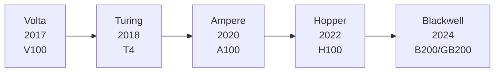

# 2.2 NVIDIA GPU 架构演进史

> 来源：AIInfraGuide 模块一 GPU 模块 | 笔记类型：学习笔记（新人友好版）
> 目标：理解 Volta→Blackwell 五代架构的关键创新，能读懂规格表 | 更新时间：2026-07-10
> 关联：前置 `../2. 硬件基础篇/1. GPU架构与计算单元.md` / 对比选型 `1. 主流GPU横向对比与选型.md`

---

## 一句话结论

从 Volta 引入 Tensor Core（2017）到 Blackwell 双芯封装（2024），每代都在「拉高算力 / 加大显存 / 提升精度灵活性 / 加速互联」四条线上推进。理解演进史能预测下一代、能读懂官方规格表、能在面试中讲清「为什么 H100 为大模型而生」。

---

## 背景与定位

- **这篇讲什么**：NVIDIA 五代 AI GPU 架构（Volta/Turing/Ampere/Hopper/Blackwell）逐代详解，每代解决了什么问题、引入了什么关键技术。
- **为什么重要**：做 AI Infra 工程经常遇到「训练跑不动该升级什么卡？推理延迟高卡在哪？FP8 和 BF16 选哪个？」——答案藏在架构设计决策里。
- **前置知识**：`1. GPU架构与计算单元.md`（Tensor Core、精度格式概念）。
- **在笔记链路中的位置**：第 4 篇，硬件基础之上的架构演进。

---

## 核心概念（新人友好讲解）

### 1. 为什么要了解 GPU 架构演进

理解 NVIDIA GPU 的代际演进，本质上是理解**AI 硬件和 AI 算法的协同进化**——每一代架构都在回应上一代暴露的瓶颈，每个新特性都有其针对的工作负载场景。

### 2. 架构演进全景图



| 架构 | 年份 | 代表产品 | 核心突破 |
|------|------|---------|---------|
| Volta | 2017 | V100 | 首次引入 Tensor Core |
| Turing | 2018 | T4 | INT8/INT4 推理加速、RT Core |
| Ampere | 2020 | A100 | 第三代 Tensor Core、MIG、TF32、BF16 |
| Hopper | 2022 | H100 | FP8、Transformer Engine、NVLink 4.0 |
| Blackwell | 2024 | B200 / GB200 | 第五代 Tensor Core、NVLink 5.0、双芯封装 |

可以把它想象成一条不断拓宽、提速的高速公路——每代都在扩展车道（算力）、提升路面质量（精度支持）、建造更高效的立交桥（互联带宽）。

---

### 3. Volta 架构（2017）—— AI 加速的开端

#### 3.1 背景：GPU 凭什么做 AI？

在 Volta 之前，深度学习训练主要依赖 GPU 的 CUDA Core 做通用浮点运算。CUDA Core 是"万金油"——什么都能算，但没有针对深度学习最核心的操作（矩阵乘法）做专门优化。好比用菜刀切面包，能用，但不如面包刀好使。

#### 3.2 关键创新：Tensor Core

Volta 最重要的贡献是引入了 **Tensor Core**——专为矩阵乘累加运算（MMA）设计的硬件单元。

传统 CUDA Core 每周期处理一次标量乘加（FMA），而一个 Tensor Core 每周期可以完成一个 4×4×4 的混合精度矩阵乘累加：`D = A × B + C`，其中 A、B 为 FP16，C、D 为 FP16 或 FP32。一次操作完成 64 次乘加，效率提升一个数量级。

#### 3.3 V100 关键规格

| 参数 | 规格 |
|------|------|
| Tensor Core 数量 | 640 个 |
| FP16 Tensor 算力 | 125 TFLOPS |
| FP32 CUDA 算力 | 15.7 TFLOPS |
| 显存 | 16 GB / 32 GB HBM2 |
| 显存带宽 | 900 GB/s |
| NVLink | NVLink 2.0，300 GB/s（双向） |

> 💡 V100 是第一块真正意义上的"AI 训练卡"。理解 V100 的 Tensor Core 设计是学习后续架构的基础。

#### 3.4 实践意义：混合精度训练

Volta 开启了编程范式转变：要用 Tensor Core，矩阵维度需是 8 的倍数，数据类型需用混合精度（FP16 计算 + FP32 累加）。

```python
# PyTorch 中使用混合精度训练（Volta 时代开始受益）
import torch
from torch.cuda.amp import autocast, GradScaler

scaler = GradScaler()
for data, target in dataloader:
    optimizer.zero_grad()
    with autocast():  # 自动选择 FP16/FP32
        output = model(data)
        loss = criterion(output, target)
    scaler.scale(loss).backward()
    scaler.step(optimizer)
    scaler.update()
```

> 🔧 **新人参数解释**：
> - **autocast**：自动混合精度上下文管理器，在前向传播时自动将 FP32 运算转为 FP16（在支持的 GPU 上用 Tensor Core）
> - **GradScaler**：梯度缩放器，FP16 梯度可能下溢（变成 0），GradScaler 先放大 loss 再反向传播，更新时再缩回来
> - **loss scaling**：FP16 的数值范围窄（最大约 65504），小梯度可能变成 0，需要先放大

---

### 4. Turing 架构（2018）—— RT Core 与推理加速

#### 4.1 解决的问题

Volta 主要面向训练。但推理部署7对延迟和吞吐要求更苛刻，且推理不需要 FP16 那么高精度——很多模型用 INT8 就能保持准确率。Volta 的 Tensor Core 只支持 FP16，推理场景算力利用不充分。

#### 4.2 关键创新

- **INT8 / INT4 Tensor Core 支持**：第二代 Tensor Core 新增整数精度，推理吞吐相比 FP16 再翻倍
- **RT Core**：光线追踪加速单元（AI Infra 领域较少涉及）
- **低功耗推理定位**：T4 的 TDP 仅 70W，适合推理服务器

#### 4.3 T4 关键规格

| 参数 | 规格 |
|------|------|
| Tensor Core 数量 | 320 个 |
| FP16 Tensor 算力 | 65 TFLOPS |
| INT8 Tensor 算力 | 130 TOPS |
| 显存 | 16 GB GDDR6 |
| 显存带宽 | 320 GB/s |
| TDP | 70W |

> 📌 T4 虽然绝对算力不如 V100，但低功耗、高 INT8 吞吐的特性使它成为推理部署的经典选择。很多云厂商的推理实例至今仍在使用 T4。

#### 4.4 实践意义：模型量化

Turing 架构推动了**模型量化**（Quantization）在工业界的普及。TensorRT 的 INT8 量化 pipeline 正是以 Turing 为目标设计的：

```bash
# ✅ 无需 sudo —— 导出 ONNX 模型
python export_onnx.py --model resnet50 --output model.onnx
```

**预期输出**（示例，实际取决于模型）：

```
[INFO] Loading PyTorch model: resnet50
[INFO] Exporting to ONNX: model.onnx
[INFO] ONNX export complete. Output: model.onnx (98.5 MB)
```

```bash
# ✅ 无需 sudo —— 用 trtexec 构建 INT8 engine（需要校准数据集）
trtexec --onnx=model.onnx --int8 --calib=calibration_cache.bin --saveEngine=model_int8.engine
```

**预期输出**（示例，实际取决于模型和 GPU）：

```
&&&& RUNNING TensorRT.trtexec [TensorRT v8502]
[08/15/2024-10:23:15] [I] === Build Options ===
[08/15/2024-10:23:15] [I] Precision: INT8
[08/15/2024-10:23:18] [I] [TRT] [MemUsageChange] Init CUDA
[08/15/2024-10:23:20] [I] Engine built in 4.5s
[08/15/2024-10:23:21] [I] === Performance Summary ===
[08/15/2024-10:23:21] [I] Throughput: 4523.4 qps
[08/15/2024-10:23:21] [I] Latency: min = 0.21 ms, max = 0.25 ms, mean = 0.22 ms
&&&& PASSED
```

> 🔧 **新人参数解释**：
> - **ONNX**：开放神经网络交换格式，跨框架的模型中间表示
> - **trtexec**：TensorRT 的命令行工具，将 ONNX 模型编译为优化后的推理 engine
> - **INT8 量化**：将 FP32/FP16 权重压缩到 INT8（8 位整数），显存占用减少 4 倍，算力翻倍
> - **calibration_cache.bin**：校准数据集缓存，量化需要用代表性数据确定每层的缩放因子

---

### 5. Ampere 架构（2020）—— 数据中心 AI 的分水岭

#### 5.1 解决的问题

到 2020 年，AI 模型规模急剧膨胀（GPT-3 有 1750 亿参数），两个痛点突出：
1. **精度格式不够灵活**：FP16 在某些模型上数值溢出，FP32 又太慢
2. **单卡利用率不高**：一块 GPU 只能跑一个任务，多租户场景资源浪费

#### 5.2 关键创新

##### TF32 —— "不用改代码的加速"

**TF32（TensorFloat-32）** 使用 FP32 的 8 位指数位（保持相同数值范围）加上 FP16 的 10 位尾数位，在**不修改任何代码**的情况下对 FP32 运算自动提速：

```
格式    符号位  指数位  尾数位  总位宽
FP32:     1       8      23      32     范围大、精度高
TF32:     1       8      10      19     范围同 FP32、精度同 FP16  ← Ampere 新增
FP16:     1       5      10      16     范围窄、精度高
BF16:     1       8       7      16     范围同 FP32、精度低  ← Ampere 新增
```

> 💡 TF32 在 Ampere 上**默认开启**。在 A100 上跑 `torch.matmul` 时，如果输入是 FP32，Tensor Core 自动用 TF32 加速，不需要显式开启混合精度。

##### MIG —— 一卡多用

**MIG（Multi-Instance GPU）** 允许将一块 A100 物理隔离为最多 7 个独立 GPU 实例，每个实例有独立的显存、缓存和计算资源。就像把大房子隔成多个独立公寓，每户有自己的水电表，互不干扰。

```bash
# ✅ 无需 sudo —— 查看 A100 支持的 MIG 配置
nvidia-smi mig -lgip
```

**预期输出**（A100 80GB 示例，显示可创建的 GPU 实例切片）：

```
GPU 0: A100-SXM4-80GB (UUID: GPU-xxxxxx)
  GPU instance profiles on GPU 0:
    ID    Name              Slice    Memory    Processors  Multiprocessors
    19    MIG 1g.10gb       1        10GB      14          14
    20    MIG 2g.20gb       2        20GB      28          28
    21    MIG 3g.40gb       3        40GB      42          42
    22    MIG 4g.40gb       4        40GB      56          56
    23    MIG 7g.80gb       7        80GB      98          98
```

> 🔧 **新人参数解释**：
> - **Slice**：计算切片数，决定实例分到多少 SM
> - **Memory**：实例独占的显存
> - **1g.10gb**：1 个计算切片 + 10GB 显存（最小实例）
> - **7g.80gb**：7 个切片 + 80GB（几乎独占整卡）

```bash
# ⚠️ 需 sudo —— 创建一个 MIG 实例（以 3g.20gb 为例）
sudo nvidia-smi mig -cgi 9,9 -C
```

> ⚠️ **sudo 权限说明**：创建/销毁 MIG 实例需要 root 权限或 CAP_SYS_ADMIN 能力。
>
> **无 sudo 用户的替代方案**：你无法自行创建 MIG 实例，但可以**查看**管理员已创建的实例：
> ```bash
> # ✅ 无需 sudo —— 查看已创建的 MIG 实例
> nvidia-smi mig -lgi
> ```
> 预期输出（如果管理员已创建实例）：
> ```
> GPU 0: A100-SXM4-80GB
>   GPU instance ID: 1  MIG 3g.20gb  (Memory: 20GB, Processors: 42)
>   GPU instance ID: 2  MIG 2g.20gb  (Memory: 20GB, Processors: 28)
> ```
> 使用时设置 `CUDA_VISIBLE_DEVICES=MIG-xxxx` 即可指定使用某个 MIG 实例。如需 MIG 隔离，请联系管理员创建。

```bash
# ✅ 无需 sudo —— 查看已创建的 MIG 实例
nvidia-smi mig -lgi
```

MIG 的典型应用场景：
- ✅ 多个推理服务共享一块 A100，各自隔离互不影响
- ✅ 开发/调试阶段，多人共用一块卡
- ❌ 不适合需要完整 GPU 算力的大模型训练

##### 第三代 Tensor Core

支持精度矩阵大幅扩展：FP16、**BF16**、TF32、INT8、INT4、Binary（1-bit），覆盖训练到推理全场景。

#### 5.3 A100 关键规格

| 参数 | 规格 |
|------|------|
| Tensor Core 数量 | 432 个（第三代） |
| FP16 / BF16 Tensor 算力 | 312 TFLOPS |
| TF32 Tensor 算力 | 156 TFLOPS |
| FP32 CUDA 算力 | 19.5 TFLOPS |
| 显存 | 40 GB / 80 GB HBM2e |
| 显存带宽 | 2.0 TB/s |
| NVLink | NVLink 3.0，600 GB/s（双向） |

#### 5.4 实践意义：BF16 训练

Ampere 让 **BF16 混合精度训练**成为主流。BF16 与 FP32 有相同的数值范围（8 位指数），避免 FP16 常见的溢出问题，同时显存和通信量减半。

```python
# 在 A100 上使用 BF16 训练（PyTorch 原生支持）
model = model.to(dtype=torch.bfloat16, device="cuda")

# 或使用 PyTorch 的 autocast
with torch.autocast(device_type="cuda", dtype=torch.bfloat16):
    output = model(input_ids)
    loss = criterion(output, labels)
```

> 💡 **BF16 vs FP16 选择**：大模型训练几乎都用 BF16（不溢出、无需 loss scaling）。FP16 需要 GradScaler 处理梯度下溢。Ampere 之前（V100）不支持 BF16 硬件加速，只能用 FP16。

---

### 6. Hopper 架构（2022）—— 为大模型而生

#### 6.1 解决的问题

LLM 时代到来后双重压力：
1. **算力饥渴**：百亿/千亿参数训练需要成百上千块 GPU
2. **通信瓶颈**：多卡 All-Reduce、All-to-All 成为重要瓶颈

Hopper 几乎每个特性都在回应这两个挑战。

#### 6.2 关键创新

##### FP8 训练 —— 精度再压一刀

第四代 Tensor Core 支持 **FP8**（E4M3 和 E5M2 两种格式），训练精度从 BF16 的 16 位压缩到 8 位，理论算力翻倍。

```
格式    符号位  指数位  尾数位  适用场景
E4M3:     1       4      3      前向传播（精度优先）
E5M2:     1       5      2      反向传播（范围优先）
```

##### Transformer Engine —— 自动驾驶级精度管理

**Transformer Engine** 在每层计算前动态分析张量数值分布，自动决定用 FP8 还是 BF16/FP16。就像"自动挡"——数值稳定的层挂高速档（FP8），数值敏感的层降档（BF16）。

```python
# 使用 Transformer Engine 的 FP8 训练
import transformer_engine.pytorch as te

# 替换标准 Linear 层为 TE 的 FP8 版本
model.layer = te.Linear(hidden_size, hidden_size)

# 启用 FP8 自动混合精度
with te.fp8_autocast(enabled=True):
    output = model(input_data)
```

> 🔧 **新人参数解释**：
> - **transformer_engine**：NVIDIA 提供的 PyTorch 库，需 `pip install transformer-engine`（无 sudo 用 conda/pip 装到用户环境）
> - **te.Linear**：TE 替换的 Linear 层，内部自动管理 FP8 精度切换
> - **fp8_autocast**：类似 PyTorch 的 autocast，但由 TE 管理精度调度

**预期输出**（FP8 vs BF16 训练对比，示例数值取决于模型和 GPU）：

```
[TE] FP8 training enabled. Using E4M3 for forward, E5M2 for backward.
Epoch 1:
  BF16 baseline: loss=2.345, throughput=12500 tokens/s
  FP8 enabled:   loss=2.342, throughput=18900 tokens/s  (+51% throughput)
```

##### NVLink 4.0 与 NVSwitch

| 指标 | Ampere (A100) | Hopper (H100) | 提升 |
|------|--------------|--------------|------|
| NVLink 带宽（双向） | 600 GB/s | 900 GB/s | 1.5× |
| All-Reduce 带宽 | 600 GB/s | 900 GB/s | 1.5× |

> ⚠️ **H100 两个版本**：PCIe 版和 SXM 版。SXM 版通过 NVSwitch 支持 8 卡全互联，NVLink 4.0 总带宽 900 GB/s；PCIe 版虽也有 NVLink 4.0 但仅支持 2 卡桥接。选型务必注意。

##### 其他重要特性

- **Thread Block Cluster**：CUDA 新增一层层次，允许多个 Thread Block 协作
- **TMA（Tensor Memory Accelerator）**：硬件异步内存拷贝单元，将数据搬运从计算流水线解耦

#### 6.3 H100 关键规格

| 参数 | 规格 |
|------|------|
| Tensor Core 数量 | 528 个（第四代） |
| FP8 Tensor 算力 | 1,979 TFLOPS（Dense）/ 3,958 TFLOPS（稀疏） |
| FP16 / BF16 Tensor 算力 | 989 TFLOPS（Dense）/ 1,979 TFLOPS（稀疏） |
| TF32 Tensor 算力 | 495 TFLOPS（Dense）/ 989 TFLOPS（稀疏） |
| 显存 | 80 GB HBM3 |
| 显存带宽 | 3.35 TB/s |
| NVLink | NVLink 4.0，900 GB/s（双向，SXM 版） |

> 💡 **Dense vs 稀疏**：从 Ampere 起支持 2:4 结构化稀疏性（Structured Sparsity），每 4 个权重中 2 个为零时可吞吐翻倍。但需要模型经过专门剪枝处理，实际大多用 Dense 算力。

---

### 7. Blackwell 架构（2024）—— 万亿参数时代

#### 7.1 解决的问题

进入万亿参数时代，单卡算力增长跟不上模型膨胀。Blackwell 的哲学：与其一味堆晶体管，不如在芯片互联层面做革命性突破。

#### 7.2 关键创新

##### 双芯封装（Dual-Die）

B200 的核心由**两块 die 通过 10 TB/s 片间互联**封装在同一芯片上。对外表现为一块 GPU，实际拥有两块 die 的算力。就像两匹马套在一起拉车，对车夫来说操作不变，但拉力翻倍。

##### 第五代 Tensor Core

- FP8 Dense 算力相比 H100 提升约 14%（双 die 加持）
- **FP4 精度首次获得硬件级支持**：Dense 算力 4,500 TOPS，稀疏后 9,000 TOPS

##### NVLink 5.0

| 指标 | Hopper (H100) | Blackwell (B200) | 提升 |
|------|--------------|-----------------|------|
| NVLink 带宽（双向） | 900 GB/s | 1,800 GB/s | 2× |
| NVLink 连接的 GPU 数 | 8 | 72（通过 NVLink Switch） | 9× |

1.8 TB/s 的互联带宽意味着 GPU 间通信速度已接近单卡显存带宽。过去需要精心设计通信拓扑规避的瓶颈，现在可以用"暴力"带宽碾过。

##### 其他亮点

- **HBM3e 显存**：单卡最高 192 GB，带宽 8 TB/s
- **第二代 Transformer Engine**：更智能的 FP8/FP4 动态精度调度
- **机密计算（Confidential Computing）**：硬件级 GPU TEE，保护训练数据隐私

#### 7.3 B200 / GB200 关键规格

| 参数 | B200 | GB200（Grace-Blackwell） |
|------|------|--------------------------|
| FP8 Tensor 算力 | 2,250 TFLOPS（Dense）/ 4,500 TFLOPS（稀疏） | 同左（GPU 部分） |
| FP4 Tensor 算力 | 4,500 TOPS（Dense）/ 9,000 TOPS（稀疏） | 同左（GPU 部分） |
| 显存 | 192 GB HBM3e | 192 GB HBM3e + 480 GB LPDDR5x（CPU） |
| 显存带宽 | 8 TB/s | 8 TB/s（GPU 部分） |
| NVLink | NVLink 5.0，1,800 GB/s | NVLink 5.0，1,800 GB/s |
| 芯片设计 | 双 die 封装 | Grace CPU + Blackwell GPU 紧耦合 |

> 📌 **GB200** 是 CPU-GPU 超级芯片，将 NVIDIA Grace ARM CPU 与 Blackwell GPU 通过高速 NVLink-C2C 互联封装，消除传统 PCIe 的 CPU-GPU 通信瓶颈。

---

### 8. 各代规格速查表

#### Tensor Core 算力演进（Dense 非稀疏）

| 精度 | V100 | T4 | A100 | H100 | B200 |
|------|------|----|------|------|------|
| FP16 / BF16 | 125 TFLOPS | 65 TFLOPS | 312 TFLOPS | 989 TFLOPS | ~1,125 TFLOPS |
| TF32 | — | — | 156 TFLOPS | 495 TFLOPS | ~563 TFLOPS |
| FP8 | — | — | — | 1,979 TFLOPS | ~2,250 TFLOPS |
| INT8 | — | 130 TOPS | 624 TOPS | 1,979 TOPS | ~2,250 TOPS |
| FP4 | — | — | — | — | ~4,500 TOPS |

#### 显存与带宽演进

| 指标 | V100 | A100 | H100 | B200 |
|------|------|------|------|------|
| 显存容量 | 32 GB | 80 GB | 80 GB | 192 GB |
| 显存类型 | HBM2 | HBM2e | HBM3 | HBM3e |
| 显存带宽 | 900 GB/s | 2.0 TB/s | 3.35 TB/s | 8 TB/s |
| NVLink 带宽 | 300 GB/s | 600 GB/s | 900 GB/s | 1,800 GB/s |

> 📌 **趋势**：显存带宽增长慢于算力增长。这反映了 AI 工作负载的 memory-bound 特性——模型足够大时，瓶颈不在计算而在访存。

---

## ⚠️ MIG 命令权限说明（独立小节）

用户环境：WSL + 有 GPU 的 Linux 服务器，**无 sudo 权限**。

| 命令 | 用途 | 权限 |
|------|------|------|
| `nvidia-smi mig -lgip` | 查看支持的 MIG 配置 | ✅ 无需 sudo（只读） |
| `nvidia-smi mig -lgi` | 查看已创建的 MIG 实例 | ✅ 无需 sudo（只读） |
| `sudo nvidia-smi mig -cgi 9,9 -C` | 创建 MIG 实例 | ⚠️ 需 sudo |

**无 sudo 替代方案**：无法自行创建 MIG 实例，只能查看管理员已创建的实例。如需 MIG 隔离，请联系管理员创建后使用 `CUDA_VISIBLE_DEVICES=MIG-xxxx` 指定实例。

---

## 面试回答（可直接口述的版本）

**问：Tensor Core 从 Volta 到 Hopper 的精度演进？**

答：Volta（2017）引入第一代 Tensor Core，只支持 FP16。Turing（2018）加 INT8/INT4 用于推理加速。Ampere（2020）是分水岭——引入 TF32（不用改代码的 FP32 加速）和 BF16（范围同 FP32、无需 loss scaling），还加了 MIG 一卡多用。Hopper（2022）引入 FP8（E4M3/E5M2 两种格式）和 Transformer Engine 自动精度调度，理论算力再翻倍。Blackwell（2024）加 FP4，推理极致压缩。

**问：TF32 是什么？为什么 Ampere 是分水岭？**

答：TF32 是 Ampere 引入的 19 位精度格式——FP32 的 8 位指数（保持范围）+ FP16 的 10 位尾数（降低精度）。关键优势是默认开启、不用改代码：在 A100 上跑 FP32 的 `torch.matmul` 会自动用 TF32 加速。Ampere 是分水岭因为它同时解决了训练（BF16）和推理（MIG 隔离）两大痛点，还是最后一个不需要 Transformer Engine 就能做好混合精度的架构。

**问：MIG 解决什么问题？无 sudo 能用吗？**

答：MIG 将一块 A100 物理隔离为最多 7 个独立 GPU 实例，每个有独立显存和计算资源，适合多租户推理共享。无 sudo 用户不能创建 MIG 实例（`sudo nvidia-smi mig -cgi` 需要 root），但可以查看已创建的实例（`nvidia-smi mig -lgi` 无需 sudo）并使用。

**问：Hopper 为什么是为大模型而生？**

答：三个关键特性：① FP8 精度将训练吞吐提升 30%-60%，配合 Transformer Engine 自动调度精度；② NVLink 4.0 带宽 900 GB/s，大幅降低多卡 All-Reduce 通信延迟；③ HBM3 的 3.35 TB/s 带宽缓解 Attention 的访存瓶颈。这三点恰好回应了大模型训练的算力饥渴和通信瓶颈两大挑战。

---

## 深入追问（可能被追问的点）

- **Q1: 2:4 结构化稀疏是什么？为什么是 2:4？**
  A: 每 4 个连续权重中必须有 2 个为零，硬件可跳过零值计算实现 2 倍加速。选 2:4 是平衡稀疏度和硬件复杂度的折中——更高稀疏度需要更复杂的索引，硬件代价大。

- **Q2: FP8 的 E4M3 和 E5M2 分别什么时候用？**
  A: E4M3（4 位指数 + 3 位尾数）精度更高，用于前向传播（需要精确计算）。E5M2（5 位指数 + 2 位尾数）范围更大，用于反向传播（梯度分布范围大，需要避免溢出）。Transformer Engine 自动在两者间切换。

- **Q3: Blackwell 双芯封装和 GB200 有什么区别？**
  A: B200 是两块 Blackwell GPU die 封装在一起（GPU-GPU 互联）。GB200 是 Grace ARM CPU + Blackwell GPU 封装在一起（CPU-GPU 互联），通过 NVLink-C2C 消除传统 PCIe 瓶颈。

- **Q4: 为什么从 Ampere 开始才有 BF16 硬件支持？V100 不能用 BF16 吗？**
  A: V100 的 Tensor Core 只支持 FP16 矩阵乘。BF16 虽然也是 16 位，但指数位布局不同（8 位 vs FP16 的 5 位），需要 Tensor Core 硬件支持。V100 上 BF16 只能用 CUDA Core 模拟（无加速），实际意义不大。

---

## 易混淆点对比

| 易混概念 | 区别 | 记忆技巧 |
|---------|------|----------|
| TF32 vs FP32 vs FP16 | TF32=FP32 范围+FP16 精度（19 位） | TF32 是"折中"精度 |
| BF16 vs FP16 | BF16=FP32 范围+低精度（8 指数位），FP16=窄范围+高精度（5 指数位） | 大模型选 BF16（不溢出） |
| FP8 E4M3 vs E5M2 | E4M3 精度高（4 指数+3 尾数），E5M2 范围大（5 指数+2 尾数） | 前向 E4M3，反向 E5M2 |
| MIG vs vGPU | MIG=硬件物理隔离，vGPU=软件时间分片虚拟化 | MIG 更彻底，vGPU 更灵活 |
| Dense vs 稀疏算力 | 稀疏=开启 2:4 结构化稀疏后翻倍 | 标称看稀疏，实际看 Dense |
| SXM vs PCIe 封装 | SXM=高功耗+全互联，PCIe=低功耗+有限互联 | 数据中心选 SXM |

---

## 自测清单（含答案）

- [x] 能说出五代架构的名称、年份和代表产品
  > **答**：
  > | 架构 | 年份 | 代表产品 | 核心突破 |
  > |------|------|---------|---------|
  > | Volta | 2017 | V100 | 首次引入 Tensor Core |
  > | Turing | 2018 | T4 | INT8/INT4 推理加速 |
  > | Ampere | 2020 | A100 | TF32、BF16、MIG |
  > | Hopper | 2022 | H100 | FP8、Transformer Engine |
  > | Blackwell | 2024 | B200/GB200 | 双芯封装、FP4、NVLink 5.0 |
  > → 详见 §2 演进全景表

- [x] 能解释 Tensor Core 与 CUDA Core 的本质区别
  > **答**：→ 同 `../2. 硬件基础篇/1. GPU架构与计算单元.md` 自测第 7 题。CUDA Core = 标量乘加（1 次/周期），Tensor Core = 矩阵块乘加（2048 次/周期），加速比约 7 倍。

- [x] 能说出 FP32/TF32/BF16/FP16/FP8 各自的位宽和适用场景
  > **答**：→ 同 `../2. 硬件基础篇/1. GPU架构与计算单元.md` 自测第 8 题。FP32(32bit 基准)、TF32(19bit 训练)、FP16(16bit 需 loss scaling)、BF16(16bit 推荐)、FP8(8bit 训练+推理)。详见该篇 §3.2 精度格式表。

- [x] 能解释为什么大模型训练选 BF16 而非 FP16
  > **答**：→ 同 `../2. 硬件基础篇/1. GPU架构与计算单元.md` 自测第 9 题。BF16 有 8 位指数位（范围同 FP32，不溢出、无需 loss scaling），FP16 只有 5 位指数位（范围窄、易溢出）。详见该篇 §3.2 + 本篇 §5.4。

- [x] 能说出 MIG 的作用和适用场景
  > **答**：MIG（Multi-Instance GPU）将一块 A100 物理隔离为最多 7 个独立 GPU 实例，每个有独立显存和计算资源。适合：✅ 多个推理服务共享一块卡（互不影响）、✅ 开发调试多人共用。不适合：❌ 需要完整算力的大模型训练。类比：把大房子隔成多个独立公寓，每户有独立水电表。→ 详见 §5.2 MIG 小节

- [x] 能区分 MIG 创建（需 sudo）和查看（无需 sudo）命令
  > **答**：
  > - 查看（✅ 无需 sudo）：`nvidia-smi mig -lgip`（支持的配置）/ `nvidia-smi mig -lgi`（已创建实例）
  > - 创建（⚠️ 需 sudo）：`sudo nvidia-smi mig -cgi 9,9 -C`
  > 无 sudo 用户只能查看管理员已创建的实例，用 `CUDA_VISIBLE_DEVICES=MIG-xxxx` 指定使用。→ 详见 §5.2 + ⚠️ 权限说明小节

- [x] 能解释 Transformer Engine 的工作原理（FP8/BF16 动态切换）
  > **答**：Transformer Engine 在每层计算前动态分析张量数值分布，自动决定用 FP8 还是 BF16。数值稳定的层用 FP8（高速档，算力翻倍），数值敏感的层用 BF16（低速档，保精度）。类似自动挡汽车——根据路况自动换挡，程序员不用手动管。→ 详见 §6.2 Transformer Engine 小节

- [x] 能比较 NVLink 各代带宽差异
  > **答**：
  > | NVLink 版本 | 代表 GPU | 带宽（双向） |
  > |------------|---------|------------|
  > | NVLink 2.0 | V100 | 300 GB/s |
  > | NVLink 3.0 | A100 | 600 GB/s |
  > | NVLink 4.0 | H100 | 900 GB/s |
  > | NVLink 5.0 | B200 | 1,800 GB/s |
  > 每代提升 50%~100%。→ 详见 §8 规格速查表

- [x] 能解释 Blackwell 双芯封装和 GB200 的价值
  > **答**：B200 是两块 Blackwell GPU die 通过 10 TB/s 片间互联封装（GPU-GPU），对外表现为一块 GPU 但算力翻倍。GB200 是 Grace ARM CPU + Blackwell GPU 封装（CPU-GPU），通过 NVLink-C2C 消除传统 PCIe 瓶颈。NVLink 5.0 达 1,800 GB/s，连接 GPU 数从 8 扩展到 72——过去需要精心设计拓扑规避的通信瓶颈，现在可以用"暴力"带宽碾过。→ 详见 §7.2 + 深入追问 Q3

- [x] 能读懂 A100/H100/B200 规格表
  > **答**：→ 详见 §8 各代规格速查表。关键指标：Tensor Core 算力（各精度）、显存容量+类型+带宽、NVLink 带宽。注意区分 Dense（稠密）和稀疏算力，实际大多用 Dense 值。

---

## 关联笔记

- `../2. 硬件基础篇/1. GPU架构与计算单元.md`（Tensor Core 基础原理）
- `1. 主流GPU横向对比与选型.md`（横向对比 + 选卡决策）
- `../../CUDA编程/4. 算子实战篇/2. CUDA-GEMM算子性能优化.md`（Tensor Core 在 GEMM 中的使用）
- `../../CUDA编程/3. 优化篇/1. Warp与执行模型.md`（Volta 独立线程调度）

---

## 参考资料

- [NVIDIA V100 Whitepaper](https://images.nvidia.com/content/volta-architecture/pdf/volta-architecture-whitepaper.pdf)
- [NVIDIA A100 Whitepaper](https://images.nvidia.com/aem-dam/en-zz/Solutions/data-center/nvidia-ampere-architecture-whitepaper.pdf)
- [NVIDIA H100 Whitepaper](https://resources.nvidia.com/en-us-tensor-core/gtc22-whitepaper-hopper)
- [NVIDIA Blackwell 技术简报](https://www.nvidia.com/en-us/data-center/technologies/blackwell-architecture/)
- [NVIDIA Transformer Engine 文档](https://docs.nvidia.com/deeplearning/transformer-engine/user-guide/index.html)
- [NVIDIA MIG 用户指南](https://docs.nvidia.com/datacenter/tesla/mig-user-guide/)
