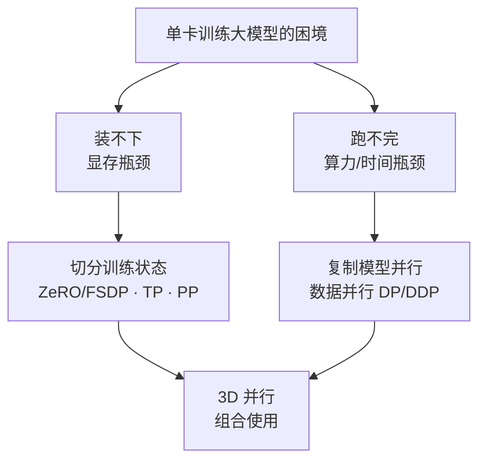
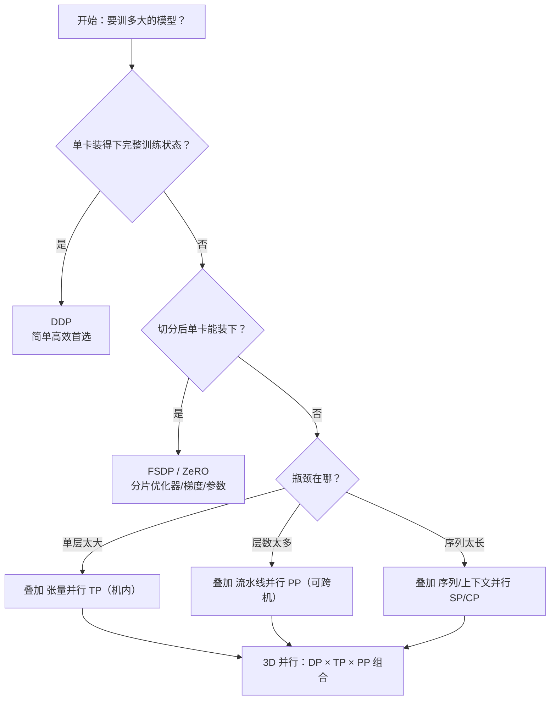

# 1.1 分布式训练总论：显存账本与五大并行策略全景

> **一句话结论**：分布式训练要解决两个独立问题——显存"装不下"靠切分状态，时间"跑不完"靠复制并行。BF16+Adam 下每参数约需 16 字节静态显存（其中优化器状态占 12 字节是大头），7B 模型仅静态就约 112GB，单卡根本装不下。五大并行策略各有分工，选型核心是"带宽决定作用域"：TP 必须机内 NVLink，PP/DP 可跨机。

---

## 目录

- [背景与现象](#背景与现象)
- [核心概念](#核心概念)
- [深入讲解](#深入讲解)
  - [1. 为什么需要分布式训练：装不下与跑不完](#1-为什么需要分布式训练装不下与跑不完)
  - [2. 训练显存账本：手算一遍就懂](#2-训练显存账本手算一遍就懂)
  - [3. 五大并行策略全景](#3-五大并行策略全景)
  - [4. 并行策略选择原则](#4-并行策略选择原则)
- [面试回答](#面试回答)
- [深入追问](#深入追问)
- [易混淆点](#易混淆点)
- [踩坑记录](#踩坑记录)
- [自测清单](#自测清单)
- [关联笔记](#关联笔记)

---

## 背景与现象

训练神经网络，本质是反复做"前向算 loss → 反向算梯度 → 优化器更新参数"。模型小时一块 GPU 全程装得下也跑得快，根本不需要分布式。但当模型膨胀到几百亿、几千亿参数，单卡会在两个维度同时撞墙。

**新人可能问：模型参数才 7B，用 BF16 存才 14GB，一张 A100 40G 不是绰绰有余吗？**

这是严重低估。训练时的显存远不止参数本身——还有梯度、Adam 优化器状态（一阶动量、二阶动量、FP32 主权重副本），加起来每参数约需 16 字节。7B 模型实际需要约 112GB，是参数本身的 8 倍。还没算前向传播堆积的激活值。

打个比方：单卡训大模型，就像让一个人用一张小书桌整理一整座图书馆——**桌子太小摊不开**（显存不够），而且**一个人搬一辈子也搬不完**（算力不够）。两个困境解法不同：前者要"拆开放到几张桌子上"，后者要"多叫几个人一起搬"。

---

## 核心概念

### 分布式训练的两个独立问题

| 维度 | 问题 | 形象比喻 | 解法方向 |
|------|------|---------|---------|
| 空间 | 显存装不下 | 书桌太小摊不开书 | 切分状态（把一份东西拆到多卡） |
| 时间 | 算力跑不完 | 一个人搬一辈子搬不完 | 复制并行（多卡各干一摊活） |

**关键认知**：这两个瓶颈解法方向不同——"装不下"靠**切分状态**，"跑不完"靠**复制并行**。后续五大策略也分属这两条线。

### 五大并行策略速查

| 策略 | 切什么 | 主要通信 | 解决的问题 | 适合机内还是跨机 |
|------|--------|---------|-----------|----------------|
| 数据并行 DP/DDP | 切数据，模型不切 | 梯度 AllReduce | 跑不完（加速） | 跨机可 |
| ZeRO / FSDP | 切优化器/梯度/参数 | ReduceScatter + AllGather | 装不下（省显存） | 跨机可 |
| 张量并行 TP | 切单层的矩阵运算 | 层内 AllReduce | 单层太大 | **必须机内** |
| 流水线并行 PP | 切网络层（按深度分段） | 段间传激活值（P2P） | 层数太多 | 跨机可 |
| 序列并行 SP/CP | 沿序列维度切 | 序列维 AllGather / All-to-All | 序列太长 | 视实现而定 |

> **新人词汇**：
> - **AllReduce**：所有进程把各自的数据汇总后再分发给所有人。详见 `../集合通信基础/3. 通信原语篇/2. 集合通信五大原语.md`
> - **ReduceScatter**：汇总后只把结果的一部分分给每个进程（Reduce + Scatter 的组合）
> - **AllGather**：每个进程把自己的数据收集起来拼成完整的再分发（Scatter 的逆操作）
> - **P2P（Point-to-Point）**：进程间一对一的直接通信，不走集合通信

---

## 深入讲解

### 1. 为什么需要分布式训练：装不下与跑不完

#### 1.1 装不下：显存瓶颈

很多人的直觉是"模型多少参数就占多少显存"，这是严重低估。训练时的显存远不止参数本身（下一节细算）。粗略地说，BF16 混合精度 + Adam 下**每个参数约需 16~18 字节静态显存**。用 LLaMA 系列估一下（仅静态显存，暂不含激活值）：

| 模型规模 | 参数量 $\Psi$ | 静态显存 $\approx 16\Psi$ | 单卡能否装下（H100 80GB） |
|----------|--------------|--------------------------|--------------------------|
| LLaMA 7B | $7 \times 10^9$ | $\approx 112$ GB | 不能装下 |
| LLaMA 70B | $70 \times 10^9$ | $\approx 1120$ GB | 远超 |
| LLaMA 405B | $405 \times 10^9$ | $\approx 6480$ GB | 需数十卡 |

连"小号"的 7B 模型，光静态显存就约 112 GB，**已超过单张 H100 的 80 GB**——还没算前向堆积的激活值。这就是第一个动因：**模型规模超过单卡显存容量**。

> **我们的环境**：8 张 A100 40G，单卡 40GB。7B 模型静态需要 112GB，一张卡只够装三分之一。

#### 1.2 跑不完：算力与时间瓶颈

即便显存无限大，单卡还有"算得太慢"这道坎。大模型训练的计算量有个广为引用的经验公式（$C$ 为总浮点运算次数，$\Psi$ 为参数量，$D$ 为训练 token 数）：

$$
C \approx 6 \Psi D
$$

这个 "6" 来自前向约 2 倍、反向约 4 倍参数量的乘加。代入 70B 模型训 1T（$10^{12}$）token：

$$
C \approx 6 \times (70 \times 10^9) \times 10^{12} = 4.2 \times 10^{23} \text{ FLOPs}
$$

单张 H100 的 BF16 算力峰值约 $10^{15}$ FLOP/s，乐观假设 50% 有效利用率（MFU）：

$$
T = \frac{4.2 \times 10^{23}}{10^{15} \times 0.5} \approx 8.4 \times 10^8 \text{ 秒} \approx 26.6 \text{ 年}
$$

单卡训 70B 要二十多年——等训完模型架构都换好几代了。而 $N$ 卡数据并行理论上能把时间压到接近 $1/N$，1024 卡可降到约 9 天量级。这就是第二个动因：**单卡算力不足以在可接受时间内完成训练**。

> **新人词汇**：
> - **FLOP/s**：每秒浮点运算次数（Floating Point Operations Per Second），衡量算力的单位
> - **MFU**（Model FLOPs Utilization）：模型算力利用率，实际计算速度占理论峰值的比例，50% 已经是很乐观的值
> - **token**：语言模型处理的基本单位，约等于一个词或子词

### 2. 训练显存账本：手算一遍就懂

这是本章重点。我们把"训练到底吃多少显存"逐项拆开，亲手算一遍 7B 模型的账，以后估算任意规模都心里有数。

训练显存分**静态显存**（与训练步无关、常驻）和**激活值显存**（随 batch / 序列长度变化）两大块。

#### 2.1 静态显存四大组成

以最主流的 **BF16 混合精度 + Adam 优化器** 为例。设参数量为 $\Psi$，逐项分析（单位：Bytes）：

| 组成 | 精度 | 每参数字节 | 说明 |
|------|------|-----------|------|
| 模型参数 | BF16 | $2\Psi$ | 前向/反向用的工作副本 |
| 梯度 | BF16 | $2\Psi$ | 反向产出，与参数同形状 |
| 优化器 - FP32 参数副本 | FP32 | $4\Psi$ | Adam 维护的高精度主权重 |
| 优化器 - 一阶动量 $m$ | FP32 | $4\Psi$ | 梯度的指数滑动平均 |
| 优化器 - 二阶动量 $v$ | FP32 | $4\Psi$ | 梯度平方的指数滑动平均 |

> **新人词汇**：
> - **BF16**（Brain Float 16）：Google Brain 提出的 16 位浮点格式，与 FP32 有相同的指数范围但精度更低，特别适合深度学习训练
> - **混合精度**：训练时用 BF16 做前向/反向（省显存、快），但优化器用 FP32 做参数更新（保精度）的策略
> - **Adam 优化器**：最常用的自适应学习率优化器，维护梯度的一阶动量（动量）和二阶动量（梯度平方的滑动平均）来调整每个参数的学习率
> - **一阶动量 $m$**：梯度的指数滑动平均，相当于"惯性"
> - **二阶动量 $v$**：梯度平方的指数滑动平均，相当于"每个参数的历史梯度大小"，用来归一化

把优化器三项加起来就是 Adam 著名的 $12\Psi$。总静态显存：

$$
M_{\text{static}} = \underbrace{2\Psi}_{\text{参数}} + \underbrace{2\Psi}_{\text{梯度}} + \underbrace{12\Psi}_{\text{Adam 状态}} = 16\Psi \text{ Bytes}
$$

训练显存的"大头"其实是**优化器状态**（$12\Psi$，占了 16 里的 12），而非参数本身。这正是 ZeRO 第一刀就切优化器状态的原因——它是性价比最高的下手处。

> **为什么优化器状态占了这么多？**
>
> Adam 优化器为了做自适应学习率，需要为每个参数维护额外信息：
> 1. 一份 FP32 精度的参数副本（因为 BF16 精度不够做累加更新）→ $4\Psi$
> 2. 一阶动量 $m$（梯度的滑动平均）→ $4\Psi$
> 3. 二阶动量 $v$（梯度平方的滑动平均）→ $4\Psi$
>
> 这三项都是 FP32（4 字节/参数），加起来 $12\Psi$，是参数本身的 6 倍！

很多资料写"每参数 16~18 字节"，那个 16~20 的浮动来自实现细节差异（比如是否额外保留一份 FP32 梯度、是否用了 FP32 主梯度累加）。本文用最经典的 BF16 混合精度配置，记 $16\Psi$ 即可。

#### 2.2 手算 7B 模型静态显存

代入 $\Psi = 7 \times 10^9$：

$$
M_{\text{static}} = 16 \times 7 \times 10^9 = 1.12 \times 10^{11} \text{ Bytes} \approx 112 \text{ GB}
$$

逐项看更直观：

- 参数：$2 \times 7\text{B} = 14$ GB
- 梯度：$2 \times 7\text{B} = 14$ GB
- 优化器状态：$12 \times 7\text{B} = 84$ GB
- **合计约 112 GB**

一张 H100 只有 80 GB——**静态显存就已经装不下了**。我们的 A100 只有 40 GB，差距更大。

> **记忆口诀**：参数 2 + 梯度 2 + Adam 状态 12 = 16 字节/参数。7B 就是 112G，70B 就是 1120G。

#### 2.3 别忘了激活值

激活值是前向传播中为反向传播保留的中间结果，它**随 batch size $b$ 和序列长度 $s$ 线性/超线性增长**，是长序列、大 batch 训练里真正的"显存刺客"。

对 Transformer，单层激活值的粗略量级正比于 $b \cdot s \cdot h$（$h$ 为隐藏维），全模型再乘层数 $L$。激活值的精确公式涉及注意力中间量、是否开 Activation Checkpointing 等，这里只需建立直觉：

> **新人词汇**：
> - **激活值**（Activation）：前向传播每经过一层算出的中间结果。反向传播需要用它们算梯度，所以必须保存。层数越多、batch 越大、序列越长，激活值越大。
> - **Activation Checkpointing**（激活检查点/梯度检查点）：前向时不保存中间激活值，反向时重新前向算一遍——用算力换显存的经典技巧。详见第8章。
> - **隐藏维 $h$**：Transformer 模型的隐藏层宽度，如 LLaMA 7B 的 $h=4096$

静态显存只取决于参数量，是"固定成本"；激活值取决于 $b$、$s$，是"可调成本"。当你 OOM 时，先想到的应是减小 batch、开梯度累积或 Activation Checkpointing 来压激活值。

#### 2.4 显存估算速查

| 项目 | 公式（Bytes） | 取决于 |
|------|--------------|--------|
| 参数 | $2\Psi$ | 参数量 |
| 梯度 | $2\Psi$ | 参数量 |
| Adam 状态 | $12\Psi$ | 参数量 |
| **静态合计** | $\mathbf{16\Psi}$ | 参数量 |
| 激活值 | $\propto b \cdot s \cdot h \cdot L$ | batch / 序列 / 模型宽深 |

记住这张表，给定任意参数量都能 30 秒估出训练显存下限。

### 3. 五大并行策略全景

知道了瓶颈在哪、显存花在哪，接下来总览五种主流并行策略。每种策略的本质都是回答两个问题：**切什么**（决定省不省显存）、**怎么通信**（决定快不快）。



ASCII 备用图：

```
                ┌─────────────────────────────────┐
                │  单卡训练大模型的困境            │
                └────────────┬────────────────────┘
                             │
              ┌──────────────┴──────────────┐
              ▼                             ▼
    ┌─────────────────┐           ┌─────────────────┐
    │  装不下          │           │  跑不完          │
    │  显存瓶颈        │           │  算力/时间瓶颈    │
    └────────┬────────┘           └────────┬────────┘
             │                             │
             ▼                             ▼
    ┌─────────────────┐           ┌─────────────────┐
    │ 切分训练状态     │           │ 复制模型并行     │
    │ ZeRO/FSDP·TP·PP │           │ 数据并行 DP/DDP  │
    └────────┬────────┘           └────────┬────────┘
             │                             │
             └──────────────┬──────────────┘
                            ▼
                ┌─────────────────────────┐
                │   3D 并行               │
                │   DP × TP × PP 组合     │
                └─────────────────────────┘
```

逐个建立直觉：

- **数据并行（DP/DDP）**：每卡一份完整模型，各算各的数据分片，反向时 AllReduce 同步梯度。它**不省显存**（每卡仍装完整模型），但能近线性加速——主攻"跑不完"。

> **新人比喻**：数据并行就像 8 个厨师各有完整的菜谱和厨具，各自做不同的菜，做完后一起汇总心得（梯度同步）。每个人都需要全套厨具（完整模型），所以不省空间，但 8 个人同时做，速度快 8 倍。

- **ZeRO / FSDP**：DDP 的"显存优化版"。既然每卡都存了一份完全相同的优化器状态/梯度/参数，那不如分片存储、用时再 AllGather 拼回来——主攻"装不下"。

> **新人比喻**：ZeRO 就是 8 个厨师发现每人都备一套完整的调料柜太占地方，于是把调料分成 8 份各管一份，需要时互相借调（AllGather）。这样每人只占 1/8 的调料空间。

- **张量并行（TP）**：把一层（如一个大 Linear）的权重矩阵按行/列切到多卡，每卡算一部分再合并。通信频繁且量大，因此**只适合机内 NVLink**——解决"单层太大"。

> **新人比喻**：张量并行就像一道菜的工作量太大（切 100 斤土豆），8 个厨师分工每人切 12.5 斤，切完合并到一起。因为需要频繁传递半成品，厨师必须挨着站（机内 NVLink）。

- **流水线并行（PP）**：把模型按层切成几段，每段放一台/一组机器，激活值像流水线一样在段间传递。通信量小（只传激活值），**可跨机**——解决"层数太多"。

> **新人比喻**：流水线并行就像工厂流水线——工序 1 做完传给工序 2，工序 2 做完传给工序 3。每个工位只需要自己的工具（模型的一段），中间只在工位间传递半成品（激活值），通信量小所以可以跨车间（跨机）。

- **序列并行 / 上下文并行（SP/CP）**：沿序列长度维切分，让超长上下文（如 128K）也能放下——解决"序列太长"。

> **新人比喻**：序列并行就像处理一条超长的文档，8 个人各读 1/8 的内容再汇总。不做序列并行的话，每个人都要读完整篇文档（显存爆炸）。

### 4. 并行策略选择原则

有了全景，怎么选？核心只有一句话：**通信带宽决定策略的作用域**。

#### 4.1 带宽决定"谁放机内、谁能跨机"

不同互联的带宽差一个数量级，这直接决定通信密集型策略只能放在哪：

| 互联 | 带宽量级 | 适配策略 |
|------|---------|---------|
| NVLink / NVSwitch（机内） | 数百 GB/s（如 NVLink 900 GB/s） | TP（通信最频繁，必须机内） |
| InfiniBand / RoCE（机间） | 数百 Gbps（如 400 Gbps ≈ 50 GB/s） | PP、DP（通信稀疏，可跨机） |
| 以太网 | 更低 | 仅 DP 这类低频通信勉强可用 |

> **关于带宽分层的详细讲解**，参见 `../集合通信基础/2. 硬件篇/1. 单机卡间通信-NVLink与NVSwitch.md`

TP 每一层前向/反向都要 AllReduce，通信极频繁，放到跨机带宽上会被通信拖垮，所以**TP 几乎总是限制在单机 8 卡内**；PP 只在段边界传一次激活值，DP 一步只同步一次梯度，二者都能跨机。这是 3D 并行布局的根本依据。

> **Ring AllReduce 为什么是带宽最优的？** 参见 `../集合通信基础/4. 算法篇/1. Ring-AllReduce带宽最优.md`

#### 4.2 一棵实用决策树



ASCII 备用图：

```
[开始：要训多大的模型？]
          │
          ▼
   ┌──────────────────┐
   │ 单卡装得下        │───是──→ [DDP：简单高效首选]
   │ 完整训练状态？    │
   └────────┬─────────┘
            │ 否
            ▼
   ┌──────────────────┐
   │ 切分后单卡        │───是──→ [FSDP / ZeRO]
   │ 能装下？          │        分片优化器/梯度/参数
   └────────┬─────────┘
            │ 否
            ▼
   ┌──────────────────┐
   │ 瓶颈在哪？        │
   └──┬──────┬──────┬─┘
      │      │      │
  单层太大  层数太多  序列太长
      │      │      │
      ▼      ▼      ▼
   [叠加TP] [叠加PP] [叠加SP/CP]
   (机内)   (可跨机)
      │      │      │
      └──────┼──────┘
             ▼
   [3D 并行：DP × TP × PP 组合]
```

**推荐路径**：从最简单的够用方案起步，不够了再加维度——单卡装得下就 DDP；装不下先上 FSDP/ZeRO；还不行再按瓶颈叠 TP/PP/CP；千亿级才需要全套 3D 并行。

**不推荐**：一上来就堆 3D 并行。每多一个并行维度都会显著增加调试复杂度和通信开销，过早优化得不偿失。

> **我们的 8×A100 40G 环境**：
> - 7B 模型：单卡装不下（需112G），但 FSDP 切 8 份后每卡约 14G 静态，加激活值可以跑
> - 13B 模型：FSDP 切 8 份后每卡约 26G 静态，可行但比较紧
> - 70B 模型：FSDP 不够，需要 FSDP + TP 组合

---

## 面试回答

**问：分布式训练要解决什么问题？请简述五大并行策略。**

"分布式训练解决两个独立问题：一是显存装不下，二是算力跑不完。显存方面，BF16+Adam 下每参数约需 16 字节，其中优化器状态占 12 字节是大头，7B 模型静态就要 112GB，单卡装不下。算力方面，70B 模型训 1T token 单卡要 26 年。

五大策略各有分工：数据并行 DDP 每卡一份完整模型各跑不同数据，不省显存但加速训练；ZeRO/FSDP 是 DDP 的显存优化版，把优化器状态、梯度、参数分片存储来省显存；张量并行 TP 把单层矩阵运算切到多卡，通信频繁必须机内 NVLink；流水线并行 PP 按层切段，段间只传激活值所以可以跨机；序列并行 SP/CP 沿序列维度切，解决超长上下文问题。

选型核心是带宽决定作用域：TP 通信最频繁必须放机内，PP 和 DP 通信稀疏可以跨机。实践中从最简单的 DDP 起步，不够再加 FSDP，再不够按瓶颈叠 TP/PP，千亿级才上 3D 并行。"

---

## 深入追问

1. **Q: 为什么是 6ΨD 而不是其他系数？**
   A: 前向传播对每个参数大约做 2 次浮点运算（一次乘、一次加），反向传播约 4 次（需要对权重和输入分别求导），加起来 6 倍。这是 Chinchilla 论文中广泛引用的经验估计。

2. **Q: ZeRO 的三个阶段分别切什么？**
   A: ZeRO-1 切优化器状态（省 4x）、ZeRO-2 再切梯度（省 8x）、ZeRO-3 再切参数（省 N 倍，N 为卡数）。FSDP 本质上是 ZeRO-3 的 PyTorch 原生实现。

3. **Q: 为什么 TP 必须机内而 PP 可以跨机？**
   A: TP 每一层的前向和反向都需要 AllReduce 同步，通信频率极高（每层 2 次），跨机带宽只有机内的 1/5~1/10，会成为严重瓶颈。PP 只在段边界传递激活值，一个 micro-batch 只传几次，通信量小得多，适合跨机。

4. **Q: 激活值显存怎么估算？**
   A: Transformer 单层激活值约正比于 $b \cdot s \cdot h$，全模型乘层数 $L$。精确公式要考虑注意力中间量（$b \cdot s \cdot s \cdot h$，序列长时此项主导）、是否开 Activation Checkpointing 等。详见 `../GPU硬件/2. 硬件基础篇/2. 显存层次与性能指标.md` 和后续第 8 章。

5. **Q: 如果不用 Adam 用 SGD，显存会少多少？**
   A: SGD 没有一阶/二阶动量（省 $8\Psi$），也不需要 FP32 参数副本（省 $4\Psi$），每参数只需 $2+2=4$ 字节。但 SGD 训练大模型效果远不如 Adam，所以实践中很少为了省显存换优化器。

6. **Q: 3D 并行的 DP × TP × PP 怎么组合？**
   A: 典型布局是：先把机内 8 卡做 TP（如 TP=8），然后多机之间做 PP（把模型分成几段），最后在相同 PP 段、相同 TP 位置的卡之间做 DP。比如 64 卡 = 8 机 × 8 卡，可以 TP=8, PP=2, DP=4。

---

## 易混淆点

| 容易混淆的概念 | 区别 |
|---------------|------|
| DP vs DDP | DP 是 `DataParallel`，单进程多线程，受 GIL 限制已淘汰；DDP 是 `DistributedDataParallel`，一卡一进程，现代标准 |
| ZeRO vs FSDP | ZeRO 是 DeepSpeed 的实现，FSDP 是 PyTorch 原生的等价实现，原理相同（分片优化器/梯度/参数），API 不同 |
| TP vs PP | TP 切的是单层内的矩阵（横向切），PP 切的是层间（纵向切）。TP 通信频繁需机内，PP 通信稀疏可跨机 |
| 参数 vs 优化器状态 | 参数是模型权重（BF16，2字节/参数），优化器状态是 Adam 维护的动量等（FP32，12字节/参数），后者是前者的 6 倍 |
| 静态显存 vs 激活值 | 静态显存只取决于参数量（固定成本 $16\Psi$），激活值取决于 batch/序列长度（可调成本） |
| MFU vs 理论峰值 | MFU 是实际达到的算力利用率，理论峰值是硬件规格值。大模型训练 MFU 通常在 40%~55% |
| AllReduce vs AllGather | AllReduce 是"汇总后分发完整结果"，AllGather 是"各拼各的凑完整"。前者用于梯度同步，后者用于 ZeRO 拼参数 |

---

## 踩坑记录

### 坑 1：只算参数显存，严重低估训练所需显存

**现象**：以为 7B 模型 BF16 只需 14GB，A100 40G 够了，结果一跑就 OOM。

**原因**：漏算了梯度（14G）和 Adam 优化器状态（84G），实际静态需要 112GB。

**解决**：永远用 $16\Psi$ 估算静态显存下限，再预留激活值空间。

### 坑 2：以为多买几张卡用 DDP 就能训大模型

**现象**：8 张 A100 40G 用 DDP 训 7B，每卡都需要完整 112G，全 OOM。

**原因**：DDP 不省显存，每卡都存完整模型+优化器+梯度。

**解决**：显存装不下时用 FSDP/ZeRO 分片，不要用 DDP。

### 坑 3：TP 跨机导致训练极慢

**现象**：2 机 16 卡做 TP=16，训练速度比单机 8 卡还慢。

**原因**：TP 每层都要 AllReduce，跨机 IB 带宽只有机内 NVLink 的 1/5~1/10，通信开销远大于计算。

**解决**：TP 限制在单机 8 卡内（TP≤8），跨机用 PP 或 DP。

### 坑 4：一上来就上 3D 并行

**现象**：训个 7B 模型就搞 TP+PP+DP 三维并行，调试两周跑不通。

**原因**：过度工程化。7B 用 FSDP 单维度并行就够了。

**解决**：从 DDP 起步，OOM 了上 FSDP，还不够再按瓶颈加维度。参考决策树。

---

## 自测清单

- [ ] 能用一句话说清分布式训练要解决的两个独立问题，并指出各自的解法方向
- [ ] 能逐项写出 BF16 + Adam 训练的静态显存组成，并解释为什么是 $16\Psi$
- [ ] 能手算给定参数量模型的静态显存，并判断单卡是否装得下（如 13B 模型需要多少 GB？）
- [ ] 能用 $C \approx 6\Psi D$ 估算训练总计算量并推算单卡耗时
- [ ] 能画出五大并行策略的"切什么 × 怎么通信 × 解决什么"对比表
- [ ] 能解释为什么 TP 必须放机内而 PP/DP 可以跨机
- [ ] 能根据模型规模和集群拓扑，用决策树选出合适的并行策略组合
- [ ] 能解释为什么优化器状态占了 $12\Psi$（Adam 的三个 FP32 副本各是什么）
- [ ] 能说出 ZeRO 的三个阶段分别切什么
- [ ] 能区分 DDP 和 FSDP 的适用场景

---

## 关联笔记

| 关联主题 | 笔记位置 | 关系 |
|---------|---------|------|
| NVLink/IB 带宽分层 | `../集合通信基础/2. 硬件篇/1. 单机卡间通信-NVLink与NVSwitch.md` | 本文引用了带宽分层结论，详细原理在此篇 |
| 五大通信原语详解 | `../集合通信基础/3. 通信原语篇/2. 集合通信五大原语.md` | 本文提到 AllReduce/AllGather/ReduceScatter 等，详解在此篇 |
| Ring AllReduce 算法 | `../集合通信基础/4. 算法篇/1. Ring-AllReduce带宽最优.md` | DDP 梯度同步的核心算法 |
| NCCL 环境变量详解 | `../集合通信基础/5. NCCL实战篇/1. NCCL通信库基础与PyTorch使用.md` | 通信库的调试和配置 |
| GPU SM/Warp/Tensor Core | `../GPU硬件/2. 硬件基础篇/1. GPU架构与计算单元.md` | 理解 GPU 算力峰值从何而来 |
| HBM 显存层次 | `../GPU硬件/2. 硬件基础篇/2. 显存层次与性能指标.md` | 理解显存带宽和容量指标 |
| 环境搭建与分布式启动 | `./2. 环境搭建与分布式启动.md` | 下一篇，从理论落地到工程实践 |
