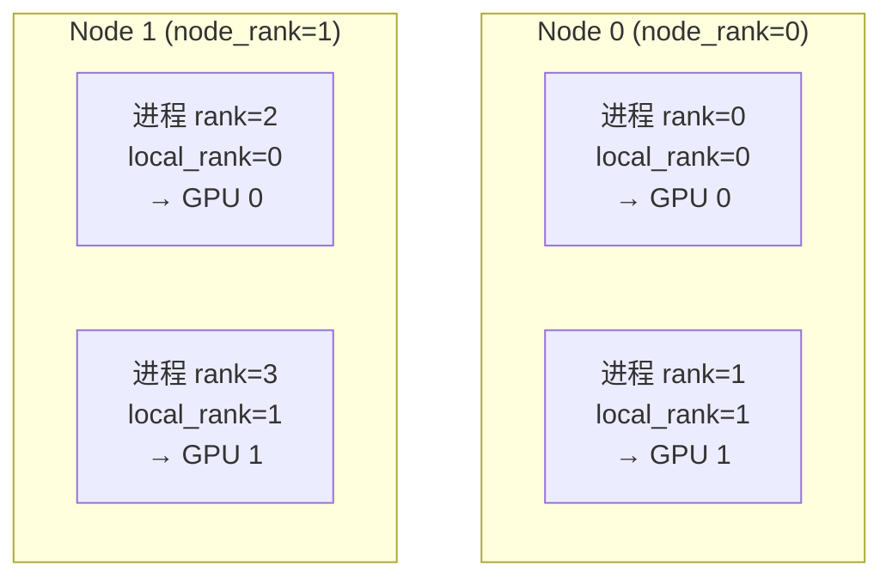
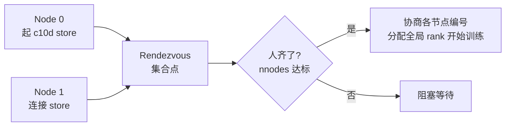
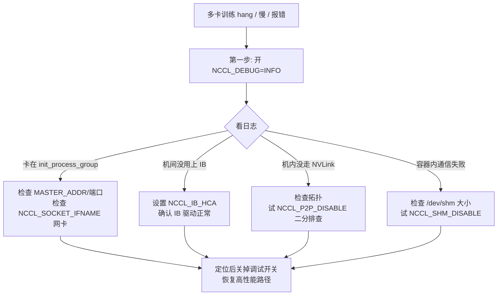
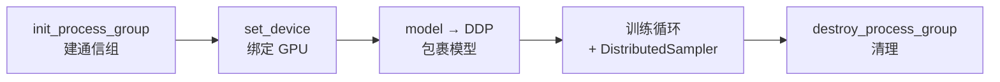

# 1.2 环境搭建与分布式启动

> **一句话结论**：PyTorch 分布式训练采用"一卡一进程"模型，核心三概念是 rank（全局编号）、local_rank（本机编号，决定绑哪块卡）、world_size（总进程数）。用 `torchrun` 一条命令批量拉起进程并自动注入环境变量，`init_process_group` 建立通信组后即可用 DDP 包裹模型自动同步梯度。通信排障第一招是 `NCCL_DEBUG=INFO`，定位完务必关掉调试开关恢复性能。

---

## 目录

- [背景与现象](#背景与现象)
- [核心概念](#核心概念)
- [深入讲解](#深入讲解)
  - [第零部分：环境搭建（新人入手）](#第零部分环境搭建新人入手)
  - [第一部分：进程组与核心概念](#第一部分进程组与核心概念)
  - [第二部分：torchrun 启动机制](#第二部分torchrun-启动机制)
  - [第三部分：NCCL 环境变量与通信调试](#第三部分nccl-环境变量与通信调试)
  - [第四部分：动手写第一个多卡训练脚本](#第四部分动手写第一个多卡训练脚本)
- [面试回答](#面试回答)
- [深入追问](#深入追问)
- [易混淆点](#易混淆点)
- [踩坑记录](#踩坑记录)
- [自测清单](#自测清单)
- [关联笔记](#关联笔记)

---

## 背景与现象

上一节从显存账本和并行全景建立了认知地图，这一节落到工程地基：在跑任何并行策略之前，得先搞清楚一件最朴素的事：多张显卡是怎么"组队"的，又怎么用一条命令把一堆进程同时拉起来、让它们知道彼此是谁？

**新人常见的困惑**：
- "我有 8 张卡，为什么不能在一个 Python 进程里管 8 张卡？"
- "rank、local_rank、world_size 到底什么关系？"
- "`torchrun` 和直接 `python train.py` 有什么区别？"
- "训练卡死没有任何报错，到底卡在哪？"

本节从环境搭建讲起，把进程模型、核心概念、启动器、NCCL 调试、最小 DDP 脚本一气讲透。读完你就能独立跑通第一个多卡训练。

---

## 核心概念

### 三大核心概念速查

| 概念 | 含义 | 取值范围 | 核心用途 |
|------|------|---------|---------|
| `rank` | 全局进程编号 | $0 \sim \text{world\_size}-1$ | 标识进程身份，`rank==0` 是主进程 |
| `local_rank` | 本节点内进程编号 | $0 \sim \text{每节点卡数}-1$ | **决定绑定哪块 GPU** |
| `world_size` | 总进程数 | = 节点数 × 每节点进程数 | 通信组规模 |

> **新人最容易犯的错**：用 `rank` 去绑 GPU。在多机场景下 `rank=2` 在第二台机器上根本没有"第 2 块卡"，会越界出错。**决定 GPU 绑定的永远是 local_rank，不是 rank**。

### 进程模型对比

| 模型 | 代表 API | 进程/线程 | 状态 |
|------|---------|----------|------|
| 单进程多线程 | `DataParallel` (DP) | 1 进程 N 线程 | 已淘汰（GIL 瓶颈） |
| 一卡一进程 | `DistributedDataParallel` (DDP) | N 进程 N 卡 | 现代标准 |

### DDP 脚本五段式骨架

```
init（建进程组）→ set_device（绑卡）→ DDP 包裹（包模型）→ 训练循环（带 Sampler）→ destroy（收尾）
```

---

## 深入讲解

### 第零部分：环境搭建（新人入手）

在跑分布式训练之前，需要先搭好环境。以下是从零开始的完整步骤，适用于 Ubuntu 服务器 + 8×A100 40G + 无 sudo 权限的场景。

#### 0.1 项目文件结构

一个典型的分布式训练项目结构如下：

```
dist_train/
├── envs/
│   └── setup_env.sh          # 环境初始化脚本
├── configs/
│   └── train_config.yaml     # 训练配置（超参、模型路径等）
├── src/
│   ├── model.py              # 模型定义
│   ├── dataset.py            # 数据集加载
│   └── train.py              # 训练主脚本
├── scripts/
│   ├── run_single_node.sh    # 单机多卡启动脚本
│   └── run_multi_node.sh     # 多机多卡启动脚本
├── checkpoints/              # 模型权重保存目录
├── logs/                     # 日志目录
└── requirements.txt          # Python 依赖
```

> **新人说明**：
> - `src/` 放核心代码，`scripts/` 放启动脚本，`configs/` 放配置文件——分离代码和配置是工程惯例
> - `checkpoints/` 和 `logs/` 是运行时生成的目录，提前建好避免首次运行报错

#### 0.2 创建 Conda 环境

> **环境说明**：用户环境为 Ubuntu 服务器，8 张 A100 40G，**无 sudo 权限**。以下命令均在用户权限下执行。

```bash
# ✅ 无需 sudo
# 创建名为 dist_train 的 conda 环境，Python 3.10
conda create -n dist_train python=3.10 -y

# 激活环境
conda activate dist_train
```

> **新人词汇**：
> - **Conda**：Python 的包管理和环境管理工具。环境（environment）相当于一个独立的 Python 安装，不同项目用不同环境互不干扰
> - **为什么用 Python 3.10**：PyTorch 2.x 对 3.10 支持最成熟，且 3.10 的类型提示和模式匹配等特性对写训练代码很友好

#### 0.3 安装 PyTorch（含 CUDA 支持）

```bash
# ✅ 无需 sudo
# 安装 PyTorch 2.x + CUDA 12.1 版本（根据服务器 CUDA 驱动版本选择）
pip install torch torchvision torchaudio --index-url https://download.pytorch.org/whl/cu121
```

> **新人注意**：
> - `--index-url` 指定从 PyTorch 官方 CUDA 专用源安装，不能用普通的 `pip install torch`（默认装 CPU 版本！）
> - CUDA 版本要和服务器的 NVIDIA 驱动兼容。用 `nvidia-smi` 查看驱动支持的最高 CUDA 版本，选不超过该版本的 PyTorch CUDA 构建
> - 如果网络慢，可以加 `-i https://pypi.tuna.tsinghua.edu.cn/simple` 用清华镜像加速（但 PyTorch 本体仍需从官方源下载）

#### 0.4 验证安装

```bash
# ✅ 无需 sudo
# 1. 验证 PyTorch 安装
python -c "import torch; print(f'PyTorch version: {torch.__version__}')"

# 2. 验证 CUDA 可用性
python -c "import torch; print(f'CUDA available: {torch.cuda.is_available()}')"

# 3. 查看 GPU 数量和型号
python -c "import torch; print(f'GPU count: {torch.cuda.device_count()}'); [print(f'  GPU {i}: {torch.cuda.get_device_name(i)}') for i in range(torch.cuda.device_count())]"

# 4. 验证 NCCL 通信库
python -c "import torch.distributed as dist; print(f'NCCL built: {dist.is_nccl_available()}')"
```

预期输出类似：

```text
PyTorch version: 2.3.0+cu121
CUDA available: True
GPU count: 8
  GPU 0: NVIDIA A100-SXM4-40GB
  GPU 1: NVIDIA A100-SXM4-40GB
  ...
  GPU 7: NVIDIA A100-SXM4-40GB
NCCL built: True
```

> **如果 CUDA available 是 False**：
> - 检查 `nvidia-smi` 是否正常输出（驱动是否安装）
> - 检查安装的 PyTorch 是否是 CUDA 版本而非 CPU 版本（`pip show torch` 看 Version 是否含 `+cu`）

#### 0.5 验证多卡通信（NCCL 测试）

```bash
# ✅ 无需 sudo
# 用 PyTorch 内置的 NCCL 测试验证多卡通信
# 单机 8 卡 AllReduce 带宽测试
python -c "
import torch
import torch.distributed as dist
import os

os.environ['MASTER_ADDR'] = '127.0.0.1'
os.environ['MASTER_PORT'] = '29500'

dist.init_process_group(backend='nccl', rank=0, world_size=1)
print('NCCL init succeeded on single process')
dist.destroy_process_group()
"
```

> **关于 NCCL 环境变量的详细讲解**，参见 `../集合通信基础/5. NCCL实战篇/1. NCCL通信库基础与PyTorch使用.md`

#### 0.6 安装其他常用依赖

```bash
# ✅ 无需 sudo
pip install numpy scipy wandb tensorboard transformers accelerate
```

> **新人词汇**：
> - **wandb**：Weights & Biases，实验追踪平台，记录 loss 曲线、梯度分布等
> - **tensorboard**：TensorFlow 出身但 PyTorch 也支持的可视化工具，看 loss 曲线和计算图
> - **transformers**：Hugging Face 的模型库，提供常用预训练模型
> - **accelerate**：Hugging Face 的分布式训练封装库，简化 DDP/FSDP 配置

---

### 第一部分：进程组与核心概念

#### 1. 从单卡到多机：三种规模与硬件拓扑

分布式训练的硬件规模通常分三档，理解它们之间的差异，才知道后续策略为什么要区分"机内"和"机间"。

| 规模 | 典型配置 | 互联方式 | 典型场景 |
|------|---------|---------|---------|
| 单机单卡 | 1 GPU | — | 调试、小模型原型 |
| 单机多卡 | 8 GPU / 节点 | NVLink / NVSwitch | 中等模型训练、张量并行 |
| 多机多卡 | N 节点 × 8 GPU | InfiniBand / RoCE | 百亿~千亿参数大模型 |

这里最关键的认知是**带宽分层**：同一台机器内的 GPU 通过 NVLink 互联，带宽可达数百 GB/s；而跨机器走 InfiniBand，带宽大约只有机内的几分之一到十分之一。这个差异直接决定了后续"哪些通信密集的策略只能放在机内"。

> **关于 NVLink/IB 带宽分层的详细讲解**，参见 `../集合通信基础/2. 硬件篇/1. 单机卡间通信-NVLink与NVSwitch.md`

打个比方：一栋楼里的同事可以随时走过去当面讨论（NVLink，机内），跨城市的团队就只能开视频会议（InfiniBand，机间）——能当面说的事尽量别开远程会，这也是并行策略布局的基本直觉。

#### 2. 进程模型：为什么是"一卡一进程"

PyTorch 分布式训练推荐的模型是 **一块 GPU 对应一个独立的操作系统进程**（one process per GPU）。很多初学者会疑惑：为什么不用单进程多线程，让一个进程管理 8 块卡？

原因有两个：

> **核心概念**：一卡一进程的本质是"用进程隔离绕开 Python 的并发限制，并让每块卡独占自己的 CUDA 上下文"。

- **绕开 GIL**：Python 的全局解释器锁（GIL）让同一进程内的多个线程无法真正并行执行 Python 字节码。如果用多线程驱动多卡，调度逻辑会被 GIL 串行化，多卡很难喂饱。多进程则各有各的解释器，互不争锁。
- **独占 CUDA 上下文**：每个进程绑定一块 GPU，拥有自己干净的 CUDA 上下文和显存空间，逻辑清晰、互不干扰，崩溃也只影响单个进程。

> **新人词汇**：
> - **GIL**（Global Interpreter Lock）：Python 的全局解释器锁。同一进程内同一时刻只有一个线程能执行 Python 代码。这是 CPython 的历史包袱，不是 Python 语言的固有特性，但至今未被移除
> - **CUDA 上下文**（CUDA Context）：每个进程使用 GPU 时需要建立的运行环境，包含显存管理、核函数加载等。一个进程可以有多个 CUDA 上下文，但每个上下文会占用额外显存

早期的 `DataParallel`（单进程多线程多卡）正是栽在 GIL 和主卡负载不均上，所以现代训练全部转向"一卡一进程"的 `DistributedDataParallel`。

> **关于 GPU SM/Warp 等硬件概念**，参见 `../GPU硬件/2. 硬件基础篇/1. GPU架构与计算单元.md`

#### 3. 核心概念：rank / local_rank / world_size

既然是多进程，就需要给每个进程编号，让它们知道"我是谁、总共有几个、我该用哪块卡"。这就是三个最核心的概念。



ASCII 备用图：

```
┌─────────────────────────────────────────────────┐
│  Node 0 (node_rank=0)                           │
│  ┌──────────────┐  ┌──────────────┐            │
│  │ 进程 rank=0  │  │ 进程 rank=1  │            │
│  │ local_rank=0 │  │ local_rank=1 │            │
│  │   → GPU 0    │  │   → GPU 1    │            │
│  └──────────────┘  └──────────────┘            │
└─────────────────────────────────────────────────┘
┌─────────────────────────────────────────────────┐
│  Node 1 (node_rank=1)                           │
│  ┌──────────────┐  ┌──────────────┐            │
│  │ 进程 rank=2  │  │ 进程 rank=3  │            │
│  │ local_rank=0 │  │ local_rank=1 │            │
│  │   → GPU 0    │  │   → GPU 1    │            │
│  └──────────────┘  └──────────────┘            │
└─────────────────────────────────────────────────┘

注意：Node 1 上 rank 是 2、3，但 local_rank 重新从 0 开始！
      set_device 用的永远是 local_rank
```

上图是一个 2 机 × 2 卡（共 4 进程）的例子，对照理解三个概念：

- **`rank`（全局 rank）**：进程在整个训练任务中的全局唯一编号，取值范围 $0 \sim \text{world\_size}-1$。上图中 4 个进程的 rank 依次是 0、1、2、3。常用 `rank == 0` 来指定"主进程"，负责打印日志、保存模型等。
- **`local_rank`（本地 rank）**：进程在**所在节点内部**的编号。它的核心作用是**决定绑定哪块 GPU**——通常直接 `torch.cuda.set_device(local_rank)`。注意上图 Node 1 上的两个进程，全局 rank 是 2、3，但 local_rank 重新从 0 开始数。
- **`world_size`（世界大小）**：参与训练的总进程数，上例为 4。它等于 `节点数 × 每节点进程数`。

> **提示**：初学者最容易混淆的就是用 `rank` 去 `set_device`。在多机场景下这会越界出错——`rank=2` 在第二台机器上根本没有"第 2 块卡"。**决定 GPU 绑定的永远是 local_rank，不是 rank**。

它们的换算关系（每节点进程数记为 $G$）：

$$
\text{rank} = \text{node\_rank} \times G + \text{local\_rank}
$$

$$
\text{world\_size} = \text{nnodes} \times G
$$

#### 4. 进程组 Process Group

有了编号，进程之间还需要建立一条"约定好的通信通道"，才能互相收发数据。这条通道就叫**进程组（Process Group）**。在做任何分布式通信之前，每个进程都必须先调用 `init_process_group` 加入这个组。

```python
import os
import torch
import torch.distributed as dist

def setup():
    # torchrun 会把这些环境变量注入进来
    rank = int(os.environ["RANK"])
    local_rank = int(os.environ["LOCAL_RANK"])
    world_size = int(os.environ["WORLD_SIZE"])

    # 1) 绑定本进程使用的 GPU（用 local_rank！）
    torch.cuda.set_device(local_rank)

    # 2) 初始化默认进程组，GPU 训练用 nccl 后端
    dist.init_process_group(
        backend="nccl",
        rank=rank,
        world_size=world_size,
    )
    return rank, local_rank, world_size

def cleanup():
    dist.destroy_process_group()
```

> **新人词汇**：
> - **进程组（Process Group）**：一组互相能通信的进程的集合。初始化后，组内进程可以做 AllReduce、Broadcast 等集合通信
> - **NCCL**（NVIDIA Collective Communications Library，读作 "nickel"）：NVIDIA 的 GPU 集合通信库，是 GPU 训练的通信底层
> - **`os.environ`**：Python 标准库的 `os.environ` 是一个字典，存放当前进程的所有环境变量。`torchrun` 注入的信息从这里读取

这里有两个值得展开的点：

**后端（backend）选择**：`backend` 决定底层用什么通信库，常见两种：

| 后端 | 适用设备 | 用途 |
|------|---------|------|
| `nccl` | GPU | GPU 间通信的事实标准，性能最优，训练首选 |
| `gloo` | CPU（也支持 GPU） | CPU 张量通信、不便用 NCCL 的调试场景 |

> **注意**：GPU 训练几乎总是选 `nccl`。NCCL 针对 NVLink / InfiniBand 做了深度优化，是后续 AllReduce 等集合通信能跑满带宽的关键。

> **关于 NCCL 的深入讲解**，参见 `../集合通信基础/5. NCCL实战篇/1. NCCL通信库基础与PyTorch使用.md`

**初始化会"阻塞等待"**：`init_process_group` 是一个同步点——它会**等到所有 world_size 个进程都到达这一行**才返回。如果某个进程没起来（比如某台机器命令没执行），其余进程就会一直卡在这里。这也是最常见的"训练 hang 住"原因之一。

#### 5. 子通信组：为 3D 并行铺路

到目前为止我们只有一个"默认进程组"，所有进程都在里面。但真正的大模型训练会同时用多种并行（数据并行 DP + 张量并行 TP + 流水线并行 PP，即 3D 并行），**每种并行需要自己独立的通信域**。

举个 8 卡的例子：假设我们要 张量并行=2、数据并行=4。那么：

- TP 组：每 2 张相邻卡组成一个 TP 组 → `{0,1}`、`{2,3}`、`{4,5}`、`{6,7}`，组内做 AllReduce 合并矩阵切片
- DP 组：跨 TP 组、相同 TP 位置的卡组成 DP 组 → `{0,2,4,6}`、`{1,3,5,7}`，组内做梯度 AllReduce

ASCII 图：

```
8 卡 TP=2 DP=4 的子组划分

卡号:  0   1   2   3   4   5   6   7
       │   │   │   │   │   │   │   │
TP组: [0,1] [2,3] [4,5] [6,7]   ← 相邻2卡一组
       │       │       │       │
DP组: [0,  2,  4,  6]  ← 偶数位一组
      [1,  3,  5,  7]  ← 奇数位一组
```

这些子组通过 `dist.new_group()` 从全局组派生：

```python
# 8 卡，TP=2，DP=4 的子组划分（简化示意）
tp_size, dp_size = 2, 4
rank = dist.get_rank()

# 构造本进程所属的 TP 组
tp_group_ranks = [
    list(range(i, i + tp_size))
    for i in range(0, tp_size * dp_size, tp_size)
]  # [[0,1],[2,3],[4,5],[6,7]]

tp_group = None
for ranks in tp_group_ranks:
    group = dist.new_group(ranks=ranks)  # 所有进程都要执行同样的 new_group 调用
    if rank in ranks:
        tp_group = group  # 只保留自己所在的组句柄

# 之后做 TP 内通信时显式指定 group=tp_group
# dist.all_reduce(tensor, group=tp_group)
```

> **关键点**：`new_group` 必须被**所有进程**调用（即使某个进程不属于这个组），否则会死锁。每个进程最终只持有"自己所在那个子组"的句柄，通信时通过 `group=` 参数指定在哪个域里发生。

这套子通信组机制是第 11 章「3D 并行」的基础。现在只需建立直觉：**全局组是大舞台，子组是各个排练厅，不同并行维度在各自的排练厅里互不打扰地通信。**

> **关于 AllReduce 等通信原语的详解**，参见 `../集合通信基础/3. 通信原语篇/2. 集合通信五大原语.md`

---

### 第二部分：torchrun 启动机制

写好了一卡一进程的训练脚本，还差最后一步：怎么用一条命令把这一堆进程同时拉起来，还让它们知道彼此是谁？这一部分讲清 PyTorch 的启动器从 `launch` 到 `torchrun` 的演进、它注入的环境变量，以及单机多卡和多机多卡两种场景下的启动方式与会合（Rendezvous）机制。

#### 6. 为什么需要专门的启动器

回想一下：一卡一进程意味着 8 卡训练要起 8 个进程，每个进程都得知道自己的 `rank`、`local_rank`、`world_size`，还要知道去哪里找"主节点"来会合。

如果手动起，你得开 8 个终端，每个都 `RANK=0 ... python train.py`、`RANK=1 ... python train.py`……不仅繁琐，多机时更是噩梦。**启动器（launcher）的作用，就是用一条命令批量拉起这些进程，并自动把每个进程该知道的环境变量塞进去。**

打个比方：启动器就像一个领队，喊一嗓子就能让全队按编号列队集合，而不需要你挨个去通知每个人"你是 3 号，去 B 区报到"。

#### 7. 从 torch.distributed.launch 到 torchrun

PyTorch 的启动器经历了一次换代：

| 启动器 | 状态 | 特点 |
|-----------|------|------|
| `python -m torch.distributed.launch` | 已废弃 | 老接口，靠 `--local_rank` 命令行参数传递，无弹性能力 |
| `torchrun` | 当前推荐 | 环境变量注入、内置弹性训练（Elastic）、自动重启、Rendezvous |

> **注意**：老代码里常见 `parser.add_argument("--local_rank")` 来接收 launch 传入的参数。迁移到 `torchrun` 后，`local_rank` 改为从环境变量 `os.environ["LOCAL_RANK"]` 读取，命令行参数那套要删掉。

`torchrun` 本质上是 `torch.distributed.run` 模块的一个控制台入口，二者等价：

```bash
torchrun --nproc_per_node=8 train.py
# 完全等同于
python -m torch.distributed.run --nproc_per_node=8 train.py
```

> **✅ 无需 sudo**

#### 8. torchrun 注入的环境变量

`torchrun` 拉起每个子进程时，会向它的环境变量里写入一组关键信息。脚本里只需要读取它们，无需自己计算：

| 环境变量 | 含义 | 典型用法 |
|---------|------|---------|
| `RANK` | 全局进程编号 | `dist.init_process_group` 的 rank |
| `LOCAL_RANK` | 节点内进程编号 | `torch.cuda.set_device(local_rank)` |
| `WORLD_SIZE` | 总进程数 | 进程组初始化 |
| `LOCAL_WORLD_SIZE` | 本节点进程数 | 计算本机资源占用 |
| `MASTER_ADDR` | 主节点 IP / 主机名 | 进程会合的"集合点"地址 |
| `MASTER_PORT` | 主节点端口 | 会合用端口（需空闲） |

所以脚本里标准的读取方式就是：

```python
import os

rank = int(os.environ["RANK"])
local_rank = int(os.environ["LOCAL_RANK"])
world_size = int(os.environ["WORLD_SIZE"])
```

> **提示**：`MASTER_ADDR` / `MASTER_PORT` 你通常不用在脚本里手动读——`init_process_group(backend="nccl")` 在 `env://` 初始化方式（默认）下会自己从这两个环境变量里读出会合地址。`torchrun` 已经替你设好了。

#### 9. 单机多卡启动

单机场景最简单，只需指定本机要起几个进程（一般等于卡数）：

```bash
# ✅ 无需 sudo
torchrun --nproc_per_node=8 train.py --epochs 10 --lr 1e-4
```

- `--nproc_per_node=8`：本机起 8 个进程，对应 8 块 GPU
- `train.py` 后面的参数会原样透传给你的脚本

这一条命令背后，`torchrun` 做了：起 8 个 `train.py` 进程 → 给它们分别写入 `RANK=0..7`、`LOCAL_RANK=0..7`、`WORLD_SIZE=8` → 设好 `MASTER_ADDR=127.0.0.1` 和一个空闲 `MASTER_PORT` → 让它们在本机会合。

> **关键点**：单机多卡下 `RANK` 和 `LOCAL_RANK` 恰好相等（只有一个节点），所以单机调试时用哪个都"看起来对"。一旦上多机，这个等式就不成立了——这也是为什么前面反复强调 `set_device` 要用 `local_rank`。

> **我们的 8×A100 40G 环境直接用这条命令即可。**

#### 10. 多机多卡启动与 Rendezvous

多机才是真正考验启动器的地方。核心问题是：分布在不同机器上的进程，如何找到彼此、确认"人齐了"再开始训练？这个"会合"过程就叫 **Rendezvous**。

> **新人词汇**：
> - **Rendezvous**（会合）：法语词汇，原意"约会、集合点"。在分布式训练中指多个进程约好在一个固定地址碰头、确认人到齐后才开始训练的机制

打个比方：多机会合就像一群人约在火车站碰头——得先约定一个明确的集合点（谁是主节点、在哪个地址端口），所有人到齐后清点人数，确认无误才一起出发。

每台机器都要执行一条 `torchrun` 命令。用 c10d 弹性会合时，各机命令几乎完全相同，由会合过程自动协商各节点编号：

```bash
# ✅ 无需 sudo
# 在 Node 0（rdzv 集合点所在机，IP 假设为 192.168.1.1）执行：
torchrun \
    --nnodes=2 \
    --nproc_per_node=8 \
    --rdzv_id=my_job \
    --rdzv_backend=c10d \
    --rdzv_endpoint=192.168.1.1:29400 \
    train.py

# 在 Node 1 执行（命令完全相同）：
torchrun \
    --nnodes=2 \
    --nproc_per_node=8 \
    --rdzv_id=my_job \
    --rdzv_backend=c10d \
    --rdzv_endpoint=192.168.1.1:29400 \
    train.py
```

参数逐个解释：

- `--nnodes=2`：总共 2 个节点。最终 `WORLD_SIZE = nnodes × nproc_per_node = 16`。
- `--rdzv_id=my_job`：本次任务的唯一标识，同一任务的所有节点必须填相同值，用于区分不同训练作业。
- `--rdzv_backend=c10d`：会合后端，`c10d` 是 PyTorch 内置实现，集合点所在节点会起一个 TCP store 供其他节点连接。
- `--rdzv_endpoint=192.168.1.1:29400`：会合点的地址，**所有节点都填同一个地址**。

> **提示**：用 c10d 动态 rendezvous 时，节点编号（node rank）由会合过程自动协商分配，因此 **各节点命令完全一致、不需要手动指定** `--node_rank`。`--node_rank` 是早期静态启动（`--master_addr`/`--master_port`）时才需要逐机指定的参数，不要和弹性写法混用。

整个会合流程：



ASCII 备用图：

```
Node 0                 Rendezvous              Node 1
┌──────────┐          ┌──────────┐           ┌──────────┐
│ 起 c10d  │─────────→│          │←──────────│ 连接     │
│ store    │          │ 集合点    │           │ store    │
└──────────┘          └────┬─────┘           └──────────┘
                           │
                           ▼
                    ┌─────────────┐
                    │ 人齐了？     │
                    │ nnodes 达标？│
                    └──┬──────┬───┘
                       │      │
                   是  │      │ 否
                       ▼      ▼
              ┌──────────┐  ┌──────────┐
              │ 协商编号  │  │ 阻塞等待  │
              │ 分配 rank │  │          │
              │ 开始训练  │  └──────────┘
              └──────────┘
```

> **注意**：早期教程常用 `--rdzv_endpoint` 的替代写法 `--master_addr` / `--master_port`（静态 rendezvous）。新代码推荐统一用 `--rdzv_backend=c10d` + `--rdzv_endpoint` 的弹性写法，它额外支持节点动态加入和容错重启。

#### 11. torchrun 的弹性与容错能力

`torchrun` 相比老 `launch` 最大的进步，是内置了**弹性训练（Elastic）**能力——这正是大规模训练长时间稳定运行的基础：

- **进程失败自动重启**：某个进程崩了，`torchrun` 可在同一组内重新拉起它（配合 checkpoint 续训）
- **节点弹性伸缩**：通过 `--nnodes=MIN:MAX` 指定节点数范围，允许部分节点中途加入/退出
- **统一的 Rendezvous 协调**：失败后所有存活进程重新会合，重新分配 rank

```bash
# ✅ 无需 sudo
# 允许 2 到 4 个节点的弹性训练
torchrun --nnodes=2:4 --nproc_per_node=8 \
    --rdzv_backend=c10d --rdzv_endpoint=192.168.1.1:29400 \
    train.py
```

> **提示**：弹性能力的完整故事（如何配合 checkpoint 做断点续训、如何应对大规模训练中频繁的硬件故障）会在第 14 章「训练容错与大规模稳定性」展开。本章只需知道：选 `torchrun` 而非老 launch，弹性是重要理由之一。

---

### 第三部分：NCCL 环境变量与通信调试

多卡训练跑不起来、卡住、或者慢得离谱，十有八九是通信层出了问题。GPU 间通信背后的主力是 NVIDIA 的 NCCL 库，而排查它的第一手段就是一组环境变量。这一部分整理最常用的 NCCL 环境变量及其用途，帮你把"黑盒卡死"变成"有日志可查"。

> **关于 NCCL 环境变量的完整详解**，参见 `../集合通信基础/5. NCCL实战篇/1. NCCL通信库基础与PyTorch使用.md`

#### 12. NCCL 是什么，为什么要调它

NCCL（NVIDIA Collective Communications Library，读作 "nickel"）是 NVIDIA 提供的 GPU 集合通信库。前面用 `backend="nccl"` 初始化进程组时，AllReduce、AllGather 这些操作底层全都由它执行。它会自动探测硬件拓扑（NVLink、PCIe、InfiniBand），选择最优的通信算法和路径。

问题在于：NCCL 默认是个"黑盒"。它自动探测、自动选择，平时不输出任何信息。一旦探测出错（比如选了一块没插网线的网卡、走了慢速的 PCIe 而非 NVLink），训练就会**卡死或慢得反常，且没有任何报错**。

这时候，环境变量就是我们打开这个黑盒、看清它行为的唯一窗口。

> **核心概念**：NCCL 的环境变量分两类——**诊断类**（让它把内部决策打印出来）和**干预类**（强制它走某条路径，用于隔离问题）。

#### 13. 排查第一招：NCCL_DEBUG

遇到任何多卡通信问题，第一件事永远是打开 NCCL 日志：

```bash
# ✅ 无需 sudo
export NCCL_DEBUG=INFO
torchrun --nproc_per_node=8 train.py
```

`NCCL_DEBUG` 有几个等级：

| 等级 | 输出内容 |
|------|---------|
| `WARN` | 仅警告和错误（默认接近此级别） |
| `INFO` | 拓扑探测、选用的算法、网卡、通信通道——排障主力 |
| `TRACE` | 极详细的逐步追踪，问题极难定位时才用 |

设为 `INFO` 后，启动日志里会出现类似这样的关键信息：

```text
NCCL INFO NET/IB : Using [0]mlx5_0:1/IB    # 用了哪块 IB 网卡
NCCL INFO Channel 00 : 0[0] -> 1[1] via NVLink   # 卡间走的是 NVLink
NCCL INFO Ring 00 : 0 1 2 3 4 5 6 7        # Ring 拓扑的连接顺序
```

> **提示**：重点看三件事——(1) 机间是否用上了 IB（而不是退化到以太网 socket）；(2) 机内卡间是否走 NVLink（而不是 PCIe）；(3) Ring/Tree 拓扑是否符合预期。这三点决定了通信带宽。

> **新人解读日志**：
> - `NET/IB : Using [0]mlx5_0:1/IB` → NCCL 选中了名为 `mlx5_0` 的 InfiniBand 网卡，这是正确的
> - `via NVLink` → 卡间通信走 NVLink（快），如果看到 `via P2P/PCIe` 或更差的路径，说明 NVLink 可能有问题
> - `Ring 00 : 0 1 2 3 4 5 6 7` → 8 张卡组成一个 Ring 环形拓扑，编号顺序符合预期

还可以配合 `NCCL_DEBUG_SUBSYS` 缩小日志范围，例如只看网络相关：

```bash
# ✅ 无需 sudo
export NCCL_DEBUG=INFO
export NCCL_DEBUG_SUBSYS=NET,GRAPH   # 只看网络与拓扑子系统
```

#### 14. 指定网卡与 IB 设备

多机训练里最高频的坑，是机器有多块网卡（管理网卡、存储网卡、计算网卡），NCCL 自动探测时选错了网卡——比如选了一块只有 1Gbps 的管理网卡，导致跨机通信慢到无法接受，或者干脆连不通而 hang 住。

这时需要手动指定：

**指定以太网/socket 网卡**：

```bash
# ✅ 无需 sudo
# 只用名为 eth0 的网卡（精确匹配）
export NCCL_SOCKET_IFNAME=eth0

# 也支持前缀匹配多块，或用 ^ 排除
export NCCL_SOCKET_IFNAME=^docker,lo   # 排除 docker 和回环网卡
```

**指定 InfiniBand HCA 设备**：

```bash
# ✅ 无需 sudo
# 指定使用的 IB 网卡（HCA）
export NCCL_IB_HCA=mlx5_0,mlx5_1
```

> **新人词汇**：
> - **HCA**（Host Channel Adapter）：InfiniBand 网卡的正式名称
> - **`mlx5_0`**：Mellanox ConnectX 系列网卡的 Linux 设备名，`mlx5` 是驱动名，`_0` 是编号
> - **管理网卡 vs 计算网卡**：服务器通常有多块网卡。管理网卡用于 SSH 登录等管理流量（带宽小），计算网卡用于训练数据传输（带宽大）。NCCL 选错网卡 = 走了小路

> **注意**：`NCCL_SOCKET_IFNAME` 用网卡名（如 `eth0`、`bond0`），可以用 `ip addr` 查看本机有哪些。在容器/云环境里网卡名千奇百怪，排除回环 `lo` 和 docker 虚拟网卡是常见做法。指定错网卡会直接导致跨机 hang 在初始化阶段。

> **查看本机网卡的命令**：
> ```bash
> # ✅ 无需 sudo
> ip addr show      # 查看所有网卡
> # 或
> ifconfig          # 老命令，部分系统需要安装 net-tools
> ```

#### 15. 调试用开关：P2P 与 SHM

下面这两个开关**正常训练时不要开**，它们是用来**隔离问题**的诊断手段——通过强制关闭某条通信路径，看问题是否消失，从而定位故障在哪一层。

**NCCL_P2P_DISABLE**：禁用 GPU 之间的点对点（P2P）直连（如 NVLink、PCIe P2P），强制改用主机（共享）内存做中转缓冲。

```bash
# ✅ 无需 sudo
export NCCL_P2P_DISABLE=1
```

如果关掉 P2P 后训练就正常了，说明问题可能出在 NVLink/PCIe 的 P2P 链路或驱动上。

> **新人词汇**：
> - **P2P**（Point-to-Point）：GPU 之间不经过 CPU 内存直接互相访问数据的能力，NVLink 和 PCIe P2P 是两种实现方式。P2P 是最快的机内通信路径
> - **SHM**（Shared Memory）：共享内存，多个进程通过 `/dev/shm`（tmpfs）交换数据的机制。NCCL 用它做机内通信的备选路径

**NCCL_SHM_DISABLE**：禁用通过共享内存（/dev/shm）进行的机内通信，强制走网络。

```bash
# ✅ 无需 sudo
export NCCL_SHM_DISABLE=1
```

常用于排查 `/dev/shm` 空间不足导致的问题——容器里 `/dev/shm` 默认往往很小（64MB），多卡通信可能因此失败。

> **关键点**：这两个开关的正确用法是"二分法排障"——开启后若问题消失，就锁定了故障层；问题定位后**必须关掉**，因为它们都会显著降低性能（禁用 P2P/SHM = 放弃最快的通信路径）。

| 用途 | 误区 |
|------|------|
| 临时隔离故障链路 | 当成性能优化常开 |
| 容器环境绕过 /dev/shm 限制（应急） | 忘记关掉，长期跑在慢速路径上 |

> **查看 /dev/shm 大小**：
> ```bash
> # ✅ 无需 sudo
> df -h /dev/shm
> ```
> 如果在容器中太小，需要联系管理员在 `docker run` 时加 `--shm-size=16g`（⚠️ 需 sudo/管理员权限）。

#### 16. CUDA_VISIBLE_DEVICES 与设备绑定

`CUDA_VISIBLE_DEVICES` 虽不是 NCCL 专属，但它和多卡绑定关系密切，初学者极易踩坑。它控制**当前进程能"看见"哪些 GPU，以及它们被重新编号后的样子**。

关键在于**重映射**：设置后，可见 GPU 会从 0 重新编号。

```bash
# ✅ 无需 sudo
# 让进程只能看到物理上的 2、3 号卡
export CUDA_VISIBLE_DEVICES=2,3
```

此时在程序里：

- `torch.cuda.device_count()` 返回 **2**（不是系统总卡数）
- `cuda:0` 实际指向**物理 2 号卡**，`cuda:1` 指向物理 3 号卡

> **注意**：这就和 `local_rank` 产生了微妙的相互作用。`torchrun` 给每个进程的 `local_rank` 是 0、1、2...，而 `set_device(local_rank)` 设置的是"可见 GPU 中的第几块"。所以：

- 如果**不设** `CUDA_VISIBLE_DEVICES`（推荐），`local_rank` 直接对应物理卡号，最简单清晰。
- 如果设了 `CUDA_VISIBLE_DEVICES=2,3` 又跑 `--nproc_per_node=2`，那么 `local_rank=0` 落到物理 2 号卡、`local_rank=1` 落到物理 3 号卡——这正是"用部分卡训练"的正确做法。

> **提示**：常见错误是同时设 `CUDA_VISIBLE_DEVICES` 又在脚本里硬编码 `cuda:2`，导致越界（因为可见范围内根本没有 index=2）。最佳实践是：**要么用 `CUDA_VISIBLE_DEVICES` 框定可见卡 + `set_device(local_rank)`，要么完全交给 torchrun，二者别混着手动指定。**

> **关于 HBM 显存层次**，参见 `../GPU硬件/2. 硬件基础篇/2. 显存层次与性能指标.md`

#### 17. 一个排障速查流程

把上面的工具串成一个实战流程：



ASCII 备用图：

```
[多卡训练 hang / 慢 / 报错]
            │
            ▼
   ┌─────────────────────┐
   │ 第一步: 开           │
   │ NCCL_DEBUG=INFO     │
   └─────────┬───────────┘
             │
             ▼
       ┌───────────┐
       │ 看日志     │
       └──┬────────┘
          │
    ┌─────┼─────┬─────┬─────┐
    ▼     ▼     ▼     ▼     ▼
 卡在init  没用IB 没走NVLink 容器内
    │     │     │        │
    ▼     ▼     ▼        ▼
 检查     设置    检查     检查
 MASTER  NCCL_  拓扑     /dev/shm
 ADDR/   IB_HCA 试P2P   试SHM
 端口     确认   DISABLE DISABLE
 检查     IB驱动
 网卡
    │     │     │        │
    └─────┼─────┴────────┘
          ▼
   ┌──────────────────────┐
   │ 定位后关掉调试开关    │
   │ 恢复高性能路径        │
   └──────────────────────┘
```

记住一条主线：**先用 `NCCL_DEBUG=INFO` 看清 NCCL 做了什么决策，再用干预类开关二分隔离，最后定位完务必恢复默认以保证性能。**

---

### 第四部分：动手写第一个多卡训练脚本

概念讲完了，是时候把进程组、torchrun、NCCL 三件套拼成一个真正能跑的多卡训练脚本。这一部分给出一个最小可运行的 DDP 模板，逐行讲清它的骨架，介绍"仅 rank 0 干活"的工程惯例，并把首次跑多卡最容易撞上的几个坑一次性列清楚。

#### 18. 最小 DDP 脚本的五段式骨架

任何一个 DDP 训练脚本，剥掉业务逻辑后都是同一副骨架。记住这个"五段式"，以后看再复杂的训练代码也能一眼找到主干：

**init**（建进程组）→ **set_device**（绑卡）→ **DDP 包裹**（包模型）→ **训练循环**（带 Sampler）→ **destroy**（收尾）



ASCII 备用图：

```
[1] init_process_group  →  [2] set_device  →  [3] model → DDP  →  [4] 训练循环  →  [5] destroy
    建通信组                 绑定 GPU          包裹模型         + Sampler       清理
                                                             
    "大家联系上"             "我用自己的卡"     "模型同步好"      "各跑各的数据"   "收工散场"
```

每个进程都会完整地把这五步走一遍——这正是"一卡一进程"的体现：8 块卡就是 8 个进程各自跑同一份脚本，差别只在它们读到的 `rank`/`local_rank` 不同。

#### 19. 完整可运行模板

下面是一个用合成数据训练的最小完整示例，可直接 `torchrun --nproc_per_node=<卡数> ddp_demo.py` 运行：

```python
# ddp_demo.py
import os
import torch
import torch.nn as nn
import torch.distributed as dist
from torch.nn.parallel import DistributedDataParallel as DDP
from torch.utils.data import DataLoader, TensorDataset
from torch.utils.data.distributed import DistributedSampler


def setup():
    rank = int(os.environ["RANK"])
    local_rank = int(os.environ["LOCAL_RANK"])
    world_size = int(os.environ["WORLD_SIZE"])
    torch.cuda.set_device(local_rank)          # 绑卡：用 local_rank！
    dist.init_process_group(backend="nccl")    # env:// 默认从环境变量读会合信息
    return rank, local_rank, world_size


def cleanup():
    dist.destroy_process_group()


def is_main_process():
    return dist.get_rank() == 0


def main():
    rank, local_rank, world_size = setup()
    device = torch.device(f"cuda:{local_rank}")

    # ---- 构造合成数据集 ----
    x = torch.randn(2048, 128)
    y = torch.randint(0, 10, (2048,))
    dataset = TensorDataset(x, y)
    sampler = DistributedSampler(dataset, num_replicas=world_size, rank=rank, shuffle=True)
    loader = DataLoader(dataset, batch_size=32, sampler=sampler)

    # ---- 模型 → 搬到对应卡 → DDP 包裹 ----
    model = nn.Sequential(nn.Linear(128, 256), nn.ReLU(), nn.Linear(256, 10)).to(device)
    model = DDP(model, device_ids=[local_rank])

    optimizer = torch.optim.AdamW(model.parameters(), lr=1e-3)
    criterion = nn.CrossEntropyLoss()

    # ---- 训练循环 ----
    for epoch in range(5):
        sampler.set_epoch(epoch)               # 关键：每个 epoch 重设种子，保证 shuffle 正确
        model.train()
        for xb, yb in loader:
            xb, yb = xb.to(device), yb.to(device)
            optimizer.zero_grad()
            loss = criterion(model(xb), yb)
            loss.backward()                    # DDP 在此处自动 AllReduce 梯度
            optimizer.step()

        if is_main_process():                  # 仅主进程打印
            print(f"[epoch {epoch}] loss = {loss.item():.4f}")

    # ---- 仅主进程保存模型 ----
    if is_main_process():
        torch.save(model.module.state_dict(), "model.pt")  # 注意 .module

    cleanup()


if __name__ == "__main__":
    main()
```

启动：

```bash
# ✅ 无需 sudo
torchrun --nproc_per_node=4 ddp_demo.py
```

> **我们的环境用 `--nproc_per_node=8` 即可跑满 8 张 A100。**

#### 20. 逐段拆解

**① setup —— 建组 + 绑卡的顺序**

```python
torch.cuda.set_device(local_rank)        # 先绑卡
dist.init_process_group(backend="nccl")  # 后建组
```

> **注意**：先 `set_device` 再 `init_process_group` 是推荐顺序。NCCL 初始化时会用"当前 GPU"做一些设备相关的设置，如果不先绑卡，多个进程可能都默认落到 0 号卡，引发显存爆掉或通信异常。

> **为什么顺序很重要？** NCCL 初始化时会探测当前设备（`torch.cuda.current_device()`）的拓扑信息。如果不先 `set_device`，8 个进程的当前设备都是默认的 0 号卡，NCCL 会在 0 号卡上创建 8 份上下文，导致 0 号卡显存爆炸，其他卡空闲。

**② DDP 包裹**

```python
model = model.to(device)                 # 必须先搬到本进程对应的卡
model = DDP(model, device_ids=[local_rank])
```

`DDP` 包裹做了两件事：初始化时把 rank 0 的模型参数 **broadcast** 给所有进程（保证各卡初始权重一致），并在反向传播时挂上 hook，自动对梯度做 **AllReduce** 同步。所以代码里看不到任何手动通信——`loss.backward()` 背后就藏着梯度同步。

> **新人词汇**：
> - **Broadcast**：一个进程把数据发给所有其他进程的通信操作。DDP 初始化时 rank 0 把模型权重 broadcast 给所有人，保证起点一致
> - **Hook**：PyTorch 的钩子机制，在某个操作前后自动执行的回调函数。DDP 在反向传播时通过梯度 hook 自动插入 AllReduce
> - **AllReduce**：所有进程把各自的梯度汇总后再分发，确保每张卡拿到相同的平均梯度。详见 `../集合通信基础/3. 通信原语篇/2. 集合通信五大原语.md`

> **关键点**：必须先 `.to(device)` 再 `DDP(...)`。在 CPU 上包 DDP 再搬卡会出错。

**③ DistributedSampler —— 让各卡数据不重叠**

DDP 的语义是"每张卡跑不同的数据分片，再同步梯度"。如果所有卡都读同一批数据，那等于白白浪费算力。`DistributedSampler` 负责把数据集按 `rank` 切成互不重叠的 `world_size` 份。

> **新人理解**：假设有 800 条数据、8 张卡。`DistributedSampler` 会把数据分成 8 份各 100 条，rank 0 拿第 0~99 条，rank 1 拿第 100~199 条……各卡数据完全不重叠，8 张卡同时处理不同数据，效率翻 8 倍。

> **提示**：用了 `DistributedSampler` 后，`DataLoader` 里就不要再设 `shuffle=True` 了（sampler 已接管打乱），否则会冲突报错。

#### 21. 仅 rank 0 干活的工程惯例

既然每个进程跑的是同一份代码，那打印日志、保存 checkpoint、写 TensorBoard 这类操作如果不加判断，就会被执行 `world_size` 次——8 卡训练日志刷 8 遍、8 个进程同时往一个文件写 checkpoint 直接损坏。

惯例是把这些"副作用操作"用 `rank == 0` 守卫起来：

```python
def is_main_process():
    return dist.get_rank() == 0

if is_main_process():
    print(...)                 # 日志只打一份
    torch.save(model.module.state_dict(), path)   # checkpoint 只存一份
    writer.add_scalar(...)     # TensorBoard 只写一份
```

两个细节：

- **保存用 `model.module`**：DDP 把原模型包在 `.module` 属性里。直接存 `model.state_dict()` 会带上 `module.` 前缀，单卡加载时 key 对不上。存 `model.module.state_dict()` 才是干净的原始权重。

> **新人理解 DDP 的 .module**：
> ```python
> model = nn.Linear(10, 5)          # 原始模型
> model = DDP(model, device_ids=[0]) # DDP 包裹后
> 
> # 此时：
> # model           → DDP 包装器
> # model.module    → 原始的 nn.Linear(10, 5)
> #
> # model.state_dict() 的 key 会带 "module." 前缀：
> #   module.weight, module.bias
> #
> # model.module.state_dict() 的 key 是干净的：
> #   weight, bias
> ```

- **`set_epoch(epoch)` 不能漏**：`DistributedSampler` 的打乱依赖一个随机种子，默认每个 epoch 种子相同——意味着每轮看到的数据切分完全一样，shuffle 形同虚设。每个 epoch 开头调 `sampler.set_epoch(epoch)`，种子才会随 epoch 变化。这是一个极其高频的隐蔽 bug。

| 推荐做法 | 常见错误 |
|---------|---------|
| `torch.save(model.module.state_dict())` | `torch.save(model.state_dict())`（带 module. 前缀） |
| 每 epoch 调 `sampler.set_epoch(epoch)` | 忘记调，导致每轮数据顺序不变 |
| 日志/保存用 `rank==0` 守卫 | 无守卫，8 卡刷 8 遍、文件写坏 |

#### 22. 首次跑多卡的常见踩坑

第一次跑多卡，大概率会撞上下面几个经典问题。提前知道，能省下几个小时的抓狂：

**坑 1：端口被占用 / Address already in use**

```text
RuntimeError: Address already in use
```

上一次训练的进程没退干净，端口还占着。解决：换个 `MASTER_PORT`，或用 `torchrun --rdzv_endpoint=主机:新端口`，或者 `pkill -f train.py` 清掉残留进程。

```bash
# ✅ 无需 sudo
# 方法1：换端口
torchrun --rdzv_endpoint=127.0.0.1:29501 --nproc_per_node=8 train.py

# 方法2：清掉残留进程
pkill -f train.py
```

**坑 2：卡死在 init_process_group（最常见）**

启动后没有任何输出、永久 hang。这几乎都是"会合"出了问题：

- 多机时 `MASTER_ADDR` 配错，或主节点端口被防火墙挡了
- 某个进程/节点根本没起来——`init_process_group` 会一直等到 `world_size` 个进程到齐
- 网卡选错（见第三部分）：`export NCCL_SOCKET_IFNAME` 指定正确网卡

> **注意**：遇到 hang 的第一反应永远是 `export NCCL_DEBUG=INFO` 重跑，看它卡在哪一步。

**坑 3：所有进程都挤在 0 号卡 / 显存 OOM**

忘了 `torch.cuda.set_device(local_rank)`，或者 `.to(device)` 用了固定的 `cuda:0`。结果 8 个进程的模型和数据全堆到 0 号卡，瞬间爆显存。检查每个 `to(device)` 和 `device_ids` 用的都是 `local_rank`。

**坑 4：各卡 loss 不一致 / 模型不收敛**

通常是数据切分或梯度同步没生效：忘了用 `DistributedSampler`（各卡跑重复数据），或忘了 `set_epoch`，或模型里有未参与 `forward` 的参数导致 DDP 报 "unused parameters" 错误（可设 `find_unused_parameters=True`，但优先排查模型结构）。

**坑 5：NCCL 版本 / 驱动不匹配**

报 `NCCL error` 或 `unhandled cuda error`。多见于环境拼装出错，确认 PyTorch 自带的 NCCL 与 CUDA 驱动兼容，容器内还要检查 `/dev/shm` 是否够大（`--shm-size` 调大，⚠️ 需 sudo/管理员权限）。

```bash
# ✅ 无需 sudo
# 检查 CUDA 驱动版本
nvidia-smi

# 检查 PyTorch 自带的 CUDA 版本
python -c "import torch; print(torch.version.cuda)"

# 检查 /dev/shm 大小
df -h /dev/shm
```

---

## 面试回答

**问：PyTorch 分布式训练怎么启动？讲讲核心概念和流程。**

"PyTorch 分布式训练采用'一卡一进程'模型——每块 GPU 对应一个独立的 OS 进程。这样设计有两个原因：一是绕开 Python 的 GIL，让多卡真正并行；二是每个进程独占 CUDA 上下文，互不干扰。

三个核心概念：rank 是全局进程编号，local_rank 是本机内编号——它决定绑定哪块 GPU，world_size 是总进程数。多机时千万不要用 rank 去绑卡，因为 rank=8 在第二台机器上没有第 8 块卡。

启动用 torchrun，一条命令批量拉起所有进程并自动注入 RANK、LOCAL_RANK、WORLD_SIZE 等环境变量。单机多卡只需 `torchrun --nproc_per_node=8 train.py`；多机多卡用 c10d 弹性会合，各机命令相同，指定相同的 rdzv_endpoint。

脚本骨架是五段式：init_process_group 建通信组 → set_device 绑卡 → DDP 包裹模型 → 训练循环带 DistributedSampler → destroy 收尾。DDP 在 loss.backward() 时自动做梯度 AllReduce，代码里看不到手动通信。注意 set_device 要在 init 之前，模型要先 to(device) 再包 DDP，每个 epoch 要调 sampler.set_epoch()，保存模型用 model.module.state_dict()。

通信排障第一招是 export NCCL_DEBUG=INFO，看 NCCL 选了什么网卡和拓扑。定位完务必关掉调试开关恢复性能。"

---

## 深入追问

1. **Q: 为什么不用多线程而用多进程？**
   A: 两个原因：(1) Python 的 GIL 让同进程内多线程无法真正并行执行 Python 代码，多卡调度会被串行化；(2) 每个进程独占一个 CUDA 上下文，互不干扰，崩溃也只影响单个进程。早期的 `DataParallel` 就是多线程方案，因 GIL 和主卡负载不均被淘汰。

2. **Q: rank 和 local_rank 在单机时有什么关系？**
   A: 单机时 `rank == local_rank`（因为只有一个节点，node_rank=0，所以 `rank = 0*G + local_rank = local_rank`）。这也是为什么单机调试时用哪个都"看起来对"，但一旦上多机就会出错。

3. **Q: init_process_group 为什么会 hang 住？**
   A: 它是一个同步阻塞点——所有 world_size 个进程都得到达这一行才返回。如果某个进程没起来（比如某台机器 torchrun 命令没执行成功），或者网络不通，其余进程就会无限等待。排查方法是开 `NCCL_DEBUG=INFO` 看卡在哪一步。

4. **Q: torchrun 相比老的 torch.distributed.launch 有什么优势？**
   A: 三点：(1) 用环境变量注入替代命令行参数，更可靠；(2) 内置弹性训练（Elastic），支持进程失败自动重启和节点动态伸缩；(3) 统一的 Rendezvous 会合机制，多机配置更简单。

5. **Q: DDP 的梯度同步是什么时候发生的？**
   A: 在 `loss.backward()` 时。DDP 通过在反向传播中注册 hook，当某个参数的梯度计算完成后立即触发 AllReduce，与其他参数的梯度计算重叠执行（梯度分桶 overlap 通信）。所以代码里看不到手动通信调用，但底层确实在同步。

6. **Q: DistributedSampler 为什么要 set_epoch？**
   A: Sampler 的 shuffle 用了一个随机种子，默认每个 epoch 种子相同——如果不调 set_epoch，每轮的数据切分完全一样，shuffle 形同虚设。set_epoch(epoch) 让种子随 epoch 变化，保证每轮看到不同的数据顺序。

7. **Q: NCCL_P2P_DISABLE 和 NCCL_SHM_DISABLE 能当性能优化常开吗？**
   A: 绝对不能。它们是诊断工具——禁用 P2P 意味着放弃 NVLink 直连，禁用 SHM 意味着放弃共享内存快速路径，都会显著降低通信性能。正确用法是二分排障：开了看问题是否消失，定位完立即关掉。

8. **Q: new_group 为什么必须所有进程都调用？**
   A: `new_group` 是一个集合操作——它需要在所有参与进程之间建立通信通道。如果某个进程不调用，其他进程在等待它时会死锁。即使某个进程不属于这个子组，也必须调用（只是不保留句柄），否则全局同步点会对不齐。

---

## 易混淆点

| 容易混淆的概念 | 区别 |
|---------------|------|
| rank vs local_rank | rank 是全局编号（多机时唯一），local_rank 是本机编号（每台机器从 0 开始）。绑卡永远用 local_rank |
| torch.distributed.launch vs torchrun | launch 是老接口（已废弃），用命令行参数传递 local_rank；torchrun 是新接口，用环境变量注入，支持弹性训练 |
| DP vs DDP | DP 是 DataParallel（单进程多线程，已淘汰）；DDP 是 DistributedDataParallel（一卡一进程，现代标准） |
| DDP vs FSDP | DDP 每卡存完整模型不省显存；FSDP 分片存储优化器/梯度/参数，省显存但通信更多 |
| NCCL_DEBUG vs NCCL_SOCKET_IFNAME | 前者是诊断类（看日志），后者是干预类（强制指定网卡）。前者用完不影响性能，后者是永久配置 |
| P2P vs SHM | P2P 是 GPU 间直连（NVLink/PCIe），SHM 是通过 /dev/shm 共享内存中转。P2P 更快，SHM 是备选 |
| model vs model.module | DDP 包裹后 model 是 DDP 包装器，model.module 才是原始模型。保存权重要存 model.module.state_dict() |
| MASTER_ADDR vs rdzv_endpoint | MASTER_ADDR 是静态会合写法，rdzv_endpoint 是弹性会合写法。新代码推荐 rdzv 系列 |
| nccl vs gloo 后端 | nccl 是 GPU 通信专用（性能最优），gloo 是 CPU 通信/调试用。GPU 训练永远选 nccl |
| set_device vs CUDA_VISIBLE_DEVICES | set_device 绑定当前进程用哪块卡；CUDA_VISIBLE_DEVICES 控制进程能看见哪些卡（会重映射编号）。推荐只用 set_device(local_rank) |

---

## 踩坑记录

### 坑 1：用 rank 绑卡导致多机越界

**现象**：单机正常，多机报 `CUDA error: invalid device ordinal`。

**原因**：代码里写了 `torch.cuda.set_device(rank)`，多机时 rank=8 在第二台机器上没有第 8 块卡。

**解决**：永远用 `torch.cuda.set_device(local_rank)`。

### 坑 2：忘记 set_device，8 个进程挤爆 0 号卡

**现象**：0 号卡 OOM，其他卡空闲。

**原因**：没有调 `set_device`，所有进程默认使用 0 号卡。

**解决**：在 `init_process_group` 之前调 `torch.cuda.set_device(local_rank)`。

### 坑 3：端口被占用

**现象**：`RuntimeError: Address already in use`。

**原因**：上一次训练的进程没退干净。

**解决**：`pkill -f train.py` 或换端口 `torchrun --rdzv_endpoint=127.0.0.1:29501 ...`。

### 坑 4：忘记 set_epoch 导致每轮数据相同

**现象**：训练 loss 曲线和单 epoch 一样反复，模型不收敛。

**原因**：`DistributedSampler` 默认每 epoch 用相同种子，不调 `set_epoch` 则 shuffle 不生效。

**解决**：每个 epoch 开头调 `sampler.set_epoch(epoch)`。

### 坑 5：保存模型带 module. 前缀

**现象**：单卡加载时报 key 不匹配 `module.weight vs weight`。

**原因**：直接存了 `model.state_dict()`，DDP 包装后 key 带 `module.` 前缀。

**解决**：存 `model.module.state_dict()`。

### 坑 6：容器内 /dev/shm 太小导致通信失败

**现象**：容器内多卡训练报 NCCL 错误或 hang。

**原因**：Docker 默认 /dev/shm 只有 64MB，不够多卡通信用。

**解决**：`df -h /dev/shm` 检查大小。如果太小，需要管理员在 docker run 时加 `--shm-size=16g`（⚠️ 需 sudo/管理员权限）。临时方案是 `export NCCL_SHM_DISABLE=1`（牺牲性能）。

### 坑 7：NCCL 选错网卡

**现象**：多机训练 hang 在初始化，或跨机通信极慢。

**原因**：NCCL 自动探测选了管理网卡（1Gbps）而非计算网卡（100Gbps IB）。

**解决**：`export NCCL_DEBUG=INFO` 看选了哪块网卡，然后用 `export NCCL_SOCKET_IFNAME=eth0` 或 `export NCCL_IB_HCA=mlx5_0` 手动指定正确的网卡。

### 坑 8：同时设 CUDA_VISIBLE_DEVICES 和硬编码设备号

**现象**：`RuntimeError: CUDA error: invalid device ordinal`。

**原因**：设了 `CUDA_VISIBLE_DEVICES=2,3`（只有 2 块卡可见，编号 0、1），但代码里硬编码了 `cuda:2`。

**解决**：不要混用。要么用 `CUDA_VISIBLE_DEVICES` 框定可见卡 + `set_device(local_rank)`，要么完全交给 torchrun。

---

## 自测清单

- [ ] 能说清"一卡一进程"相比单进程多线程的两点优势（GIL、CUDA 上下文）
- [ ] 能准确区分 rank、local_rank、world_size，并解释为什么 `set_device` 必须用 local_rank
- [ ] 能写出 `rank = node_rank × G + local_rank` 这个换算关系
- [ ] 能说出 nccl 与 gloo 后端各自的适用场景
- [ ] 能解释 `init_process_group` 为什么会导致训练 hang 住
- [ ] 能描述 8 卡 TP=2/DP=4 场景下子通信组是如何划分的
- [ ] 能说出 `new_group` 为什么要所有进程都调用
- [ ] 能写出单机 8 卡、2 机 16 卡的 torchrun 启动命令
- [ ] 能说明 c10d 弹性会合下各机命令为何可以相同
- [ ] 能解释 Rendezvous（会合）机制解决了什么问题
- [ ] 能说出遇到多卡通信问题的第一个动作（开 `NCCL_DEBUG=INFO`）
- [ ] 能说清 `NCCL_P2P_DISABLE` / `NCCL_SHM_DISABLE` 是诊断工具而非优化项
- [ ] 能说清 `CUDA_VISIBLE_DEVICES` 如何重映射 GPU 编号
- [ ] 能默写出 DDP 脚本的五段式骨架
- [ ] 能独立写出并用 torchrun 跑通一个最小 DDP 训练脚本
- [ ] 能解释为什么 `set_device` 要在 `init_process_group` 之前
- [ ] 能解释为什么 `.to(device)` 要在 DDP 包裹之前
- [ ] 能说清 `DistributedSampler` + `set_epoch` 的作用
- [ ] 能解释保存模型为什么要用 `model.module.state_dict()`
- [ ] 能列举至少 3 个首次跑多卡的常见坑及排查手段
- [ ] 能从零搭建 conda 环境、安装 PyTorch、验证多卡可用性

---

## 关联笔记

| 关联主题 | 笔记位置 | 关系 |
|---------|---------|------|
| 显存账本与五大并行策略 | `./1. 分布式训练总论-显存账本与五大并行策略.md` | 上一篇，建立了"为什么需要分布式"的认知地图 |
| NVLink/IB 带宽分层 | `../集合通信基础/2. 硬件篇/1. 单机卡间通信-NVLink与NVSwitch.md` | 本文引用了带宽分层结论 |
| 五大通信原语详解 | `../集合通信基础/3. 通信原语篇/2. 集合通信五大原语.md` | DDP 用的 AllReduce/Broadcast 等原语详解 |
| Ring AllReduce 算法 | `../集合通信基础/4. 算法篇/1. Ring-AllReduce带宽最优.md` | DDP 梯度同步的核心算法 |
| NCCL 环境变量详解 | `../集合通信基础/5. NCCL实战篇/1. NCCL通信库基础与PyTorch使用.md` | NCCL 通信库的完整配置和调试指南 |
| GPU SM/Warp/Tensor Core | `../GPU硬件/2. 硬件基础篇/1. GPU架构与计算单元.md` | GPU 硬件基础 |
| HBM 显存层次 | `../GPU硬件/2. 硬件基础篇/2. 显存层次与性能指标.md` | 显存带宽和容量指标 |
