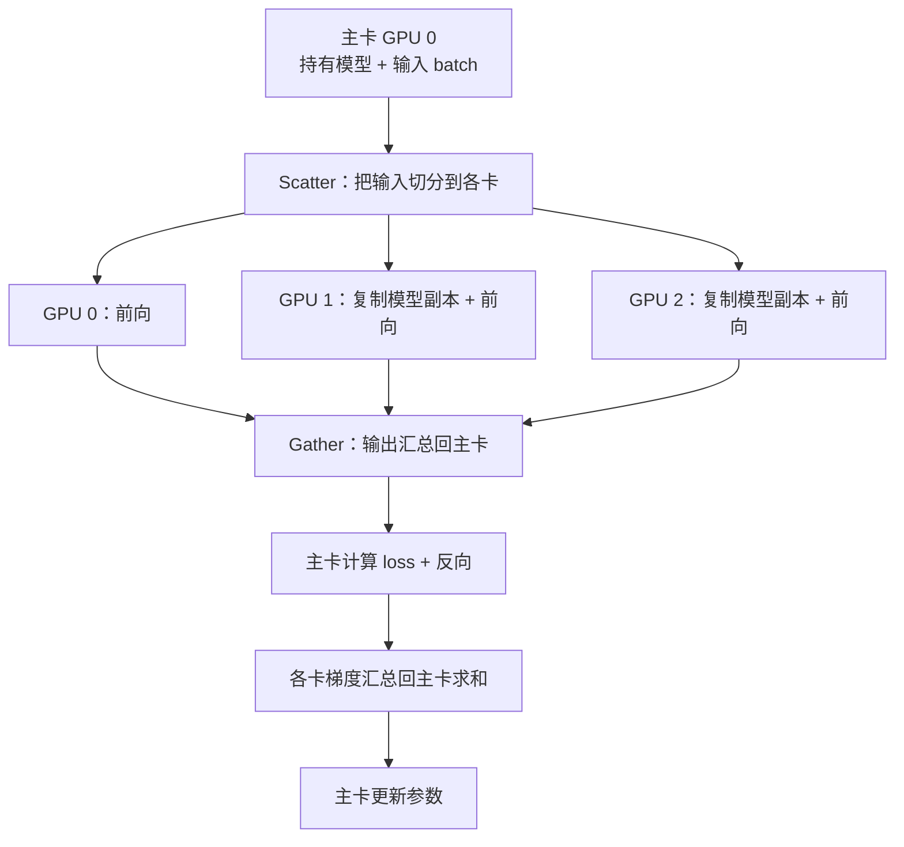
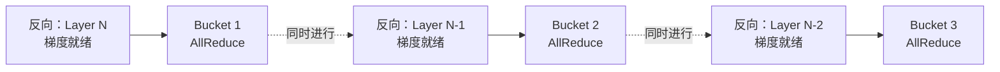
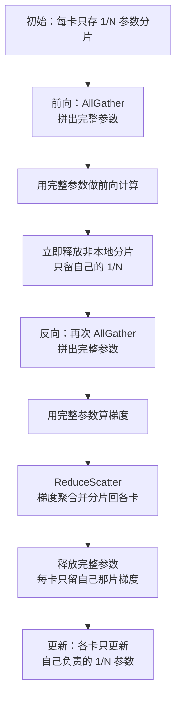
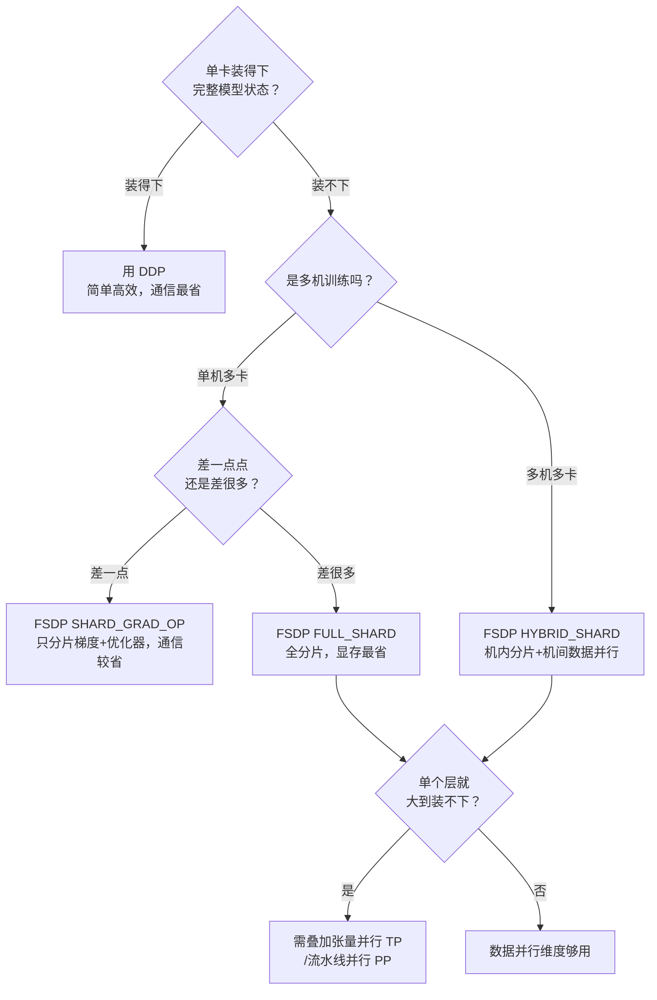

# 4.1 数据并行详解：原理与通信量推导

> **一句话结论**：数据并行是分布式训练中最基础也最常用的策略——每块 GPU 完整副本，各自算不同的数据，同步梯度。从最早的 DP（单进程、已废弃）到 DDP（多进程、去中心化 AllReduce）再到 FSDP（参数分片、省显存），三代演进的核心权衡只有一笔账：**DDP 省通信（每步 2Ψ）、但费显存（每卡 16Ψ）；FSDP 省显存（每卡 16Ψ/N）、但费通信（每步 3Ψ，多 50%）**。选哪个取决于你的瓶颈是显存还是吞吐。
> 
> 数学上，数据并行的平均梯度 **严格等于** 单卡在全局 batch 上的梯度——前提是各卡同步梯度且 local batch 大小相同。因此数据并行不只是"差不多就行"的经验技巧，而是有严格数学保证的等价。

## 背景与现象

### 数据并行要解决什么问题

训练太慢——数据量太大，单卡一个 epoch 要跑很久。

打个比方：一个班有 6000 份试卷要批改，一位老师批完要一周。数据并行的做法是找来 6 位老师，每人分 1000 份同时批，一天就能收工。前提是——**每位老师手里都得有一份完整的评分标准**（即完整的模型副本），批完后大家还要**对齐评分尺度**（同步梯度），保证不会出现"张老师给分松、李老师给分紧"的情况。

用技术语言重述这套流程：

1. 每块 GPU 持有一份**完整的模型副本**（参数完全相同）
2. 把一个大 batch 的数据**均匀切分**到各 GPU，每卡只算自己那一份（称为 local batch）
3. 各 GPU **独立**做前向和反向，算出各自的梯度
4. 通过通信把所有卡的梯度**取平均**，让每块卡拿到完全一致的梯度
5. 每块卡用这份一致的梯度更新参数——更新后所有副本依然完全相同

> 📷 **原文图片占位**：`dp_diagram.png`
> - **Caption**：数据并行：模型复制到多卡，各卡在不同数据微批上并行前反向，再同步梯度
> - **在线查看**：https://caomaolufei.github.io/AIInfraGuide/images/dp_diagram.png
> - **原文位置**：4.1 节"数据并行要解决什么问题"，5 步流程描述之后、"关键点"之前
> - **操作**：请手动截图并替换此占位符

> **关键点**：数据并行的核心约束是 **每卡都要装得下完整模型**。它加速了训练，但没有减少单卡的显存负担。这正是后面 FSDP 要突破的地方——当模型大到单卡装不下时，纯数据并行就无能为力了，必须引入参数分片。

> **提示**：分布式训练要解决的是两类正交的问题——**跑不完**（时间太长，数据并行的主场）和**装不下**（显存不足，需要 ZeRO/FSDP、张量并行、流水线并行）。本文聚焦数据并行这一维度，以及它如何逐步拥有解决显存问题的能力。

---

## 核心概念

### 三代数据并行一句话总结

| 代际 | 方案 | 一句话 | 状态 |
|------|------|--------|------|
| **第一代** | DataParallel（DP） | 单进程多线程，主卡当中心，改一行代码就能多卡 | ❌ 已废弃 |
| **第二代** | DistributedDataParallel（DDP） | 每卡一独立进程，去中心化 AllReduce 同步梯度 | ✅ 生产标准 |
| **第三代** | FullyShardedDataParallel（FSDP） | 参数分片存储，按需组装，省显存 | ✅ 大模型标配 |

### DDP vs FSDP 核心对比

| 维度 | DDP | FSDP（FULL_SHARD） |
|------|-----|-------------------|
| **核心思路** | 每卡完整模型，梯度 AllReduce | 参数分片，按需 AllGather |
| **每卡通信量** | $2\Psi$ | $3\Psi$（多 50%） |
| **单卡显存** | $16\Psi$ | $\frac{16\Psi}{N}$ |
| **适用场景** | 单卡装得下 | 单卡装不下 |

---

## 深入讲解

### 数据并行的数学基础

数据并行不是"差不多就行"的近似技巧，它在数学上与单卡训练**严格等价**（在同步 SGD 下）。

考虑一个 batch 的损失，定义为样本损失的平均值。设全局 batch 大小为 $B$：

$$
L = \frac{1}{B} \sum_{i=1}^{B} \ell(x_i; \theta)
$$

对参数求梯度：

$$
g = \nabla_\theta L = \frac{1}{B} \sum_{i=1}^{B} \nabla_\theta \ell(x_i; \theta)
$$

把 $B$ 个样本均匀分给 $N$ 块 GPU，每卡分到 $\frac{B}{N}$ 个样本。第 $k$ 块卡的**本地梯度**：

$$
g_k = \frac{N}{B} \sum_{i \in \mathcal{D}_k} \nabla_\theta \ell(x_i; \theta)
$$

所有卡的本地梯度**取平均**：

$$
\bar{g} = \frac{1}{N} \sum_{k=1}^{N} g_k = \frac{1}{N} \sum_{k=1}^{N} \frac{N}{B} \sum_{i \in \mathcal{D}_k} \nabla_\theta \ell(x_i; \theta) = \frac{1}{B} \sum_{i=1}^{B} \nabla_\theta \ell(x_i; \theta) = g
$$

> **核心结论**：$N$ 卡数据并行的平均梯度 $\bar{g}$ **精确等于**单卡在全局 batch 上的梯度 $g$。所以数据并行 = 用更多卡分摊计算，但每一步的参数更新与"单卡跑一个 $B$ 大小的 batch"在数学上一模一样。

这个推导带出两个实践结论：

- **为什么梯度要 AllReduce 求平均，而不是求和**：因为每卡的本地损失已经在 local batch 内做过平均（除以 $\frac{B}{N}$），跨卡再对 $N$ 个本地梯度求平均，才能还原出全局 batch 的平均梯度。如果求和，等价于把学习率放大了 $N$ 倍。
- **有效 batch size 变大了**：数据并行的有效 batch size = 单卡 local batch × $N$。这也是为什么扩大卡数时通常要相应调整学习率。

> **注意**：这个"严格等价"只在同步梯度、且各卡 local batch 大小相同的前提下成立。如果各卡数据条数不均（最后一个 batch 不满）、或用了异步更新，等价性会被打破。

---

### 第一代：DataParallel（DP）——为什么被淘汰

`torch.nn.DataParallel`（简称 DP）是 PyTorch 最早提供的多卡方案。最大卖点是"改一行代码就能多卡"——`model = nn.DataParallel(model)`。但它是**单进程多线程**架构。



```
    ASCII 备用图（DP 工作流程）：
    主卡 GPU0 → Scatter 切分数据 → GPU1/GPU2 各做前向
                               → GPU0 前向
    → 输出 Gather 回主卡 → 主卡算 loss + 反向
    → 梯度和汇总回主卡 → 主卡更新参数
```

**三个致命缺陷**：

| 缺陷 | 原因 |
|------|------|
| **GIL 限制** | 单进程多线程，Python 全局解释器锁让多线程无法真正并行调度 |
| **负载不均** | 主卡额外承担 Scatter/Gather、loss 计算、梯度汇总，显存和算力都更重 |
| **通信低效** | 每步都要重新复制模型；数据走主卡中转，容易挤在 PCIe 上而非高速 NVLink |

> **关键点**：DP 的病根在于**单进程 + 主卡中心化**。DDP 的所有改进，本质上都是在拆掉这两个前提——改成多进程、去中心化。

---

### 第二代：DDP（DistributedDataParallel）

DDP 的核心变革：**每块 GPU 一个独立进程**，各进程持有自己的完整模型副本，彼此地位对等——没有"主卡"，梯度同步走**去中心化的 AllReduce**。

#### DP vs DDP 对比

| 维度 | DataParallel（DP） | DistributedDataParallel（DDP） |
|------|-------------------|-------------------------------|
| **进程模型** | 单进程多线程 | 每卡一个进程，无 GIL 争抢 |
| **模型副本** | 每步重新 replicate | 只在初始化时 Broadcast 一次 |
| **梯度同步** | 汇总到主卡求和 | 去中心化 AllReduce，各卡对等 |
| **负载** | 主卡偏重 | 各卡均衡 |
| **通信路径** | 经主卡中转 | 点对点 Ring，充分利用 NVLink |

DDP 的生命周期可以概括为"一次广播，多次同步"：

1. **初始化**：构造 DDP 时，把 rank 0 的参数 **Broadcast** 到所有进程，保证副本起点一致
2. **前向 + 反向**：每个进程在自己的数据分片上**独立**计算，互不通信
3. **梯度同步**：反向传播过程中，通过 **AllReduce** 把各进程的梯度取平均，同步后各卡梯度一致
4. **参数更新**：各进程用一致的梯度独立更新——因为起点一致、梯度一致，更新后依然一致

> **核心概念**：DDP 全程只在**初始化广播**和**反向的梯度 AllReduce** 两处通信。前向完全无通信，这是它比 DP 高效的根本原因。

#### Bucket 机制：让通信藏进计算里

这是 DDP 性能优化的精髓。最朴素的做法是：等整个反向传播算完所有梯度，再统一发起一次 AllReduce。但这样有个大问题——**通信时 GPU 在干等**，算力被浪费。

> 📷 **原文图片占位**：`dp_overlap1.svg`
> - **Caption**：朴素 DP：先完成整个反向传播，再统一同步梯度，通信期间 GPU 空闲
> - **在线查看**：https://caomaolufei.github.io/AIInfraGuide/images/dp_overlap1.svg
> - **原文位置**：4.2 节"Bucket 机制"，朴素做法描述之后、DDP 巧思解释之前
> - **操作**：请手动截图并替换此占位符

DDP 的巧思是利用反向传播的特性：反向是**从最后一层往前**逐层算的，靠后的层梯度先就绪。既然如此，为什么要等全部算完？某一层的梯度甚至可以在更靠前的层梯度尚未算完时，就被收集并同步——一旦最后一层反向完成，那部分梯度就能立即 AllReduce，同时反向计算继续向前推进。

> 📷 **原文图片占位**：`dp_overlap2.svg`
> - **Caption**：梯度同步与反向传播重叠：靠后层的梯度先就绪即可立即同步，与更靠前层的反向计算并行
> - **在线查看**：https://caomaolufei.github.io/AIInfraGuide/images/dp_overlap2.svg
> - **原文位置**：4.2 节"Bucket 机制"，DDP 巧思解释之后、Bucket 规则之前
> - **操作**：请手动截图并替换此占位符

于是 DDP 把参数梯度按反向计算顺序打包成若干 **Bucket**（桶，默认约 25 MB 一个）。规则是：

- 某个 Bucket 里的所有梯度都就绪了，**立即**对这个 Bucket 发起 AllReduce
- 与此同时，更靠前的层还在继续算反向

> 📷 **原文图片占位**：`dp_overlap3.svg`
> - **Caption**：梯度分桶：把多个梯度打包成一个 Bucket，只发起一次 AllReduce，减少通信次数
> - **在线查看**：https://caomaolufei.github.io/AIInfraGuide/images/dp_overlap3.svg
> - **原文位置**：4.2 节"Bucket 机制"，Bucket 规则之后、"通信和计算重叠"之前
> - **操作**：请手动截图并替换此占位符

这样通信和计算就**重叠（overlap）** 起来了：



```
    ASCII 备用图（Bucket 机制）：
    时间线 →
    [反向 Layer N]  ──→ [Bucket 1 AllReduce] ────────────→
         [反向 Layer N-1] ──→ [Bucket 2 AllReduce] ────→
              [反向 Layer N-2] ──→ [Bucket 3 AllReduce] →
    通信和计算在时间上重叠（overlap）
```

> **提示**：Bucket 大小是可调的（`bucket_cap_mb`）。桶太小→通信次数多、固定开销占比高；桶太大→重叠效果差（要等更久才凑满一桶）。默认值对大多数模型够用。

> **注意**：如果模型里有参数**没有参与前向计算**（比如条件分支下某些层没被走到），它们的梯度永远不就绪，对应的 Bucket 永远等不满，AllReduce 就会卡住导致死锁。这时需要设置 `find_unused_parameters=True`，让 DDP 主动标记未使用的参数。但这个选项有额外开销，能避免则避免。

计算与通信重叠让 DDP 在中等规模下几乎能线性加速，但这个红利在**超大规模会失效**。随着 GPU 越来越多（数百甚至上千块），协调开销和网络需求显著增长，通信逐渐盖不住计算，每多加一块卡效率反而更低。下面是一组基准测试：超过某个上限后吞吐量开始明显下降，而单卡显存占用保持恒定、不受 DP rank 增加的影响（这也印证了前面那句话——加卡只摊薄计算、不摊薄显存）。

> 📷 **原文图片占位**：`dp_scaling.svg`
> - **Caption**：随 DP rank 增加的吞吐量与单卡显存占用：超过某上限后吞吐量下降，单卡显存恒定
> - **在线查看**：https://caomaolufei.github.io/AIInfraGuide/images/dp_scaling.svg
> - **原文位置**：4.2 节"Bucket 机制"末尾，DDP 规模扩展性讨论之后、"提示"关于 ring latency 之前
> - **操作**：请手动截图并替换此占位符

> **提示**：在 512+ GPU 规模下，通信还会开始受限于**环延迟（ring latency）**（信号绕 Ring 传播一圈的时间），DP 通信无法再被完全重叠。到了这个点，就该转向其他并行维度（TP/PP/ZeRO）而不是继续堆 DP。

#### DDP 的根本局限

DDP 继承了数据并行的天生约束——**每块 GPU 都要装下完整的"参数 + 梯度 + 优化器状态"**。

对一个 $\Psi$ 参数量的模型，用混合精度 + Adam 训练时，单卡显存：

- FP16 参数：$2\Psi$
- FP16 梯度：$2\Psi$
- FP32 优化器状态（master 权重 + 一阶动量 + 二阶动量）：$12\Psi$

合计约 $16\Psi$。对 7B 模型就是约 112 GB——**单张 80 GB 的 H100 直接装不下**。

> **关键点**：DDP 增加卡数只能**摊薄计算时间**（更快），不能**摊薄单卡显存**（更省）。要突破显存墙，就要问：这份 $16\Psi$ 的冗余，能不能也切开分给各卡？——这正是 FSDP 的出发点。

---

### AllReduce 通信量的数学推导

很多教程直接抛出"DDP 每步通信量是 $2\Psi$"这个结论，但不解释怎么来的。搞懂这个推导，才能真正理解为什么 Ring AllReduce 是带宽最优的。

#### AllReduce = ReduceScatter + AllGather

一次 AllReduce 在实现上等于一次 ReduceScatter 加一次 AllGather。

- **ReduceScatter**：把每卡的数据分成 $N$ 块，跨卡对相同位置的块做聚合（求和），最后每卡拿到一块已经聚合完成的结果
- **AllGather**：每卡把自己那块结果广播出去，最后所有卡都拿到完整的聚合结果

用图书馆盘点打比方：$N$ 个管理员每人手上有全馆图书的一份清点记录。ReduceScatter 阶段，把书架分成 $N$ 区，1 号管理员负责汇总所有人 A 区的数据、2 号汇总 B 区……盘完后每人手里只有自己那一区的最终总数；AllGather 阶段，大家再互相通报自己区的总数，最后每人都拿到全馆的完整总数。

#### Ring AllReduce 的通信量

设梯度总大小为 $\Psi$（元素数）。数据切成 $N$ 份，每份 $\frac{\Psi}{N}$。

**ReduceScatter 阶段**：$N-1$ 步，每步每卡发送 $\frac{\Psi}{N}$。每卡发送总量：

$$
(N-1) \times \frac{\Psi}{N}
$$

**AllGather 阶段**：同样 $N-1$ 步，每步每卡发送 $\frac{\Psi}{N}$。

两阶段相加，每卡发送的总数据量为：

$$
2 \times (N-1) \times \frac{\Psi}{N} = 2\Psi \cdot \frac{N-1}{N}
$$

> **核心结论**：当卡数 $N$ 很大时，$\frac{N-1}{N} \to 1$，所以每卡的通信量趋近于 $2\Psi$，且**与卡数 $N$ 无关**。这就是"DDP 每步通信量 $2\Psi$"的出处。

#### 为什么不用"汇总到一张卡"的朴素做法

| 方案 | 单卡通信量 | 是否随 N 膨胀 |
|------|-----------|---------------|
| 中心化汇总（DP 式） | 主卡 $2(N-1)\Psi$ | ❌ 主卡线性膨胀 |
| Ring AllReduce（DDP） | $2\Psi \cdot \frac{N-1}{N} \approx 2\Psi$ | ✅ 恒定，与 N 无关 |

关于 Ring AllReduce 算法的详细分析，参见 `../3. 通信原语篇/1. 集合通信原语详解.md`。

---

### 第三代：FSDP（FullyShardedDataParallel）

回到 DDP 的痛点：每卡冗余存了一份 $16\Psi$ 的完整状态。FSDP 的答案简单而彻底——**别冗余存了，把参数、梯度、优化器状态都切成 $N$ 份，每卡只存 $\frac{1}{N}$，需要用的时候再临时拼出来**。

#### ZeRO 三阶段与 FSDP 策略对应

| ZeRO 阶段 | 分片内容 | 每卡显存（$N$ 卡） | 对应 FSDP 策略 |
|-----------|---------|-------------------|---------------|
| **Stage 1** | 优化器状态 | $2\Psi + 2\Psi + \frac{12\Psi}{N}$ | （含在 `SHARD_GRAD_OP` 内） |
| **Stage 2** | + 梯度 | $2\Psi + \frac{14\Psi}{N}$ | `SHARD_GRAD_OP` |
| **Stage 3** | + 参数 | $\frac{16\Psi}{N}$ | `FULL_SHARD` |

> **核心概念**：Stage 3（FULL_SHARD）把全部 $16\Psi$ 都切开，单卡显存降到 $\frac{16\Psi}{N}$。以 7B 模型、8 卡为例：DDP 每卡约 112 GB（装不下），FSDP FULL_SHARD 每卡约 112/8 = 14 GB（轻松装下）。

#### FSDP 的执行流程：AllGather + ReduceScatter



```
    ASCII 备用图（FSDP 一个 unit 的前向+反向流程）：
    
    初始化：每卡存 1/N 参数分片
    ┌───────────────────────────────────┐
    │ 前向：                              │
    │   AllGather → 拼出完整参数           │
    │   → 算前向 → 释放非本地分片           │
    │                                     │
    │ 反向：                              │
    │   AllGather → 再拼出完整参数          │
    │   → 算梯度 → ReduceScatter → 只留本地梯度分片 │
    │   → 释放完整参数                     │
    │                                     │
    │ 更新：只更新本地 1/N 参数             │
    └───────────────────────────────────┘
```

**两个关键通信**：

1. **前向的 AllGather**：算某个 unit 前，把散落各卡的参数分片收集起来，临时拼成完整参数。算完立刻扔掉非本地部分。
2. **反向的 AllGather + ReduceScatter**：反向要再拼一次完整参数（因为前向后已经释放了）算出完整梯度；然后用 **ReduceScatter**，一步同时完成"梯度聚合"和"分片回各卡"——每卡最终只拿到自己负责那一片的聚合梯度。

> **关键点**：注意反向的梯度同步用的是 **ReduceScatter** 而非 DDP 的 AllReduce。因为 FSDP 每卡只需更新自己的分片，所以只需拿到"自己那片"的聚合梯度就够了，不必像 DDP 那样让每卡都拿到完整梯度。

#### FSDP 四种分片策略

| 策略 | 行为 | 显存节省 | 通信开销 | 适用场景 |
|------|------|---------|---------|---------|
| `FULL_SHARD` | 参数+梯度+优化器全部分片 | 最高 | 最高 | 大模型，显存紧张 |
| `SHARD_GRAD_OP` | 梯度+优化器分片，参数不分片 | 中等 | 中等 | 中等模型 |
| `HYBRID_SHARD` | 机内 FULL_SHARD + 机间数据并行 | 高 | 机间较低 | 多机训练首选 |
| `NO_SHARD` | 不分片（等价 DDP） | 无 | 最低 | 调试对照 |

> **提示**：`HYBRID_SHARD` 是多机大模型的推荐策略。它的洞察是——机内有高带宽的 NVLink，适合做通信密集的 FULL_SHARD；机间只有较慢的 InfiniBand，就退化成通信量小的数据并行（AllReduce）。相当于把"高频通信"关在机内，"低频通信"才跨机，是显存与通信的最佳折中。

#### FSDP2：下一代 API

PyTorch 正在推进新一代 API `fully_shard`（俗称 FSDP2）。与 FSDP1 的"整个模块打包分片"（module-wrapper）不同，FSDP2 采用 **per-parameter 分片**，底层基于 `DTensor`（Distributed Tensor）抽象。主要优势：

- 分片粒度到单个参数，更灵活，避免整块打包的显存/通信浪费
- 基于 DTensor，与张量并行（TP）、序列并行等组合时接口更统一
- 更清晰的初始化与 checkpoint 语义

> **提示**：截至 PyTorch 2.x，FSDP2 已可用且是官方主推方向。新项目值得尝试 FSDP2（尤其要和 TP 组合时），追求稳定的存量生产项目 FSDP1 仍是稳妥选择。实战代码见 `2. PyTorch数据并行从原理到实战.md`。

---

### 显存账本：三代方案定量对比

沿用混合精度 + Adam 的经典估算，对 $\Psi$ 参数量的模型：

$$
\underbrace{2\Psi}_{\text{FP16 参数}} + \underbrace{2\Psi}_{\text{FP16 梯度}} + \underbrace{4\Psi}_{\text{FP32 master 权重}} + \underbrace{4\Psi + 4\Psi}_{\text{Adam 动量}} = 16\Psi
$$

| 方案 | 参数 | 梯度 | 优化器状态 | 单卡合计 | $N=8$ 时（7B 模型） |
|------|------|------|-----------|---------|-------------------|
| **DDP** | $2\Psi$ | $2\Psi$ | $12\Psi$ | $16\Psi$ | ~112 GB |
| **FSDP SHARD_GRAD_OP** | $2\Psi$ | $\frac{2\Psi}{N}$ | $\frac{12\Psi}{N}$ | $2\Psi + \frac{14\Psi}{N}$ | ~26 GB |
| **FSDP FULL_SHARD** | $\frac{2\Psi}{N}$ | $\frac{2\Psi}{N}$ | $\frac{12\Psi}{N}$ | $\frac{16\Psi}{N}$ | ~14 GB |

（7B 即 $\Psi = 7\times10^9$，$16\Psi \approx 112$ GB；$N=8$。）

结论：

- **DDP 显存与卡数无关**：加卡不减负，$16\Psi$ 恒定。天花板。
- **优化器状态是最大头**（$12\Psi$，占 75%）：所以 ZeRO-1/2 只分片优化器状态和梯度就能省掉大半。
- **FULL_SHARD 随卡数线性下降**：卡越多越省，理论上能训练任意大模型。

> **注意**：这张表只算了模型状态，没算激活值。激活值随 batch size、序列长度、模型深度增长，长序列训练时往往才是大頭。FSDP 分片的是模型状态，对激活值无能为力——那需要 Activation Checkpointing、序列并行等手段。

---

### 通信量对比：DDP vs FSDP

#### DDP：每步 $2\Psi$

一次 AllReduce 同步梯度，单卡通信量约 $2\Psi$。这是数据并行通信量的基准线。

#### FSDP：每步 $3\Psi$

- 前向 AllGather：约 $\Psi$
- 反向 AllGather：约 $\Psi$
- 反向 ReduceScatter：约 $\Psi$

合计约 $3\Psi$，比 DDP 的 $2\Psi$ **多出 50\%**。

> **关键点**：为什么 AllReduce 是 $2\Psi$，而 AllGather 或 ReduceScatter 各只是 $\Psi$？因为 AllReduce = ReduceScatter + AllGather，本身就是两个 $\Psi$ 操作的组合。FSDP 把这两半拆开用，再额外多一次前向 AllGather，所以是 $\Psi + \Psi + \Psi = 3\Psi$。

| 维度 | DDP | FSDP FULL_SHARD |
|------|-----|-----------------|
| 每卡通信量/步 | $2\Psi$ | $3\Psi$（多 50%） |
| 通信时机 | 反向时一次 AllReduce | 每个 unit：前向 AllGather + 反向 AllGather + ReduceScatter |
| 单卡显存 | $16\Psi$ | $\frac{16\Psi}{N}$ |
| 计算通信重叠 | Bucket 机制 | prefetch 预取下一层参数 |

> **核心概念**：DDP 和 FSDP 是一组清晰的**权衡对偶**——DDP 省通信但费显存；FSDP 省显存但费通信。没有免费午餐，选哪个取决于你的瓶颈是显存还是吞吐。

---

### 选型决策指南

核心问题只有一个：**参数 + 梯度 + 优化器状态 + 激活值 单卡装得下吗？**



```
    ASCII 备用图（选型决策树）：
    
    单卡装得下？ ────YES──→ 用 DDP
        │
       NO
        │
        ├── 单机多卡？
        │     ├── 差一点？ → FSDP SHARD_GRAD_OP
        │     └── 差很多？ → FSDP FULL_SHARD
        │
        └── 多机多卡？ → FSDP HYBRID_SHARD
                    │
                    └── 单层也装不下？ → 叠加 TP/PP
```

落成一句话规则：

- **单卡装得下** → 用 DDP。别为了"显得高级"上 FSDP，白白多付 50% 通信。
- **单卡差一点装不下** → 优先 FSDP `SHARD_GRAD_OP`（ZeRO-2），通信比 FULL_SHARD 省。
- **单卡差很多** → FSDP `FULL_SHARD`（ZeRO-3），显存最省。
- **多机 + 大模型** → FSDP `HYBRID_SHARD`，避免慢速跨机链路跑高频通信。
- **单个层都装不下**（如超大 FFN） → 数据并行维度到头了，叠加 TP/PP，走向 3D 并行。

---

## 面试回答

### 面试官问："DDP 和 FSDP 的本质区别是什么？什么时候该用哪个？"

**口述回答**：

DDP 和 FSDP 的区别可以概括为"完整副本 vs 参数分片"。

**DDP** 每卡存完整模型，梯度通过 AllReduce 同步，通信量每步 $2\Psi$（梯度大小），但单卡显存 $16\Psi$（参数+梯度+优化器状态），7B 模型要约 112GB——单卡装不下。

**FSDP** 把参数、梯度、优化器状态切成 $N$ 份，每卡只存 $\frac{1}{N}$，要用时通过 AllGather 临时拼出完整参数。单卡显存降到 $\frac{16\Psi}{N}$（8 卡约 14GB），但通信量增加到 $3\Psi$（多 50%），因为每个 unit 都要做前向 AllGather + 反向 AllGather + 反向 ReduceScatter。

**选型规则**：单卡装得下完整模型 → DDP；装不下 → 优先 SHARD_GRAD_OP（ZeRO-2），还不行 → FULL_SHARD（ZeRO-3）；多机 → HYBRID_SHARD。

---

## 深入追问

1. **AllReduce 的单卡通信量为什么是 $2\Psi$ 而不是随 $N$ 增长？**
   - Ring 算法：数据切 N 份，两个阶段各 N-1 步，每卡发 $(N-1)\times\Psi/N$，合计 $2\Psi\times(N-1)/N \approx 2\Psi$。

2. **DDP 的 Bucket 机制具体怎么实现重叠？**
   - 反向从后往前，靠后层梯度先就绪，一桶满了就触发 AllReduce，同时前面还在继续算反向。

3. **`find_unused_parameters=True` 的开销来源？什么时候必须用？**
   - DDP 需要遍历所有参数检查哪些梯度没就绪，有额外开销。当模型有条件分支导致部分参数没参与前向时必须用。

4. **FSDP 为什么反向用 ReduceScatter 而不是 AllReduce？**
   - FSDP 每卡只更新自己的 1/N 参数，只需对应分片的聚合梯度，不需要完整梯度。

5. **Hybrid Shard 为什么是多机最优策略？**
   - 机内 NVLink 高带宽适合频繁的 AllGather/ReduceScatter，机间 IB 慢适合通信量少的 AllReduce。

6. **数学上，数据并行的平均梯度等价于单卡全局 batch 梯度，前提条件是什么？**
   - 各卡同步梯度、local batch 大小相同。

7. **FSDP2 相比 FSDP1 的核心改进是什么？**
   - Per-parameter 分片替代 module-wrapper，基于 DTensor 统一接口，更好地与 TP 组合。

---

## 易混淆点

| 易混淆对 | 区别 | 记忆诀窍 |
|----------|------|----------|
| **DP vs DDP** | DP 单进程+主卡中心化，DDP 多进程+去中心化 | P=Process（单），D=Distributed（多） |
| **DDP vs FSDP** | DDP 完整副本，FSDP 参数分片 | DDP=Duplicated（冗余），FSDP=Sharded（分片） |
| **SHARD_GRAD_OP vs FULL_SHARD** | GradOp 参数不分片（2Ψ+N分之其余），FullShard 全部分片 | GradOp=Gradient+Optimizer 分片 |
| **AllReduce vs ReduceScatter** | AllReduce 人人有完整结果，ReduceScatter 每人只留一片 | FSDP 用后者因为每卡只需自己那片 |
| **ZeRO-3 vs FSDP FULL_SHARD** | ZeRO-3 是 DeepSpeed 实现，FULL_SHARD 是 PyTorch 原生实现 | 原理相同，实现不同 |
| **Ring AllReduce vs Tree AllReduce** | Ring 带宽最优（大 Ψ），Tree 低延迟（小 Ψ） | Ring 大，Tree 小 |

---

## 踩坑记录

| 坑 | 现象 | 原因 | 解决 |
|----|------|------|------|
| 模型里有不参与前向的参数 | DDP 构造时 hang 住或报 warning | 梯度永远不就绪，Bucket 等不满 | `find_unused_parameters=True` |
| 学习率没按卡数缩放 | 有效学习率过大，loss 震荡 | 梯度 AllReduce 取平均后，全局 lr = base_lr | 卡数翻倍时应用线性缩放规则 |
| `DistributedSampler` 没用 | 每卡读到相同数据 | 各卡从 dataset 拿了相同的样本 | 用 `DistributedSampler` 确保数据分片 |
| 没调 `set_epoch` | 每个 epoch 数据分配相同 | sampler 种子没随 epoch 变化 | `sampler.set_epoch(epoch)` |
| FSDP 保存用 `state_dict()` | 加载出错、分片信息丢失 | FSDP 参数分片存储，直接保存只落本地分片 | 使用 `Distributed Checkpoint`（DCP） |
| 显存估算不准导致 OOM | 训练中 OOM | 只算了模型状态，没算激活值和碎片 | 估算后乘 1.2~1.5 安全系数 |

---

## 自测清单

- [ ] 能推导数据并行的平均梯度严格等于单卡全局 batch 梯度，并解释为何梯度要"求平均"而非"求和"
- [ ] 能说清 DP 的三个致命缺陷，以及 DDP 分别是如何针对性解决的
- [ ] 能解释 DDP Bucket 机制如何实现计算通信重叠，以及 `find_unused_parameters` 的作用
- [ ] 能写出 AllReduce = ReduceScatter + AllGather 等价关系，并推导 Ring AllReduce 单卡通信量约 $2\Psi$
- [ ] 能说出 ZeRO 三个阶段各分片什么，对应 FSDP 哪种 `sharding_strategy`
- [ ] 能画出 FSDP 一个 unit 前向 + 反向的通信流程（AllGather / ReduceScatter 在哪些位置）
- [ ] 能解释 FSDP 反向为什么用 ReduceScatter 而不是 AllReduce
- [ ] 能算出 DDP 和 FSDP 各分片策略下的单卡显存，并说明优化器状态为何是最大头
- [ ] 能解释 FSDP 每步通信量 $3\Psi$ 比 DDP $2\Psi$ 多 50% 的来源
- [ ] 能根据"单卡是否装得下 / 是否多机"给出 DDP、SHARD_GRAD_OP、FULL_SHARD、HYBRID_SHARD 选型决策

---

## 关联笔记

| 主题 | 关联笔记 |
|------|----------|
| 集合通信原语 AllReduce/ReduceScatter/AllGather 详解 | `../3. 通信原语篇/1. 集合通信原语详解.md` |
| Ring AllReduce 算法 | `../集合通信基础/4. 算法篇/1. Ring-AllReduce带宽最优.md` |
| 通信与计算 Overlap | `../集合通信基础/4. 算法篇/3. 通信与计算Overlap.md` |
| 优化器状态显存分析（75% 占比） | `../4. 优化器篇/1. 优化器原理与显存开销分析.md` |
| DDP/FSDP 实战代码 | `../5. 数据并行篇/2. PyTorch数据并行从原理到实战.md` |
| ZeRO 通信量详细推导 | `../6. ZeRO篇/1. ZeRO显存优化系列.md` |
| TP/DP/PP 通信开销对比 | `../集合通信基础/6. 应用篇/1. 通信视角理解分布式并行策略.md` |
| 显存管理与多卡互联 | `../GPU硬件/4. 系统进阶篇/1. 显存管理与多卡互联.md` |

## 参考资料

- [PyTorch DistributedDataParallel — API 文档](https://docs.pytorch.org/docs/stable/generated/torch.nn.parallel.DistributedDataParallel.html)
- [PyTorch DDP Design Note（Bucket 与梯度同步机制）](https://docs.pytorch.org/docs/stable/notes/ddp.html)
- [PyTorch FSDP — FullyShardedDataParallel](https://docs.pytorch.org/docs/stable/fsdp.html)
- [ZeRO: Memory Optimizations Toward Training Trillion Parameter Models](https://arxiv.org/abs/1910.02054)
- [PyTorch FSDP: Experiences on Scaling Fully Sharded Data Parallel](https://arxiv.org/abs/2304.11277)
- [Bringing HPC Techniques to Deep Learning（Ring AllReduce 原理）](https://andrew.gibiansky.com/blog/machine-learning/baidu-allreduce/)
- [NCCL Documentation](https://docs.nvidia.com/deeplearning/nccl/user-guide/docs/)
