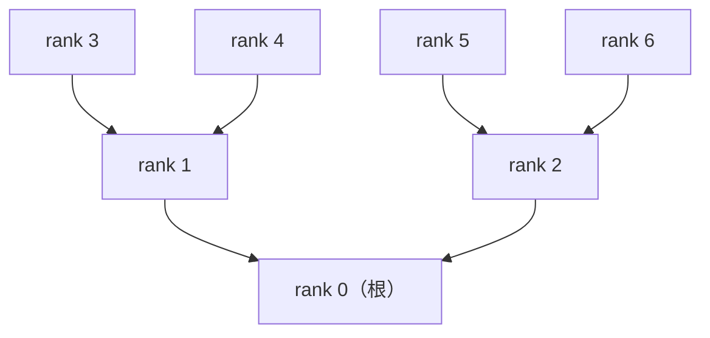

# 3.2 Tree AllReduce：低延迟的另一种思路

> 来源：AIInfraGuide 模块一·通信原理 第 6 章 | 笔记类型：学习笔记（新人友好版）
> 目标：理解 Tree AllReduce 为什么延迟低，掌握 Ring vs Tree 选型 | 更新时间：2026-07-10
> 关联：前置 3.1 Ring AllReduce / 后续 4.1 NCCL 算法选择 / 深入 5.1 通信特征对比
---

## 一句话结论

Tree AllReduce 以**树形拓扑**组织通信，延迟降至 **O(log N)**，适合小数据量同步（如标量 loss）。代价是根节点带宽瓶颈，大数据量时不如 Ring。NCCL 会根据数据大小**自动**在 Ring 和 Tree 之间切换（也可用 `NCCL_ALGO=Tree`/`NCCL_ALGO=Ring` 强制指定）。本篇偏理论。

## 背景与定位

3.1 篇讲到 Ring AllReduce 带宽最优，但延迟是 O(N) 的——节点数越多延迟越高。在数据量很小（如同步一个标量 loss）的场景下，延迟而非带宽才是瓶颈。Tree AllReduce 用树形拓扑解决这个问题，把延迟降到 O(log N)。

## ⚠️ 环境与 sudo 权限说明

本篇是纯理论算法理解篇。相关命令在 4.1 篇详讲：

| 相关命令 | 权限 | 说明 |
|---------|:----:|------|
| `NCCL_ALGO=Tree` 强制 Tree | ✅ 无需 sudo | 4.1 篇详讲 |
| `NCCL_ALGO=Ring` 强制 Ring | ✅ 无需 sudo | 4.1 篇详讲 |

## 核心概念（新人友好讲解）

### 1. Ring 延迟 O(N) 的局限

Ring AllReduce 需要 2(N-1) 轮传递：

```
N=8:    2×7 = 14 轮
N=64:   2×63 = 126 轮
N=256:  2×255 = 510 轮
```

当数据量很小（如同步一个 4 字节的标量 loss）时，每轮的**启动开销**（latency overhead）远大于数据传输时间。256 个节点要传 510 轮，每轮哪怕只花 1μs 启动，总延迟也要 510μs。

> **生活类比**：Ring 就像 256 个同学排成一圈传一张小纸条——纸条太小传起来没意义，但每个人转手都要花时间。换成树形结构，班长收 8 个组长的，8 个组长各收 8 个同学的，只要 2 轮（log₂256≈8 轮）就收齐了。

### 2. 树形拓扑设计

Tree AllReduce 把节点组织成一棵树，通信分两个阶段：

> **生活类比**：就像**班长收作业**——叶节点（同学）先把作业交给父节点（组长），组长汇总后交给根节点（班长），这叫 Reduce 阶段；然后班长把结果一层层发回给所有人，这叫 Broadcast 阶段。

#### Mermaid 拓扑图



#### ASCII 备用图（纯文本环境用）

```
              rank 0 (根)
             /          \
         rank 1        rank 2
        /      \      /      \
    rank 3  rank 4  rank 5  rank 6

Reduce 阶段（叶→根，自底向上）:
  rank 3,4 → rank 1    rank 5,6 → rank 2
  rank 1,2 → rank 0    (根节点拿到完整归约结果)

Broadcast 阶段（根→叶，自顶向下）:
  rank 0 → rank 1,2
  rank 1 → rank 3,4    rank 2 → rank 5,6
  (所有节点都拿到结果)
```

### 3. 两个阶段

#### Reduce 阶段（叶 → 根）

从叶节点向根节点逐层归约：

```
第1步: 叶节点(rank 3,4,5,6) 各自把数据发给父节点(rank 1,2)
第2步: rank 1,2 把收到的数据与本地数据归约，发给 rank 0
第3步: rank 0 拿到所有数据的归约结果

共 ⌈log₂N⌉ 步（N=7 时 log₂7≈3 步）
```

#### Broadcast 阶段（根 → 叶）

从根节点向叶节点逐层广播：

```
第1步: rank 0 把结果发给 rank 1,2
第2步: rank 1,2 发给 rank 3,4,5,6

共 ⌈log₂N⌉ 步
```

### 4. 延迟 O(log N) 的优势

| N（节点数） | Ring 延迟 O(N) | Tree 延迟 O(log N) | 差距 |
|:----------:|:-------------:|:-----------------:|:----:|
| 8 | 14 轮 | 6 轮 | 2.3x |
| 64 | 126 轮 | 12 轮 | 10.5x |
| 256 | 510 轮 | 16 轮 | 31.9x |
| 1024 | 2046 轮 | 20 轮 | 102x |

> 💡 **结论**：节点数越多，Tree 的延迟优势越明显。1024 个节点时 Tree 比 Ring 快 100 倍（延迟维度）。

### 5. 根节点带宽瓶颈（Tree 的代价）

Tree 的代价是**根节点成为带宽瓶颈**：

```
Reduce 阶段: 根节点(rank 0)要接收 N/2 个子节点的数据
Broadcast 阶段: 根节点要发送 N/2 份数据

根节点收发总量 = N/2 × M + N/2 × M = N × M
```

而 Ring 每 rank 只有 2M。当数据量大时，根节点的带宽会先被打满，成为瓶颈。

### 6. Ring vs Tree 对比

| 📊 对比项 | Ring AllReduce | Tree AllReduce |
|---------|:-------------:|:--------------:|
| 端到端延迟 | O(N) | **O(log N)** ✅ |
| 带宽利用率 | **接近 100%** ✅ | 较低（根节点瓶颈） |
| 每 rank 通信量 | 2(N-1)/N × M ≈ 2M | 根节点 N×M（最大） |
| 最适场景 | 梯度同步（大张量） | 标量指标同步（loss、step） |
| 数据量敏感 | 大数据优 | 小数据优 |

### 7. NCCL 自动切换

> 💡 **NCCL 内部会根据数据大小自动在 Ring 和 Tree 算法之间切换**，该决策对上层框架完全透明。

- **大数据量**（MB 级，如梯度）→ 自动选 Ring（带宽最优）
- **小数据量**（KB 级，如标量 loss）→ 自动选 Tree（延迟最优）

也可通过环境变量强制指定（4.1 篇详讲）：

```bash
# 强制 Ring（用于对比测试，✅ 无需 sudo）
NCCL_ALGO=Ring python train.py

# 强制 Tree
NCCL_ALGO=Tree python train.py
```

## 动手实践

### 实验 1：延迟计算对比

**场景**：同步一个 4 字节标量 loss，每轮通信启动开销 1μs。

```
Ring 延迟 = 2(N-1) × 1μs
  N=8:    14 μs
  N=256:  510 μs
  N=1024: 2046 μs ≈ 2ms

Tree 延迟 = 2 × ⌈log₂N⌉ × 1μs
  N=8:    6 μs
  N=256:  16 μs
  N=1024: 20 μs

N=1024 时: Ring 2ms vs Tree 0.02ms，差 100 倍
```

### 实验 2：大数据量时 Ring 反而优

**场景**：AllReduce 1GB 梯度，带宽 50 GB/s（IB NDR）。

```
Ring:  每卡发 2(N-1)/N × 1GB ≈ 2GB，耗时 ≈ 2/50 = 40ms（延迟可忽略）
Tree:  根节点收发 N×1GB = N GB，根节点耗时 ≈ N/50
       N=8 时根节点 8/50 = 160ms（4倍慢于 Ring）
```

> 💡 **结论**：大数据量时 Tree 的根节点瓶颈更严重，Ring 反而优。所以"看数据量选算法"。

## 面试回答（30 秒口述版）

> Tree AllReduce 用树形拓扑，Reduce 阶段叶到根、Broadcast 阶段根到叶，延迟 O(log N)，适合小数据量同步如标量 loss。代价是根节点带宽瓶颈，大数据量时不如 Ring。Ring 延迟 O(N) 但带宽最优，大数据量用 Ring。NCCL 根据数据大小自动切换，也可用 NCCL_ALGO 环境变量强制指定。选型口诀：大数据用 Ring，小数据用 Tree。

## 深入追问

**Q1：Tree 的"树"是几叉树？**
通常是二叉树（每个节点最多 2 个子节点），这样 log₂N 最优。NCCL 内部可能用多叉树来平衡带宽和延迟。

**Q2：根节点瓶颈能不能缓解？**
可以用"递归半数"（Recursive Halving）等变体，把树分成多棵子树各自归约再合并。但这已超出基础范围，实际中 NCCL 会自动选择最优策略。

**Q3：实际训练中什么时候触发 Tree AllReduce？**
同步标量 loss、step 计数等小数据时。PyTorch DDP 在梯度同步用 Ring（大数据），但一些元信息同步可能用 Tree。

**Q4：NCCL 怎么决定用 Ring 还是 Tree？**
NCCL 根据数据大小、节点数、拓扑等自动计算最优算法。阈值不是固定的，`NCCL_DEBUG=INFO` 可以看到它选择的算法。

**Q5：能同时用 Ring 和 Tree 吗？**
可以。NCCL 可能对不同大小的通信用不同算法。一次训练中，梯度同步用 Ring，loss 同步用 Tree。

## 易混淆点对比

| 易混概念 | 区别 | 记忆技巧 |
|---------|------|---------|
| Ring vs Tree 延迟 | Ring O(N)，Tree O(log N) | 排环 vs 班长收 |
| Ring vs Tree 带宽 | Ring 均匀最优，Tree 根节点瓶颈 | Ring 全员忙，Tree 根累死 |
| 大数据 vs 小数据选型 | 大用Ring，小用Tree | 梯度用Ring，loss用Tree |
| Reduce 阶段 vs Broadcast 阶段 | 叶→根 vs 根→叶 | 收作业 vs 发答案 |

## 常见报错速查表

| ❌ 现象/报错 | 原因 | ✅ 解决 |
|-------------|------|---------|
| 强制 Tree 后性能下降 | 大数据用了 Tree，根节点瓶颈 | 去掉 `NCCL_ALGO=Tree`，让 NCCL 自动选 |
| 强制 Ring 后小数据慢 | 小数据延迟 O(N) | 用 `NCCL_ALGO=Tree` 或让 NCCL 自动选 |
| 不确定用了哪个算法 | 没开调试日志 | `NCCL_DEBUG=INFO` 查看算法选择 |

## 自测清单

- [ ] 能说出 Tree AllReduce 延迟是 O(log N)
- [ ] 能说出 Tree 的两个阶段（Reduce 叶→根，Broadcast 根→叶）
- [ ] 能解释 Tree 的根节点带宽瓶颈
- [ ] 能说出 Ring vs Tree 的选型口诀（大数据 Ring，小数据 Tree）
- [ ] 知道 NCCL 会自动切换算法，也可用 `NCCL_ALGO` 强制指定
- [ ] 能估算 N=256 时 Ring vs Tree 的延迟差距

## 关联笔记

- **前置**：`1. Ring-AllReduce带宽最优.md`（Ring 的延迟局限引出 Tree）
- **后续**：`1. NCCL通信库基础与PyTorch使用.md`（`NCCL_ALGO` 环境变量）
- **同级**：`3. 通信与计算Overlap.md`（性能优化的另一个维度）
- **环境**：`技术工具学习索引.md`

## 参考资料

- [NVIDIA NCCL Algorithms](https://docs.nvidia.com/deeplearning/nccl/user-guide/docs/usage.html)
- [AIInfraGuide 原文](https://github.com/caomaolufei/AIInfraGuide/blob/main/docs/guides/模块一-前置知识/communication/collective-communication-primer.md)
