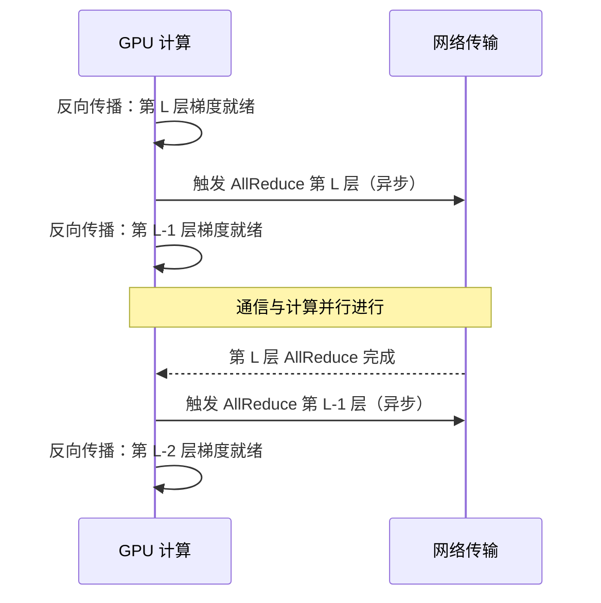

# 3.3 通信与计算 Overlap

> 来源：AIInfraGuide 模块一·通信原理 第 7 章 | 笔记类型：学习笔记（新人友好版）
> 目标：理解 DDP bucket 机制如何把通信藏进计算时间里 | 更新时间：2026-07-10
> 关联：前置 2.2 集合原语 / 后续 4.1 NCCL / 深入 5.1 DDP 通信开销
---

## 一句话结论

训练性能的理论上限是计算和通信完全并行——在 GPU 反向传播计算后续层梯度的同时，**异步传输已就绪的前面层梯度**。PyTorch DDP 通过 **bucket 机制**自动实现：参数分组为若干 bucket，一个 bucket 内梯度算完立即异步触发 AllReduce，不等整个模型。✅ `bucket_cap_mb=25` 是默认值，单机多卡可跑验证。

## 背景与定位

分布式训练中，反向传播算梯度和 AllReduce 同步梯度是两个必须的步骤。如果串行执行（先算完所有梯度，再做一次大 AllReduce），通信时间白白浪费了计算资源。Overlap 的核心思想是把通信"藏"进计算时间里，让两者并行。

## ⚠️ 环境与 sudo 权限说明

| 命令/操作 | 权限 | 说明 |
|-----------|:----:|------|
| `DDP(model, bucket_cap_mb=25)` | ✅ 无需 sudo | PyTorch API，单机多卡可跑 |
| `torchrun --nproc_per_node=2` | ✅ 无需 sudo | WSL 可跑 |
| 观察真实 Overlap 效果 | ⚠️ 需多卡+大模型 | 单机小模型 Overlap 收益不明显 |

**核心说明**：代码可以单机跑通验证能运行，但真实 Overlap 收益需要多卡 + 大模型才能体现（计算时间足够长才能"藏住"通信）。

## 核心概念（新人友好讲解）

### 1. Overlap 核心思想

> **生活类比**：你在炒菜（计算）的同时烧水（通信）——水烧开的时间藏在了炒菜时间里，总时间只比炒菜多一点点。如果先炒完菜再烧水（串行），总时间是炒菜+烧水。

```
没有 Overlap（串行）:
  [反向传播 L层 ████] [AllReduce L层 ████] [反向传播 L-1层 ████] [AllReduce L-1层 ████]
  ← 通信时 GPU 空闲，浪费时间

有 Overlap（并行）:
  [反向传播 L层 ████]           [反向传播 L-1层 ████]           [反向传播 L-2层 ████]
                    [AllReduce L层 ████] [AllReduce L-1层 ████]
  ← 通信藏在计算里，GPU 一直忙
```

### 2. 反向传播梯度就绪即触发

反向传播是从后往前算梯度的（最后一层先算完）。关键洞察：**第 L 层梯度算完后，不需要等 L-1 层，可以立即触发 L 层的 AllReduce**，同时继续算 L-1 层梯度。

```
反向传播顺序: L → L-1 → L-2 → ... → 0

时间线:
  t0: 算完 L 层梯度 → 立即异步触发 AllReduce(L)
  t1: 算 L-1 层梯度（同时 AllReduce(L) 在后台跑）
  t2: 算完 L-1 层梯度 → 触发 AllReduce(L-1)（同时 AllReduce(L) 可能还没完）
  ...
```

### 3. DDP bucket 机制

PyTorch DDP 不是"一个参数一个参数地同步"，而是把参数分组为若干 **bucket**（桶），一个 bucket 内所有参数的梯度计算完毕后，立即异步触发 AllReduce。

> **生活类比**：不是等所有作业都批改完才一起发回去，而是批完一个班就发一个班——分批处理，流水线化。

#### Mermaid 时序图



#### ASCII 备用图（纯文本环境用）

```
GPU计算:  [算L层梯度 ██]          [算L-1层梯度 ██]          [算L-2层 ██]
                           │              │                    │
网络传输:                  └─[AllReduce L ██]└─[AllReduce L-1 ██]
                           ↑ 异步触发      ↑ L算完后立即触发
                           
关键: GPU 在算 L-1 时，网络在传 L，两者并行
```

### 4. bucket_cap_mb 调参权衡（新人重点）

```python
from torch.nn.parallel import DistributedDataParallel as DDP

model = DDP(
    model,
    device_ids=[local_rank],
    bucket_cap_mb=25,    # 默认 25MB，控制 Overlap 粒度
)
```

**新人参数讲解**：
- **`bucket_cap_mb`**：每个 bucket 的最大容量（单位 MB）。模型参数被分成若干个 bucket，每个不超过这个大小。
- **默认值 25MB**：PyTorch 默认值，对大多数模型是较好的起点。

#### 调参权衡表

| bucket_cap_mb | 触发频率 | 等待时间 | 通信启动开销 | 适用场景 |
|:------------:|:--------:|:--------:|:-----------:|---------|
| 大（如 100MB） | 低 | 长（要积累更多梯度） | 少 | 层大、带宽高 |
| 小（如 5MB） | 高 | 短（很快就能触发） | 多 | 层小、延迟高 |
| **25MB（默认）** | **中** | **中** | **中** | **通用** |

> ⚠️ **注意**：
> - **太大**：需要积累更多梯度才触发，Overlap 效果变差（通信启动晚）
> - **太小**：通信次数多，每次 AllReduce 有固定启动开销（如 NCCL 协议握手），总开销增加
> - **通常 25MB 是较好的起点**，可根据模型层大小适当调整

### 5. CUDA Stream 与异步通信

Overlap 的底层实现依赖 **CUDA Stream**：

```
CUDA Stream 是 GPU 上的任务队列，不同 Stream 可以并行执行

default stream:  反向传播计算（算梯度）
NCCL stream:     AllReduce 通信（传梯度）

两个 stream 并行执行 → 计算与通信 Overlap
```

> 💡 **新人理解**：CUDA Stream 就像 GPU 内部的"多车道"——计算走一条车道，通信走另一条，互不阻塞。NCCL 的集合通信操作在独立的 stream 上异步执行。

## 动手实践

### 实验 1：DDP bucket 配置（✅ 无需 sudo）

```python
import os
import torch
import torch.nn as nn
import torch.distributed as dist
from torch.nn.parallel import DistributedDataParallel as DDP

def main():
    rank = dist.get_rank()
    torch.cuda.set_device(rank)

    # 简单模型
    model = nn.Sequential(
        nn.Linear(1024, 1024),
        nn.ReLU(),
        nn.Linear(1024, 1024),
        nn.ReLU(),
        nn.Linear(1024, 10),
    ).cuda()

    # DDP 包装，关键参数 bucket_cap_mb
    model = DDP(
        model,
        device_ids=[rank],
        bucket_cap_mb=25,    # 默认 25MB，可调整观察效果
    )

    optimizer = torch.optim.SGD(model.parameters(), lr=0.01)
    loss_fn = nn.CrossEntropyLoss()

    # 模拟训练
    for step in range(3):
        x = torch.randn(32, 1024).cuda()
        y = torch.randint(0, 10, (32,)).cuda()

        # 前向
        out = model(x)
        loss = loss_fn(out, y)

        # 反向（DDP 在这里自动 Overlap 通信）
        optimizer.zero_grad()
        loss.backward()       # ← 梯度就绪即异步 AllReduce

        # 更新参数
        optimizer.step()

        if rank == 0:
            print(f"step {step}: loss = {loss.item():.4f}")

if __name__ == "__main__":
    os.environ.setdefault("MASTER_ADDR", "localhost")
    os.environ.setdefault("MASTER_PORT", "12360")
    rank = int(os.environ.get("RANK", 0))
    world_size = int(os.environ.get("WORLD_SIZE", 1))
    dist.init_process_group(backend="nccl", rank=rank, world_size=world_size)
    main()
    dist.destroy_process_group()
```

**运行**（2 卡）：

```bash
torchrun --nproc_per_node=2 ddp_overlap_demo.py
```

**预期输出**：

```
step 0: loss = 2.3145
step 1: loss = 2.2987
step 2: loss = 2.2756
```

> 💡 **解读**：输出看似普通，但 DDP 在 `loss.backward()` 内部自动做了 Overlap——梯度就绪即异步 AllReduce。你不需要手动写通信代码。

### 实验 2：调整 bucket_cap_mb 对比（✅ 无需 sudo）

```python
# 把上面的 DDP 包装改成不同值对比
model_small = DDP(model, device_ids=[rank], bucket_cap_mb=5)   # 小 bucket
model_large = DDP(model, device_ids=[rank], bucket_cap_mb=100)  # 大 bucket
model_default = DDP(model, device_ids=[rank], bucket_cap_mb=25) # 默认
```

> 💡 **观察方法**：用 PyTorch Profiler 或 `NCCL_DEBUG=INFO` 可以看到不同 bucket 大小下 AllReduce 的触发次数和时机。小模型差异不明显，大模型（如 7B+）差异显著。

## 面试回答（30 秒口述版）

> 通信计算 Overlap 是分布式训练性能优化的核心——在反向传播算后续层梯度的同时，异步传输已就绪的前面层梯度。PyTorch DDP 通过 bucket 机制自动实现：参数分组成若干 bucket，一个 bucket 内梯度算完立即异步触发 AllReduce，不等整个模型。bucket_cap_mb 默认 25MB，太大 Overlap 差（触发晚），太小启动开销多（通信次数多）。底层依赖 CUDA Stream，计算和通信在不同 stream 上并行执行。

## 深入追问

**Q1：为什么不一个参数一个参数地同步？**
每个参数单独 AllReduce 会有巨大的启动开销（每次 NCCL 通信有固定延迟）。bucket 把多个参数打包，减少通信次数。但 bucket 太大又会导致等太久才触发，Overlap 效果差。

**Q2：Overlap 能完全隐藏通信吗？**
不能。如果通信时间 > 计算时间（如跨机网络慢），通信会"溢出"到计算之外。Overlap 只能把通信藏进计算时间里，当通信 > 计算时，超出部分仍然串行。这就是为什么跨机要用高速网络。

**Q3：bucket_cap_mb 怎么调优？**
经验法则：模型层大且带宽高（NVLink）可以适当增大；层小且延迟高（跨机）可以适当减小。用 Profiler 观察 AllReduce 触发时机和通信占比，调整后对比。25MB 是安全起点。

**Q4：DDP 是怎么知道一个 bucket 梯度算完了？**
PyTorch 通过 autograd 的 hook 机制。每个参数注册一个梯度就绪 hook，当 backward 计算到该参数的梯度时触发 hook。DDP 检查 bucket 内所有参数的 hook 都触发后，启动该 bucket 的 AllReduce。

**Q5：ZeRO 也有 Overlap 吗？**
有。ZeRO-1/2 用 ReduceScatter 替代 AllReduce，同样可以 Overlap。ZeRO-3 因为前向也要 AllGather 收集参数，Overlap 更复杂，DeepSpeed 等框架有专门优化。

## 易混淆点对比

| 易混概念 | 区别 | 记忆技巧 |
|---------|------|---------|
| 串行 vs Overlap | 串行通信时 GPU 空闲，Overlap 通信时 GPU 忙 | 炒菜时同时烧水 |
| bucket 大 vs 小 | 大触发少等待久，小触发多启动开销多 | 25MB是平衡点 |
| 计算 stream vs 通信 stream | 不同 CUDA Stream 并行执行 | 多车道 |
| DDP vs 手动通信 | DDP 自动 Overlap，手动要自己写异步 | DDP是自动挡 |

## 常见报错速查表

| ❌ 现象/报错 | 原因 | ✅ 解决 |
|-------------|------|---------|
| 单卡跑 DDP 报错 | DDP 需要多进程 | 用 `torchrun --nproc_per_node=2` 启动 |
| `bucket_cap_mb` 设太大 OOM | bucket 缓冲区占用显存 | 减小 bucket_cap_mb |
| 训练没加速 | 单机小模型 Overlap 收益不明显 | 用大模型或多机验证；用 Profiler 看通信占比 |
| 通信和计算没 Overlap | NCCL 通信没在独立 stream | DDP 默认已优化；自定义通信需用 `dist.isend` 等异步 API |

## 自测清单

- [ ] 能解释 Overlap 的核心思想（通信藏进计算时间）
- [ ] 能说出 DDP bucket 机制的工作原理
- [ ] 能说出 `bucket_cap_mb` 默认值（25MB）和调参权衡
- [ ] 能解释为什么太大和太小都不好
- [ ] 知道 Overlap 底层依赖 CUDA Stream
- [ ] 能写出 DDP 的基本代码（`DDP(model, bucket_cap_mb=25)`）
- [ ] 知道 Overlap 不能完全隐藏通信（通信 > 计算时会溢出）

## 关联笔记

- **前置**：`2. 集合通信五大原语.md`（AllReduce 是被 Overlap 的对象）、`1. 点对点通信-Send与Recv.md`（异步通信基础）
- **后续**：`1. NCCL通信库基础与PyTorch使用.md`（NCCL 底层 stream）
- **深入**：`1. 通信视角理解分布式并行策略.md`（DDP 通信开销分析）
- **环境**：`技术工具学习索引.md`

## 参考资料

- [PyTorch DDP 文档](https://pytorch.org/docs/stable/generated/torch.nn.parallel.DistributedDataParallel.html)
- [PyTorch Distributed Training Tutorial](https://pytorch.org/tutorials/intermediate/ddp_tutorial.html)
- [AIInfraGuide 原文](https://github.com/caomaolufei/AIInfraGuide/blob/main/docs/guides/模块一-前置知识/communication/collective-communication-primer.md)
